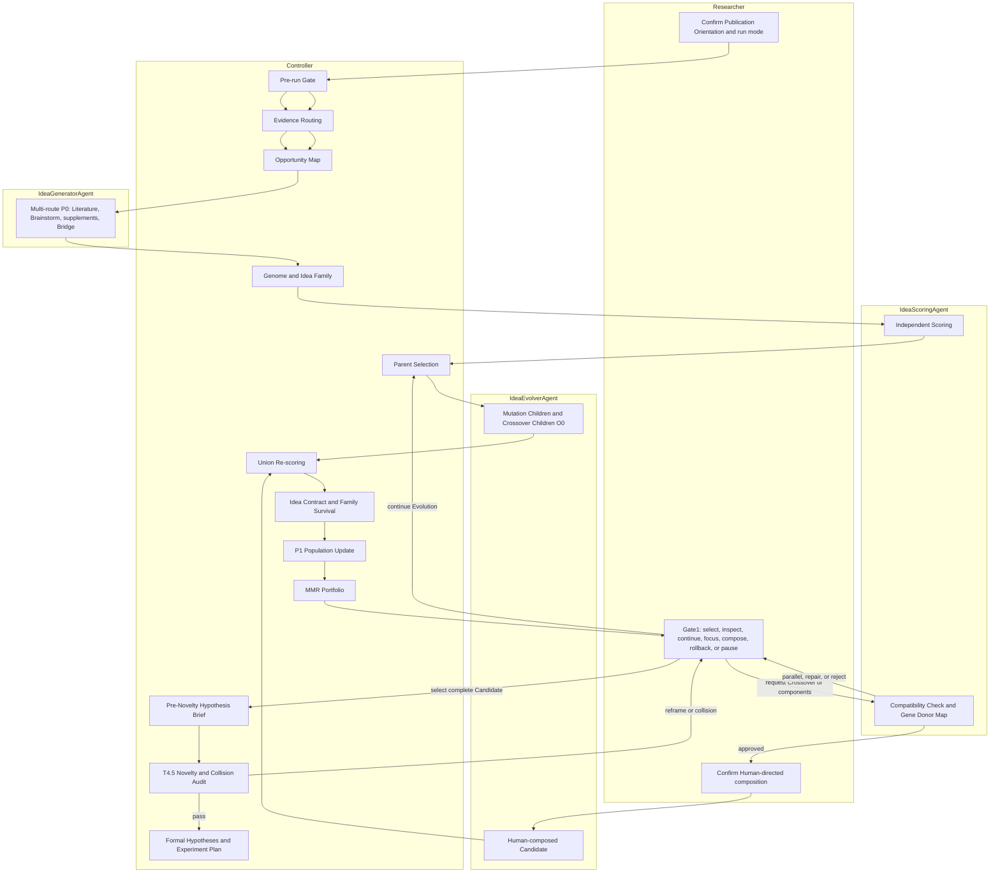

# ResearchOS Pipeline Detail

> [English](../en/agent_pipeline_detail.md) | [中文](../cn/agent_pipeline_detail.md)

This document is the **sole primary specification** for the current ResearchOS workflow.

It consolidates formerly scattered agent descriptions, experiment protocols, quick-start snippets, and some configuration notes.

If you want a single document to understand:

- how the entire system flows
- what each Agent is responsible for
- what each input/output file means
- what exactly happens when you run a single Agent in isolation
- the difference between the full pipeline and single-stage debugging
- the roles of resume, budget, fallback, MCP, and skills in the process

then prioritize reading this document.

---

## 1. Understand the System in One Sentence

ResearchOS is not “one big Agent that figures out how to do everything on its own”, but a **state-machine-driven, artifact-first** research runtime:

```text
T1 Project initialization
 -> T2 literature retrieval, deduplication, verification, and deep-read queue construction
 -> T3 deep reading and structured paper notes
 -> T3.5 literature synthesis
 -> T3.6 optional survey-paper branch (runtime gate: write a survey or not)
 -> T4 Evidence Routing, Candidate Population formation, and Evolution
 -> T4-GATE1 researcher decision, composition, parallel-track, or rollback gate
 -> T4 selected Candidate Pre-Novelty brief
 -> T4.5 novelty/collision audit and post-audit formalization on pass
 -> T5-REBOOST-GATE research-reboost handoff compilation
 -> T5-SPECIALIZE-EXECUTOR-SKILLS project-Skill publication and validation
 -> T5-EXECUTOR-GATE external executor selection
    -> mock_dry_run: T5-DRY-RUN external-executor protocol dry run -> T5-EXECUTOR-GATE
    -> codex_cli / claude_code_window / manual: T5-EXTERNAL-WAIT waits for external results
 -> T8-STYLE-GATE after `external_executor/executor_research_report.md` is available
 -> T8 resource indexing, section writing, assembly audit, review, and revision
 -> T9 submission-package construction, compilation, repair, and closeout
```

The current main chain has deprecated the default semantics of “ResearchOS itself implementing and running long experiments internally during T5–T7”. ResearchOS is responsible for research protocol, executor selection, AGENTS/CLAUDE control instructions, file contracts, and the writing–evidence closed loop; Codex CLI, Claude Code window, human external executors, or mock dry-run are responsible for implementing and running experiments in isolated paths. The normal entry is `T5-REBOOST-GATE`, which executes `research-reboost` through the configured model and validates the handoff. The separate `T5-SPECIALIZE-EXECUTOR-SKILLS` task then runs the repository `project-skill-specialization` Skill, atomically publishes the project-specific Suite, validates it independently, and records its input fingerprint before executor selection. `T5-HANDOFF` remains a legacy-compatible protocol compiler. The T5-to-T8 interface is the required file `external_executor/executor_research_report.md`; other `external_executor/` files remain optional context for T8. The old T7/T7.5 nodes have been removed from the main state machine, and ordinary `run-task T7` / `run-task LEGACY-T7-FULL` now fail with a removal message.

Where:

- `StateMachine` is responsible for “who to run next”
- `AgentRunner` is responsible for “actually running a given Agent”
- `ToolRegistry` is responsible for “which tools this Agent can invoke”
- `workspace` is responsible for “where all inputs/outputs are persisted on disk”
- `validator` is responsible for “whether this stage is truly considered complete”

---

## 2. Current Real Stage Diagram

The current real states are defined in [config/system_config/state_machine.yaml](../../config/system_config/state_machine.yaml).

The main chain is as follows:

```text
T1
 -> T2
 -> T3
 -> T3.5
 -> T3.6-GATE-SURVEY
    -> no: T4
    -> yes: T3.6-PLAN -> T3.6-GATE-OUTLINE -> T3.6-GATE-CORPUS
            -> optional T3.6-EXPAND
            -> T3.6-STATE
            -> T3.6-SEC-BACKGROUND -> T3.6-SEC-TAXONOMY
            -> T3.6-SEC-THEME-1 -> T3.6-SEC-THEME-2 -> T3.6-SEC-THEME-3 -> T3.6-SEC-THEME-4
            -> T3.6-SEC-COMPARISON -> T3.6-SEC-CHALLENGES -> T3.6-SEC-FUTURE
            -> T3.6-SEC-INTRO -> T3.6-SEC-CONCLUSION -> T3.6-SEC-ABSTRACT
            -> T3.6-ASSEMBLE -> T3.6-REVIEW -> T3.6-COMPILE -> T3.6-FEED -> T4
 -> T4
    -> Population/Portfolio ready: T4-GATE1 -> user selects, continues Evolution, composes, keeps parallel, inspects, regenerates, rolls back, or pauses -> T4
    -> complete Candidate selection: Pre-Novelty brief -> T4.5
    -> pass*: T5-REBOOST-GATE
    -> reframe/drop/reject/collision: T4.5-HUMAN-REVIEW -> user chooses T5-REBOOST-GATE/T4/done
 -> T5-REBOOST-GATE -> T5-SPECIALIZE-EXECUTOR-SKILLS
 -> T5-EXECUTOR-GATE
    -> mock_dry_run: T5-DRY-RUN -> T5-EXECUTOR-GATE
    -> claude_code_window/codex_cli/manual: T5-EXTERNAL-WAIT
 -> T8-STYLE-GATE
 -> T8-RESOURCE
 -> T8-WRITE
 -> T8-SECTION-PLAN
 -> T8-SEC-METHOD
 -> T8-SEC-EXPERIMENTS
 -> T8-SEC-RELATED
 -> T8-SEC-ANALYSIS
 -> T8-SEC-INTRO
 -> T8-SEC-CONCLUSION
 -> T8-SEC-ABSTRACT
 -> T8-DRAFT
 -> T8-SELF-CHECK
 -> T8-REVIEW-1
 -> T8-REVISE-1
 -> T8-REVIEW-2
 -> T8-REVISE-2
 -> T8-PAPER-CLAIM-AUDIT
 -> T9
 -> done
```

A few points that are easiest to misremember:

- `HELLO` is an explicitly run smoke task, not the main chain starting point; the main chain’s `initial_state` is `T1`
- The current main chain only automatically transitions to `T5-REBOOST-GATE` when the `Final Gate Verdict` at `T4.5` is explicitly one of the pass enumerations, such as `pass_to_experiment` / `pass_with_required_baselines`; `return_to_T4_reframe`, `drop_due_to_collision`, `reject`, `collision`, `fail`, missing verdict, or unrecognized verdict all lead to `T4.5-HUMAN-REVIEW`, where the user chooses to continue the external experiment chain, reframe back to T4, or end the project. The system no longer auto-rejects, auto-backtracks, or auto-approves, avoiding T4.5–T4 dead loops and preventing the model from making value judgments on the user’s behalf when novelty is uncertain. T7/T7.5 are no longer main-chain nodes.
- `T8` is not a single node, but a multi-node chain composed of style confirmation, resource indexing, alignment matrix, outline, per-section writing, assembly, self-check, review, and revision; any `next_task: T8` / `next_task: T8-WRITE` from old reports or gates will be safely mapped by the state machine to `T8-STYLE-GATE`, and will only directly enter `T8-RESOURCE` if a valid `drafts/writing_style.json` already exists.
- Gate1 presents a Rich Portfolio backed by `_gate1_candidate_cards.md`, `_gate1_selection_brief.md`, and the native Population snapshots. Candidate cards explain the mechanism, practical implication, score rationale, paper-reading-note dependencies, risks, and recommended action; `_candidate_directions.json` and Pass1/Pass2 JSON remain compatibility projections. After a complete selection, T4 writes `_gate1_user_selection.json`, `hypothesis_brief.yaml`, lineage, and T4.5 search targets. T4.5 audits novelty/collisions before any formal hypotheses or experiment plan are created; a passing T4.5 formalization then updates the formal bundle and T5 authority.
- `T8-REVIEW` is not the current real state name; the current real state names are:
  - `T8-REVIEW-1`
  - `T8-REVIEW-2`
- `T9` is not just packaging; it is now “build bundle -> compile -> on failure repair and retry -> on success verify”

---

## 3. Running Modes: Full Pipeline vs Single-Stage Debugging

### 3.1 Full Pipeline

Full pipeline command:

```bash
cd ResearchOS
researchos run --workspace ./workspace/local-test2
```

Or explicitly using the current source entry:

```bash
cd ResearchOS
PYTHONPATH=. python -m researchos.cli run --workspace ./workspace/local-test2
```

Its characteristics:

- advances the entire state machine
- enters and resumes from human gates
- automatically jumps from one task to the next
- fully embodies the chain `T5-REBOOST-GATE -> T5-SPECIALIZE-EXECUTOR-SKILLS -> T5-EXECUTOR-GATE -> T5-DRY-RUN -> T5-EXECUTOR-GATE` for protocol tests, or `T5-EXTERNAL-WAIT -> T8-STYLE-GATE -> T8` after a real external writer handoff

### 3.2 Resume Full Pipeline

```bash
cd ResearchOS
researchos resume --workspace ./workspace/local-test2
```

Or:

```bash
cd ResearchOS
PYTHONPATH=. python -m researchos.cli resume --workspace ./workspace/local-test2
```

Applicable scenarios:

- previously stopped at a gate
- chose to pause when the budget was exceeded
- task was interrupted, but the workspace already has the stage artifacts on disk

### 3.3 Run a Single Task

```bash
cd ResearchOS
researchos run-task T3 --workspace ./workspace/local-test2
```

Or:

```bash
cd ResearchOS
PYTHONPATH=. python -m researchos.cli run-task T3 --workspace ./workspace/local-test2
```

Its characteristics:

- only runs one task
- does not automatically jump to the next task
- still performs input validation
- still performs output validation
- still injects resume semantics

### 3.4 Debug by Copying Predecessor Artifacts from Another Workspace

```bash
cd ResearchOS
researchos run-task T8-RESOURCE \
  --workspace ./workspace/scratch-write \
  --from ./workspace/local-test2
```

This will:

- find predecessor inputs according to the I/O contract of `T8-RESOURCE`
- copy from `local-test2` to `scratch-write`
- then only run `T8-RESOURCE`

If you want to keep the source workspace’s T1 and seed, but restart the full state machine from T2, don’t use `run-task`:

```bash
researchos run \
  --workspace ./workspace/new-test5-t2-redo \
  --from ./workspace/new-test5 \
  --start-task T2
```

This will copy `project.yaml`, `user_seeds/seed_papers.jsonl`, `user_seeds/pdfs/`, seed constraints/ideas/external resources, and `literature/bridge_domain_plan.json` according to the `T2` input contract, then initialize `state.yaml` with `current_task: T2`. Old T2 outputs such as `papers_raw.jsonl`, `papers_verified.jsonl`, `deep_read_queue.jsonl` will not be copied.

The standard T5-to-T8 entry is `researchos run-task T8 --workspace ...`. It accepts and ingests the modern external handoff, then delegates the complete chain beginning at the mandatory writing-style Gate. For isolated debugging, use the concrete node `T8-STYLE-GATE`; if a valid `drafts/writing_style.json` already exists, `T8-RESOURCE` can also be run directly. Other concrete downstream node names retain single-task behavior: after their declared inputs validate, `researchos run-task T8-WRITE --workspace ...` is the targeted recovery entry for a missing or interrupted outline/storyline.

### 3.5 Key Differences

| Dimension | `run` / `resume` | `run-task` |
| --- | --- | --- |
| Advances FSM? | Yes | No |
| Handles human gate? | Yes | Only executes the current task, does not advance |
| Suitable for reproducing a single-stage bug? | Moderate | Best |
| Suitable for full delivery? | Best | Not suitable |
| Suitable for testing `T5 external execution -> T8`? | Yes | No |

---

## 4. Workspace is the Source of Truth for This Chain

The core design of ResearchOS is: **progress is recovered from files, not from model memory**.

Therefore, the first step to understanding the pipeline is to understand the workspace directory structure.

Using `./workspace/local-test2` as an example, the typical directory includes:

- `project.yaml`
- `state.yaml`
- `user_seeds/`
- `literature/`
- `resources/`
- `ideation/`
- `novelty/`
- `external_executor/`
- `experiments/`
- `evaluation/`
- `drafts/`
- `submission/`
- `_runtime/`

Where:

- `project.yaml` is the research subject and direction
- `state.yaml` is the state machine state
- `_runtime/` holds runtime information
  - `resume/`
  - `logs/`
  - `traces/`

`init-workspace`, `run`, `resume`, and `run-task` idempotently refresh the standard directory tree and generate a `_DIR_GUIDE.md` for the workspace root and each standard subdirectory. These guides are not paper content; they are directory protocol documentation; currently they use two tables: a directory protocol table that explains which stage generates the directory, which stage consumes it, human/agent editable scope, prohibited content, and validation rules; and a key file table that lists core files/subdirectories and their purposes.

New workspaces by default only create directories of the current main chain. Legacy `pilot/`, top-level `reviews/`, workspace-local `skills/`, and `external_executor/workdir` are no longer created by default; if an old workspace already contains these directories, the runtime will supplement a legacy/optional guide, but will not delete or move existing artifacts. Subtrees such as `external_executor/expr`, legacy `external_executor/workdir`, `resources/repos`, and PDF/figure that may contain external code or assets will not be recursively polluted. Existing custom `_DIR_GUIDE.md` files are preserved; only ResearchOS-generated guides are refreshed.

### 4.1 What is the Task I/O Contract?

The input/output contract for each task is defined in:

- [researchos/orchestration/task_io_contract.py](../../researchos/orchestration/task_io_contract.py)

It determines:

- which inputs to check before running a single task
- which predecessor files to copy when using `--from`
- which outputs the validator at least expects

### 4.2 Why Many Stages Support “Resume”

Because these stages explicitly read existing artifacts, for example:

- `T3` reads existing `deep_read_notes/`
- `T3.6` reads existing `survey_plan.json`, `survey_state.json`, `sections/*.tex`, `survey_audit.json`, and compilation logs, and continues writing/compiling section by section
- the external experiment chain reads existing handoff/result_pack/status/manifest artifacts and the required `external_executor/executor_research_report.md`; T8 then reads that report plus optional `external_executor/` context
- `T9` reads existing `submission/bundle/` and compilation traces

Therefore, the resume semantics of ResearchOS are essentially:

- not “recovering from the model’s internal conversation context”
- but “recovering from the facts already written in the workspace”

---

## 5. Overall Stage Overview

| Task | Agent | Mode | Core Objective | Main Outputs |
| --- | --- | --- | --- | --- |
| `HELLO` | `HelloAgent` | - | Explicit smoke test, not automatically executed in the main chain | `hello.txt` |
| `T1` | `PIAgent` | `init` | Initialize research project and seed information | `project.yaml`, `state.yaml` |
| `T2` | `ScoutAgent` | - | Search, retain candidates/backlog tiering, verify, build citation graph domain map and deep-read queue | `papers_raw`, `papers_dedup`, `papers_verified`, `papers_backlog`, `citation_edges`, `domain_map`, `deep_read_queue` |
| `T3` | `ReaderAgent` | `read` | Per-paper deep reading and structured evidence (including §13 Mechanism Claim, §14–§19 CDR, and abstract A/B bridging fields) | `deep_read_notes/`, `shallow_read_notes/`, `metadata_triage.md`, `comparison_table.csv`, `related_work.bib` |
| `T3.5` | `ReaderAgent` | `synthesize` | Using citation graph as skeleton and overlaying LLM survey judgments, generate domain synthesis and adjacency transfer materials | `synthesis_workbench.json`, `synthesis_outline.md`, `synthesis_draft.md`, `synthesis.md` |
| `T3.6-GATE-SURVEY` | runtime gate | `survey_gate` | State-machine-level immediate gate; ask whether to write a taxonomy-driven survey; if no, go directly to T4 without launching the LLM | `drafts/survey/decision.json` |
| `T3.6-PLAN` to `T3.6-FEED` | `SurveyWriterAgent` | survey series | Optional survey paper branch: taxonomy planning, human confirmation, per-section writing, assembly, survey-mode review, compilation, export T4 idea fuel | `drafts/survey/survey_plan.json`, `survey_state.json`, `sections/*.tex`, `survey.tex`, `survey_review.md`, `survey.pdf`, `ideation/survey_insights.json` |
| `T4` | `IdeationAgent` + internal evolution controller | - | Pre-run confirmation, Evidence Routing, asymmetric P0, role-separated scoring, P0->P1 evolution, and Gate1-compatible projection; after a complete selection, compile Pre-Novelty material only | `evidence/`, `populations/P0.json`, `populations/P1.json`, `genomes/`, `families/`, `scoring/`, `evolution/`, `candidates/`, `archive/`, retained Pass1/Pass2/Gate1 projections, `hypothesis_brief.yaml`, `selected/t45_search_targets.json` |
| `T4-GATE1` | runtime gate | - | State-machine-level decision panel for Portfolio selection, parallel tracks, continued Evolution, focus, Crossover, component composition, inspection, Route regeneration, rollback, and pause; source versions remain preserved | `ideation/human_directives/`, `human_compositions/`, `_gate1_user_selection.json` |
| `T4.5` | `NoveltyAuditorAgent` | - | Audit the selected Pre-Novelty idea for novelty/collisions; a non-pass verdict goes to the human gate, while a pass compiles the formal hypothesis and execution bundle | `novelty_audit.md`, collision records, `hypotheses.md`, `exp_plan.yaml`, Contribution-Hypothesis Mapping, Validation Map, Kill Criteria, formalization manifest |
| `T5-REBOOST-GATE` | `SkillAgent(research-reboost)` | `reboost` | Use the configured model to compile and validate a source-bounded experiment handoff; does not run real experiments, choose an executor, publish the executor Skill Suite, or write executor-specific prompts | `external_executor/handoff_pack.json`, `external_executor/report/reboost_report.json`, `external_executor/report/reboost_validation_report.json`, `paper_card_evidence_index.json`, `expected_outputs_schema.json`, `allowed_paths.txt`, `AGENTS.md`, `CLAUDE.md` |
| `T5-SPECIALIZE-EXECUTOR-SKILLS` | `ProjectSkillSpecializationAgent` | `build` | Run the repository project-specialization Skill, atomically publish the 13 complete project-specific executor Skill directories, independently validate them, and record the input fingerprint for resume | `project_skill_context.yaml`, `schemas/project_skill_context.schema.json`, `skills/`, `report/skill_specialization_report.json`, `report/skill_specialization_execution.json` |
| `T5-HANDOFF` | `ExperimenterAgent` | `handoff` | Legacy-compatible protocol compiler; retains the same external-executor contract for an older workspace or explicit recovery path | `external_executor/handoff_pack.json` and the external-executor control files |
| `T5-EXECUTOR-GATE` | `ExperimenterAgent` | `executor_gate` | State-machine-level immediate gate; user selects mock/Claude Code/Codex CLI/manual, writes executor control receipts, and deterministically patches AGENTS/CLAUDE | `external_executor/report/executor_selection.json`, `external_executor/report/executor_capabilities.json` |
| `T5-EXTERNAL-WAIT` | `ExperimenterAgent` | `external_wait` | No-LLM wait/resume boundary; checks whether the external executor has written the required T8 report plus supporting result pack/status/manifest files | `external_executor/wait_acceptance_report.json`; required downstream input `external_executor/executor_research_report.md` |
| `T5-DRY-RUN` | `ExperimenterAgent` | `dry_run` | Run through the result_pack/status/manifest/raw/config/log file protocol with a mock executor; explicitly `mock_only=true`; does not synthesize empirical T8 claims | `external_executor/result_pack.json`, `executor_status.json`, `external_executor/report/run_manifest.json`, `heartbeat.json`, `raw_results/`, `configs/`, `logs/` |
| `LEGACY-T5-PILOT` | `ExperimenterAgent` | `pilot` | Legacy compatibility node: explicit old internal small-scale experiment | `pilot_plan.yaml`, `pilot_code/`, `pilot_results.json`, `motivation_validation.md` |
| `LEGACY-T6-NOVELTY` | `NoveltyAgent` | - | Legacy compatibility node: incremental novelty review based on Pilot | `novelty_report.md`, `collision_cases.md`, `must_add_baselines.md` |
| `T8-STYLE-GATE` | runtime gate | `style_gate` | State-machine-level immediate gate, confirm IS/CCF-A/both writing style, language, and LaTeX template, and record human interaction provenance | `drafts/writing_style.json` |
| `T8-RESOURCE` | `WriterAgent` | `resource_index` | Index writing resources, consume Pre-T5 materials plus `external_executor/executor_research_report.md` and supporting external executor artifacts, and generate section/evidence/figure-table plan and alignment matrix seed | `drafts/manuscript_resource_index.json`, `drafts/section_plan.json`, `drafts/evidence_plan.json`, `drafts/figure_table_plan.json`, `drafts/alignment_matrix.json` |
| `T8-WRITE` | `WriterAgent` | `outline` | Write argument outline based on resource index and alignment matrix | `drafts/outline.md` |
| `T8-SECTION-PLAN` | `WriterAgent` | `section_plan` | Initialize per-section shared state and per-chapter assignment sheets | `drafts/paper_state.json`, `drafts/section_outlines/*.md` |
| `T8-SEC-METHOD` | `WriterAgent` | `section_draft` | Write only the Method chapter | `drafts/sections/methodology.tex` |
| `T8-SEC-EXPERIMENTS` | `WriterAgent` | `section_draft` | Write only the Experiments chapter | `drafts/sections/experiments.tex` |
| `T8-SEC-RELATED` | `WriterAgent` | `section_draft` | Write only the Related Work chapter | `drafts/sections/related_work.tex` |
| `T8-SEC-ANALYSIS` | `WriterAgent` | `section_draft` | Write only the Analysis/Discussion chapter | `drafts/sections/analysis.tex` |
| `T8-SEC-INTRO` | `WriterAgent` | `section_draft` | Write only the Introduction after Method/Experiments | `drafts/sections/introduction.tex` |
| `T8-SEC-CONCLUSION` | `WriterAgent` | `section_draft` | Write only the Conclusion, and include `\subsection{Limitations}` within it | `drafts/sections/conclusion.tex` |
| `T8-SEC-ABSTRACT` | `WriterAgent` | `section_draft` | Finally write only the Abstract | `drafts/sections/abstract.tex` |
| `T8-DRAFT` | `WriterAgent` | `draft` | Assemble chapters with tools, spot-check, claim audit, craft/alignment audit | `drafts/paper.tex`, `drafts/manuscript_audit.md`, `drafts/craft_audit.md` |
| `T8-SELF-CHECK` | `WriterAgent` | `self_check` | Author self-check of numbers, citations, figures, argument chain, craft/alignment FAIL/WARN | `drafts/self_check.md` |
| `T8-REVIEW-1` | `ReviewerAgent` | round 1 | First round per-section review and comprehensive review | `drafts/review_rounds/round_1_sections/*.md`, `drafts/review_rounds/round_1.md` |
| `T8-REVISE-1` | `WriterAgent` | `revise` | First round revision by section patches | `drafts/patches/round_1_patches.json`, `drafts/revision_response_round_1.md`, `drafts/paper.tex` |
| `T8-REVIEW-2` | `ReviewerAgent` | round 2 | Second round per-section review, checking closure of the previous round | `drafts/review_rounds/round_2_sections/*.md`, `drafts/review_rounds/round_2.md` |
| `T8-REVISE-2` | `WriterAgent` | `revise` | Second round revision by section patches | `drafts/patches/round_2_patches.json`, `drafts/revision_response_round_2.md`, `drafts/paper.tex` |
| `T8-PAPER-CLAIM-AUDIT` | `WriterAgent` | `paper_claim_audit` | Final check before T9 that numbers/claims in paper.tex can be traced back to result-to-claim/evidence pack | `drafts/paper_claim_audit.md`, `drafts/paper_claim_audit.json` |
| `T9` | `SubmissionAgent` | - | Submission bundle construction, compilation, repair, and acceptance | `submission/bundle/`, `migration_report.md` |

---

## 6. Detailed Logic for Each Agent

Below we detail each task. We will try to explain:

- which files are read
- which files are written
- what the file fields actually mean
- how tools are called
- semantic differences between isolated run and full pipeline run
- how the resume mechanism takes effect

It is recommended to look at each stage together with the following five types of code anchors:

1. `researchos/agents/*.py`
   - Agent class, `initial_user_message()`, `validate_outputs()`
2. `researchos/prompts/*.j2`
   - working instructions, stage constraints, output structure in prompts
3. `config/system_config/state_machine.yaml`
   - real node name, branches, and successor of this stage in the full pipeline
4. `researchos/orchestration/task_io_contract.py`
   - input/output artifact contract
5. `config/system_config/agent_params.yaml`
   - model, budget, tools, read/write permissions, resume-related parameters

### Runtime Division of Labor: Tools vs Prompts

The current pre-T5 chain no longer shoves all critical actions into the prompt, nor forces everything onto the LLM. The principle is:

- Steps that are mechanically reproducible, repeatable, verifiable, and do not depend on domain knowledge are placed in tools / runtime: T2 raw automatic disk writing and finalization, deduplication, metadata verification, deep-read queue, PDF coverage verification, T3.5 synthesis workbench, schema validation.
- Parts that require domain knowledge, paper comprehension, semantic disambiguation, mechanism judgment, or writing trade-offs are left to LLM prompts / guidance: query semantic design, domain profile, paper importance explanation, method families, common assumptions, trends, research questions, hypothesis selection, novelty risk assessment.
- Tools can first produce hints / provenance / coverage telemetry, which the LLM then reviews and supplements; but tool hints must not be written as final academic conclusions.
- Structured outputs written in the prompt, if declared in `structured_outputs` or the task contract, will be re-checked by runtime/validator, not just trusting the model’s self-report.

This is also the current strengthening direction: prioritize tool-ifying steps that are “mechanically reproducible, testable, and error-prone,” letting the LLM focus on judgment and explanation. Conversely, anything requiring domain knowledge, paper comprehension, mechanism judgment, or writing trade-offs should not be hard-coded in Python templates.

A typical example is the `LLMInsights` mechanism in T3.5: the Reader LLM first generates method family classification, common assumptions, trends, and research questions (LLM-first), then passes them via `build_synthesis_workbench(llm_insights={...})` to the tool for structured assembly; the tool no longer hard-codes keyword matching or template classification, but faithfully uses the insights provided by the LLM. If the LLM does not provide a certain type of insight, the tool falls back to a `LLM_REVIEW_REQUIRED` placeholder, waiting for later LLM review and supplementation.

### LLM-first Guidance vs Hard Rule Boundary

Currently, built-in Agents use `researchos/agent_guidance/*/SKILL.md` as lightweight Skill-style guidance blocks injected into the prompt. Such guidance only tells the LLM how to think and how to use tools, and does not directly replace the model’s judgment.

Hard rules include:

- workspace paths, read/write permissions, schema, JSONL/CSV/BibTeX formats
- PDF page coverage, truncation records, FULL-TEXT / PARTIAL-TEXT / ABSTRACT-ONLY determination
- metadata verification, deduplication, real API sources, no fabrication of papers
- whether output files exist, whether chapters/fields are complete
- Paper ID and file path normalization: in-text citations can keep the real ID, e.g., `[arxiv:2301.12345]`; file names and paths must use the safe ID, e.g., `arxiv_2301.12345.md`

LLM judgment includes:

- `domain_profile`: research domain, ambiguous terms, include/exclude concepts, related subfields
- academic explanations such as source_type / method_family / why_relevant
- method families, common assumptions, technical trends, research questions in T3.5 (passed to tools via `LLMInsights`)
- mechanism differences, novelty level, whether baselines must be added in T4/T4.5
- mechanism keyword extraction in T4.5 (structured pattern matching + LLM context adjustment)

Tools can only organize evidence, preserve provenance, and provide explainable hints; the final academic conclusions must be reviewed and written by the corresponding Agent’s LLM. Conversely, mechanical tasks such as deduplication, schema, page coverage, ID normalization, and JSONL/CSV/BibTeX writing should not repeatedly invoke the LLM.

A special distinction is needed for two types of content that “look like rules”:

- `informs_search` is indeed a search for INFORMS journal records, suitable for OR/MS, management science, supply chain, queueing, optimization, and other areas where INFORMS coverage is strong; what is preserved here is the data source coverage characteristic description, not encoding topic relevance judgments into the tool. Currently T2 enables it by default as a supplementary retrieval source; if the result is empty or fails, it is recorded and the process continues without blocking the main retrieval.
- References like `[arxiv:2301.12345]` in the body text are valid because they preserve the real paper ID; only when writing file paths must they be normalized to `arxiv_2301.12345.md` / `arxiv_2301.12345.pdf`. The validator should be compatible with both raw IDs and normalized IDs in the body text, but must not tolerate fabricated non-existent IDs.

### `updataPreT5.md` / Pre-T5 + T8 Implementation Mapping

The T2/T3/T3.5/T4/T4.5/T8 items emphasized in `/mnt/data/reference/updataPreT5.md` are not just documentation-level. They have now been implemented in prompts, tools, validators, and state contracts, but a distinction must be made between what is “enforced by validation” and what is still “completed through LLM academic judgment.”

| updataPreT5.md Item | Current Implementation | Status |
| --- | --- | --- |
| CDR single source of truth | `config/system_config/cdr_schema.yaml` defines `problem_frame`, `design_rationale`, `artifact`, `data_view`, `evaluation_mode`, `contribution_type`, `boundary_conditions`, `cross_paper_tension`, and makes it explicit that provenance is not a quality gate | Implemented |
| T2 retrieval breadth and cross-domain recall | `researchos/prompts/scout.j2` enables `informs_search` by default, allows `query_bucket=adjacent_field/theory_bridge` and `bridge_id` as recall intent; Scout LLM prioritizes outputting `semantic_screen` for seed neighborhoods, bridge/must_explore, and high-priority mainline candidates; `apply_semantic_screening` only merges judgments; `build_domain_map` only allows LLM-screened papers into core/theory/adjacent; `build_deep_read_queue` requires 100% retention of the verified pool for deep_read or shallow_read/backlog, not using bucket/retrieval_intent as semantic admission | Implemented |
| T2 citation graph main axis | `fetch_outgoing_citations` reads OpenAlex outgoing references + related works, and parses a small number of one-hop candidate papers; OpenAlex/Crossref/seed records preserve `canonical_id`, `referenced_works`, `related_works`, `refs_unavailable`; at runtime, `data.papers` are automatically appended to `papers_raw.jsonl`, and `source_id -> referenced_works/related_works` are independently appended to `literature/citation_edges.json`; `build_domain_map` generates `domain_map.json` containing `core/theory_bridge/adjacent/boundary/audit` | Implemented |
| T3 note schema extension | `researchos/prompts/reader.j2` read mode expanded from 13 to 19 sections, adding §14 Design Rationale through §19 Cross-Paper Tension; `researchos/agents/reader.py::_validate_cdr_note_fields` validates fields and the `contribution_type` enum | Implemented |
| T3 abstract-only bridging fields | `abstract_sweep.py` and `reader.j2` require abstract-only notes to write `## A. Core Approach / Perspective` and `## B. Bridge Point`; `reader.py` performs structural validation on `shallow_read_notes/` and `deep_read_notes/` with `[ABSTRACT-ONLY]` notes, and is compatible with legacy Chinese title reads | Implemented |
| T3 FULL-TEXT / truncation validation | `reader.j2` requires chunked re-reading covering all pages; `reader.py` validates `Reading Coverage`, page ranges, final `Truncation` status, and Key Results evidence anchor | Implemented |
| T3 resume anti-re-read | On entry, Reader prioritizes `deep_read_queue_pending.jsonl`; runtime refreshes `notes_manifest.json` and pending queue/meta; records complete/incomplete/missing by queue rank, matches multiple keys (`normalized_id`, raw ID, title, DOI) to avoid re-writing already-read papers after resume | Implemented |
| T3.5 contribution space synthesis | `reader.j2` synthesize mode changed to LLM analysis first, then passing `LLMInsights` to `build_synthesis_workbench`; `literature_synthesis.py` generates `contribution_space` and `cross_paper_tensions` | Implemented |
| T3.5 adjacent/theory bridge transfer | `build_synthesis_workbench` reads `domain_map.json`, outputs `citation_graph_context`, `domain_map_bucket_summary`, `adjacent_transfers`, and `bridge_transfer_drafts`; `synthesis.md` must include a “transferable mechanisms from adjacent domains” section or explain insufficient adjacent coverage in the corpus | Implemented |
| T3.5 no hardcoded knowledge | `build_synthesis_workbench` only structures evidence and LLM insights; method families, common assumptions, trends, and research questions are supplied by the LLM, with `LLM_REVIEW_REQUIRED` written where missing; tool hints are not treated as the final synthesis | Implemented |
| T4 native multi-route formation, with Pass 1/Pass 2 compatibility | The default controller runs Evidence Routing, Opportunity Map, multi-route P0 formation, independent scoring, O0 offspring, and P1/Portfolio selection. It union-rescores only when an admitted Child changes the Population; otherwise it retains the existing independently obtained Parent reports with an explicit reuse receipt, without inventing a score or issuing another provider call. An initial Route may submit an explicitly conjectural minimal `IdeaSeed` and enrich it later; a Route/score/Child-local failure writes a diagnostic, repairs or degrades locally, and cannot cancel other Candidates. It projects the retained Pass 1/Pass 2 Gate1 artifacts for the existing state machine; `researchos/prompts/ideation.j2` is explicit Legacy-only, never the default native path, and cannot overwrite native artifacts. | Implemented |
| T4 four constraint routes remain supplements | `mechanism_challenge`, `reverse_operation`, `subgroup_failure`, and `gap_exploration` are explicit coverage routes in the native population. They can surface a useful boundary, counterfactual, or failure mode but do not replace evidence-routed Literature and informed-brainstorm mainlines; `_candidate_directions.json` distinguishes `mainline/supplement/bridge/not_supported_by_current_evidence`. | Implemented |
| T4 provenance no longer a gate | `supporting_papers`, `closest_baselines`, `from_synthesis_section` are optional documentation fields; `prior_art: none` is legal and indicates high novelty/high risk, not scored down for lacking baselines | Implemented |
| T4 anti-incrementalism gate | `ideation.py` validates `design_rationale`, `contribution_type`, `contribution_character`, `contribution_strength` for selected / hypothesis-linked ideas; `routine` cannot pass as a selected idea | Implemented |
| T4 diversity and mainline sources | `ideation.py` requires `_candidate_directions.json` and `idea_scorecard.yaml` to record `idea_origin`, `constraint_status`; the validator will reject a candidate pool consisting only of the four supplementary channels | Implemented |
| T4 soft novelty/concentration diagnostics | `ideation_tools.py` provides `analyze_idea_concentration` and `compute_idea_novelty_signal`; `idea_scorecard.yaml` must record `counterfactual_check`, `nearest_prior_work`, `novelty_signal`; Gate1 brief must display concentration hints, Origin distribution, and Novelty-Utility spectrum. Field presence is used to prevent skipping review, not gated on merit; when evidence is insufficient, `insufficient_evidence`, `not_computed`, `domain_map_unavailable` are allowed with an explanation, avoiding forced three-class classification | Implemented |
| T4.5 collision + ambition | `novelty_auditor.j2` requires writing both Collision Axis and Ambition Axis; `mechanism_tools.py` adds `extract_design_rationale_tuple` / `compare_design_rationale_tuples`; `novelty_auditor.py` validates `_design_rationale_tuples/` and routine reframe requirements | Implemented |
| T4.5 non-pass verdict human decision | `novelty_auditor.j2` requires writing `Final Gate Verdict`; the state machine for T4.5 uses `__parse_from_output__`: only explicit pass enumerations like `pass_to_experiment` / `pass_with_required_baselines` enter `T5-REBOOST-GATE`; `return_to_T4_reframe` / `drop_due_to_collision` / `reject` / `collision` / `fail`, missing verdict, and unknown verdicts all enter `T4.5-HUMAN-REVIEW`. This node is an `immediate_gate`, does not start an LLM, does not auto-reject, auto-return to T4, or default to pass; the user reviews `novelty_audit.md`, Gate1 brief, and scorecard, then chooses to continue the external experiment chain, return to T4, or end, and the decision is persisted to `ideation/novelty_human_review.json` | Implemented |
| T8 consuming CDR and new Pre-T5 artifacts | T8-RESOURCE generates `cdr_claim_ledger.json` and `alignment_matrix.json`, and copies `domain_map.json`, `synthesis_workbench.json`, `idea_scorecard.yaml`, `writing_style.json`, and `external_executor/executor_research_report.md` via task contract; these files are strong prerequisites for single tasks in `T8-RESOURCE`, `T8-WRITE`, `T8-SECTION-PLAN`, and `T8-SEC-RELATED`, preventing silent degradation of Related Work; Related Work consumes `adjacent_transfers`, `bridge_transfer_drafts`, `domain_map.theory_bridge`, `cross_domain_sources`, and `nearest_prior_work`, alignment rows consume `counterfactual` / `novelty_signal`; `audit_writing_craft` will WARN to check whether Related Work visibly uses recent work, adjacent transfers, or cross-paper tension signals; Reviewer adds `CDR Contribution Verdict` | Implemented |
| T9 compilation validation | T9 generates `compile_report.json`, recording LaTeX build, hash/mtime, error logs, and PDF artifact; not just checking if `paper.pdf` exists | Implemented |

Here, the CDR schema and tool outputs are "structured responsibilities" and "evidence scaffolding", not deterministic academic templates. Areas requiring knowledge, judgment, and writing remain to be completed by the LLM: T3 design rationale judgment, T3.5 method family/tension synthesis, T4 forward generation, T4.5 novelty/ambition interpretation, T8 final paper narrative—none of these can be replaced by hard-coded tools.

---

## 6.1 HELLO

### Role

- Agent: `HelloAgent`
- Code: [researchos/agents/hello.py](../../researchos/agents/hello.py)

### Input

None.

### Output

| File | Meaning |
| --- | --- |
| `hello.txt` | Maximum runtime success signal |

### Internal Logic

1. Invoke a simple shell / echo
2. Write `hello.txt`
3. Call `finish_task`

### Actual Execution Process

`HelloAgent` is the smallest runtime smoke test. It does not read research context; it simply follows the `hello.j2` prompt to call `echo` or directly organize fixed content, then uses `write_file(path="hello.txt", content="Hello, Runtime!")` to write to the workspace root. After writing, it uses `read_file` or a validator-side read to confirm the file content, and finally calls `finish_task`. `validate_outputs()` not only checks for file existence but also requires the content of `hello.txt` to exactly equal `Hello, Runtime!`, so it can simultaneously verify tool registration, write permissions, output contract, and the finish-task conclusion chain.

### When to Use

- New environment smoke test
- Verify:
  - Whether the LLM can be invoked
  - Whether tools can be invoked
  - Whether the workspace can be written
  - Whether the validator can conclude

### Example Command

```bash
cd ResearchOS
researchos run-task HELLO --workspace ./workspace/dev-smoke
```

---

## 6.2 T1: PIAgent (init)

### Role

- Agent: `PIAgent`
- mode: `init`
- Code: [researchos/agents/pi.py](../../researchos/agents/pi.py)
- Prompt: [researchos/prompts/pi.j2](../../researchos/prompts/pi.j2)

### Current Default Configuration

- LLM connection: the global `api_base` / `api_key` / `model`
- Main tools:
  - `read_file`
  - `write_file`
  - `ask_human`
  - `finish_task`
  - `process_seed_paper`

### Input Files

| Input Key | File | Required | Meaning |
| --- | --- | --- | --- |
| - | `project.yaml` | No | Usually not present before T1 |
| - | `user_seeds/seed_papers.jsonl` | No | Seed papers manually provided by the user |
| - | `user_seeds/seed_outline_profile.json` | No | Structured profile generated after normalizing the user’s Markdown survey/research outline; generated by `normalize_seed_outline` or a runtime helper |
| - | `user_seeds/seed_ideas.md` | No | User’s existing ideas |
| - | `user_seeds/seed_constraints.md` | No | Constraints such as budget, hardware, target venue |
| - | `user_seeds/seed_external_resources.jsonl` | No | External resources like datasets, models, code repositories, regulations, standards, governance frameworks |
| - | `user_seeds/bridge_domains.yaml` | No | Optional preset bridge domains; T1 will show them to the user for confirmation, not directly promote them to must_explore |

In addition to file inputs, T1 also receives topic parameters from the CLI layer, for example:

- `--topic`
- `--project-id`

### Output Files

| Output Key | File | Meaning |
| --- | --- | --- |
| `project` | `project.yaml` | Project master configuration; almost all subsequent tasks depend on it |
| `state` | `state.yaml` | Initial state machine state |
| - | `user_seeds/seed_papers.jsonl` | If user supplements seed papers during T1 |
| - | `user_seeds/seed_ideas.md` | If user clarifies ideas during T1 |
| - | `user_seeds/seed_constraints.md` | If user provides hard constraints |
| - | `user_seeds/seed_external_resources.jsonl` | If user provides additional resources |
| `bridge_domain_plan` | `literature/bridge_domain_plan.json` | T2 cross-domain recall plan; may be an empty plan |

### What Exactly is Stored in `project.yaml`

Typically contains:

- `project_id`
- `research_direction`
- `keywords`
- `target_venue`
- `constraints`
- `submission` or other extended fields

Its purpose is to let downstream stages understand the project based on structured configuration instead of relying on user chat content.

### Internal Logic

The essence of T1 is not “free chat” but a structured initialization phase:

1. Runtime first executes a startup supplement gate, allowing the user to supplement or confirm material entries before scanning `user_seeds/`
2. Read existing seeds
3. Clarify research direction and boundaries through multi-turn interaction
4. Collect existing user resources
5. Form `project.yaml`
6. Generate or confirm `literature/bridge_domain_plan.json`
7. Perform schema/semantic validation on `project.yaml` and bridge plan
8. Conduct ethics/risk screening
9. Write `state.yaml`

### Actual Execution Process

When `PIAgent(init)` starts, `AgentRunner` first executes a runtime-level `T1 startup supplement gate` before the first LLM call: it calls `ask_human` to ask whether the user wants to supplement seed PDFs, arXiv/DOI, initial ideas, hard constraints, target venue, budget/GPU, or external resources. The purpose of this gate is to give the user a clear supplement/confirmation opportunity before the system scans `user_seeds/`, preventing subsequent T2/T3/T4 from starting based on outdated or missing materials. Responses are written to `_runtime/t1_startup_gate.json` and `_runtime/human_interactions.jsonl`; on resume, if the file already exists, the runtime will reuse the responses and inject context without showing the popup again. If input is unavailable or the response is empty, the run enters a recoverable pause and will not let the model pretend the user has confirmed.

Once the startup gate is completed, `PIAgent(init)` reads the user topic from CLI / `ExecutionContext.extra`, and calls `inspect_user_seeds`, `list_files`, and `read_file` to check the workspace for existing `user_seeds/seed_papers.jsonl`, `user_seeds/seed_ideas.md`, `user_seeds/seed_constraints.md`, `user_seeds/seed_external_resources.jsonl`, and user Markdown outlines. If a seed outline such as `/mnt/data/reference/algorithm-risk-survey_seed-outline.md` is found, it must first be normalized to `user_seeds/seed_outline_profile.json`; the runtime also has a deterministic helper as a fallback. Normalization only derives seed ideas, constraints, and external resources; it will not write `representative_literature_directions` into `seed_papers.jsonl`. This step only collects context and must not open additional input boxes; a log such as "Checking existing materials" is only a status note. Any point that truly requires a user choice, confirmation, or supplementation must call `ask_human`; plain prose must not imitate a question while execution continues.

Afterwards, it conducts rounds of interviews via `ask_human`. Each `ask_human.question` must explain three things: which T1 round it is currently in, why the user’s answer is needed, and which fields the user should fill in. Draft confirmation and Bridge Domain Plan selection must directly include the `project.yaml` draft or candidate direction list in the `question`; they cannot just say “please confirm the above.” If the model still writes a short question relying on previous context, the runner will automatically incorporate the same-round Agent body text into the input question, preventing the user from seeing only an input box without seeing the draft/candidates. Typical rounds are:

| Round | Why User Input is Needed | What Needs to be Answered |
| --- | --- | --- |
| Round 1 | `project.yaml` needs clear research boundaries, otherwise T2/T4 will search and ideate too broadly | Research question, scope, what not to do, budget/GPU/venue/deadline |
| Round 2 | Subsequent literature retrieval and idea generation need seeds as preferences and constraints | Seed papers, existing ideas, hard constraints; content already found in `user_seeds/` can be directly confirmed |
| Round 2.5 | T5 external experiment handoff needs reusable resources | Datasets, code repositories, benchmarks, baselines, pre-trained models |
| Round 3 | User confirmation needed before writing `project.yaml` | Whether the draft is correct, whether modifications are needed |
| Bridge round | T2 needs to know whether to focus on exploring cross-domain transfer materials | LLM proposes candidate bridge domains; user can choose key intersections, delete, manually add, or skip all |

If the user provides paper entries, T1 first uses `process_seed_paper` to normalize them and write them into the seed file. The bridge round first has the LLM generate candidate directions based on the `project.yaml` draft, seed papers, and seed ideas, and then lets the user confirm via `ask_human`. This gate must allow four types of choices: key intersection (`priority=must_explore`), normal intersection (`priority=should_explore`), deletion of certain directions, or “no intersection / skip all.” The formal `literature/bridge_domain_plan.json` only includes the list after user confirmation; once written into the formal list, the entries are confirmed bridges, and `source=user|auto` inside entries only records whether the candidate originally came from the user or the LLM suggestion, and no longer determines whether it is confirmed. If the user chooses no intersection, a legal empty plan must be written: `{"semantics":"bridge_domain_plan","source":"none","bridge_domains":[]}`; in this case T2 does not run bridge-specific queries, T3 does not mandate reading bridge papers, and T4 does not mandate generating `bridge_synthesis` ideas. Finally, it uses `write_structured_file` to generate `project.yaml` and `literature/bridge_domain_plan.json`, and if necessary writes `state.yaml` and seed artifacts. `bridge_domain_plan.json` cannot be written in the workspace root: `write_file` will reject such structured artifacts, and `write_structured_file(schema_name="bridge_domain_plan")` also only accepts `literature/bridge_domain_plan.json`, because T2 only reads this formal path. At closeout, `validate_outputs()` checks the structure against `project` and `bridge_domain_plan` schemas, and checks that when source=none the list must be empty, and that a non-empty list must have `bridge_id` and dedicated `queries`; if sensitive research directions are detected, ethical screening will prevent completion.

T1 may appear slower than ordinary chat because it is not a single Q&A but instead organizes human preferences, existing materials, external resources, and constraints into a structured source of truth reusable by T2–T9. If the workspace already has a complete `project.yaml` and seed files, you can resume/debug directly from T2 or a later node; otherwise T1 must first ask clearly to avoid wasting large amounts of subsequent LLM/retrieval/experiment resources on the wrong direction.

### Standalone Run vs Full Run

- Running `run-task T1` alone only completes the initialization files and will not automatically enter T2
- Running a full `run` will automatically enter T2 after T1 succeeds

### Example Commands

Full initialization:

```bash
cd ResearchOS
researchos init-workspace \
  --workspace ./workspace/local-test2 \
  --project-id local-test2 \
  --topic "memory systems for llm agents"

researchos run-task T1 --workspace ./workspace/local-test2
```

Or a complete chain from scratch:

```bash
cd ResearchOS
researchos run --workspace ./workspace/local-test2
```

---

## 6.3 T2: ScoutAgent

### Role

- Agent: `ScoutAgent`
- Code: [researchos/agents/scout.py](../../researchos/agents/scout.py)
- Prompt: [researchos/prompts/scout.j2](../../researchos/prompts/scout.j2)
- Contract: [researchos/orchestration/task_io_contract.py](../../researchos/orchestration/task_io_contract.py)

T2 is not “just searching a few papers” but a full:

1. query expansion
2. multi-source retrieval
3. preserving raw results
4. deduplication
5. relevance scoring
6. metadata verification
7. access triage
8. deep-read queue construction

### Current Default Configuration

T2 uses the one provider/model in `config/model_settings.yaml`. It has no user-managed step, token, or wall-clock budget table. `config/system_config/agent_params.yaml` declares Scout tools, permissions, prompts, and mechanical behaviour; workspace-local `literature/literature_params.json` records the researcher-confirmed corpus settings for this project.

Main tools include:

- `multi_source_search`
- `search_papers`
- `semantic_scholar_search`
- `arxiv_search`
- `openalex_search`
- `crossref_search`
- `fetch_paper_metadata`
- `openalex_get_work`
- `crossref_get_work`
- `expand_queries`
- `detect_duplicate_queries`
- `deduplicate_papers`
- `score_papers`
- `enrich_papers`
- `build_verified_papers`
- `build_deep_read_queue`
- `fetch_outgoing_citations`
- `build_domain_map`
- `elsevier_scopus_search`
- `informs_search`
- `log_scout_progress`

### Input Files

| Input Key | File | Required | Meaning |
| --- | --- | --- | --- |
| `project` | `project.yaml` | Yes | Research direction, keywords, target venue, budget, etc. |
| `seed_papers` | `user_seeds/seed_papers.jsonl` | No | User highly relevant seed papers, highest priority |
| `seed_constraints` | `user_seeds/seed_constraints.md` | No | Restrictions on retrieval scope, years, venue, or other limits |
| `seed_ideas` | `user_seeds/seed_ideas.md` | No | User’s existing directions, should be converted to query semantics |
| `seed_external_resources` | `user_seeds/seed_external_resources.jsonl` | No | Datasets, repos, model names, can serve as retrieval anchors |
| `bridge_domain_plan` | `literature/bridge_domain_plan.json` | No, but a full chain will have T1 write it | Cross-domain recall plan; `must_explore` only comes from user confirmation; an empty plan is legal |

### Output Files

| Output Key | File | Meaning |
| --- | --- | --- |
| `papers_raw` | `literature/papers_raw.jsonl` | Raw retrieval hits, before deduplication; preserves `canonical_id`, `referenced_works`, `retrieval_intent`, `bridge_id`, and optional `semantic_screen` |
| `papers_dedup` | `literature/papers_dedup.jsonl` | Retained candidate set after deduplication, scoring, and enrichment; the association primary key is `canonical_id`, not the title |
| `papers_verified` | `literature/papers_verified.jsonl` | Trusted paper pool from the retained candidate set after metadata verification; T3 queue only draws from here |
| `papers_backlog` | `literature/papers_backlog.jsonl` | Backlog candidates outside the retained candidate set; by default they do not automatically enter T3 abstract sweep, used for coverage auditing, manual retrieval, and troubleshooting, not counted as T3 required reading |
| `verification_failures` | `literature/verification_failures.jsonl` | Samples that failed verification or had metadata inconsistency |
| `citation_edges` | `literature/citation_edges.json` | One-hop outgoing citation / related works edges collected in T2; recovery paths only use on-disk metadata, no additional online queries |
| `domain_map` | `literature/domain_map.json` | Citation graph domain map: core / theory_bridge / adjacent / boundary, citation_edges, bucket_assignments, and audit; not the final research gap |
| `deep_read_queue` | `literature/deep_read_queue.jsonl` | Deep-read queue for T3, no longer equal to the full candidate pool |
| `access_audit` | `literature/access_audit.md` | Material accessibility audit, telling you which papers are worth further probing |
| `search_log` | `literature/search_log.md` | Retrieval log, search expressions, and result notes |
| `missing_areas` | `literature/missing_areas.md` | Areas where current retrieval coverage is still insufficient; not a final research gap conclusion |

### What Do These Output Files Mean Respectively

#### `papers_raw.jsonl`

This is the rawest pool of hits.

Characteristics:

- Duplicates are allowed
- Fields may not be complete
- Not necessarily all trustworthy
- Primarily used for auditing "what exactly was found"

Its value lies in:

- Making it easy to trace back the retrieval scope
- Facilitating analysis of which items were lost after dedup and verification

#### `papers_dedup.jsonl`

This is the candidate pool, not the deep-read pool.

Characteristics:

- Already deduplicated
- Already relevance-scored
- Already enriched
- But does not mean every paper is suitable for T3

#### `papers_verified.jsonl`

This is the more trustworthy input pool for T3.

`build_verified_papers` will look up real metadata using the "best available identifier":

- `arxiv:` -> arXiv metadata
- DOI -> CrossRef metadata
- `W...` -> OpenAlex metadata
- Others -> Semantic Scholar metadata

During verification, the system checks:

- Title similarity
- Year match
- Whether a local PDF already exists

And writes:

- `verification_status`
  - `metadata_verified`
  - `pdf_verified`
  - `failed_verification`
- `verification_method`
- `verification_confidence`
- `verification_title_similarity`
- `verification_year_match`

#### `verification_failures.jsonl`

Used to record reasons for failure, rather than silently discarding.

This way, later we can know:

- Was it an API request failure
- Or a metadata mismatch
- Or an inability to find reference metadata at all

#### `deep_read_queue.jsonl`

This is one of the most important inputs for T3.

Its purpose is to separate:

- “Papers found by search”
- From “papers worth deep reading”

#### `citation_edges.json` and `domain_map.json`

These are the T2 citation graph backbone required by `updataPreT5.md`. Beyond keyword retrieval, Scout will call `fetch_outgoing_citations(openalex_id_or_doi=..., max_refs=60)` on seed papers and a small number of high-signal hits. This tool only fetches OpenAlex outgoing `referenced_works` and `related_works`, avoiding `cited_by` to prevent pagination cost and noise from incoming citations. The current implementation also resolves a small amount of one-hop neighbor metadata into `data.papers`; because `fetch_outgoing_citations` has been added to the set of tools that automatically persist to disk in T2, the runtime appends these one-hop candidates to `papers_raw.jsonl`, allowing snowball/adjacent candidates to genuinely enter dedup, verification, and the deep-read queue, rather than staying only in the prompt text.

Meanwhile, after each successful call to `fetch_outgoing_citations`, the runtime appends `source_id -> referenced_works/related_works` directly to `literature/citation_edges.json`. This step is independent of whether neighbor paper metadata is successfully resolved: even if `max_candidate_papers=0` or fetching OpenAlex neighbor details fails, citation edges are still retained. The deterministic finalize step will then supplement edges from `referenced_works` / `related_works` in persisted records and call `build_domain_map` to generate:

- `core`: Only non-seed papers with `semantic_screen.can_enter_core=true` can enter; `seed` merely signals user- or upstream-provided priority reading signals and is not unconditionally placed into core
- `theory_bridge`: Bridging material where `semantic_screen.role=theory_bridge`, recording `bridge_id`, `relation_to_project`, and `why_theory_bridge`
- `adjacent`: Adjacent material that has been reviewed by `semantic_screen` and has a connection to core/seed via citations/related/snowball; non-seed papers without `semantic_screen` will not enter adjacent based solely on degree or bucket
- `boundary`: Unfiltered candidates, candidates that after filtering cannot enter core/theory_bridge/adjacent, or candidates with sparse connections
- `citation_edges`: Currently available one-hop edges
- `bucket_assignments`: Review bucket for each `canonical_id`
- `audit`: `edges_total`, `papers_with_refs`, `papers_refs_unavailable`, `papers_no_openalex_id`, `screened_papers`, `theory_bridge_ids`

`domain_map.json.semantics` is fixed as `domain_map_for_synthesis_and_ideation_not_final_gaps`. It is a structured scaffold for T3.5/T4/T8, not “the final domain structure judged by tools” or “real research gaps”. If edges are empty, it is recorded in `warnings`; this indicates that citation graph signals are limited, and downstream LLMs must reduce reliance on the graph, rather than forcibly fabricating adjacent transfer.

Entry boundaries for `domain_map` are strict: `core` must simultaneously satisfy `semantic_screen.can_enter_core=true`, `role=core`, and `relation_to_project` being interpretable relations like mechanism/method/evaluation/baseline-dataset; `theory_bridge` must satisfy `role=theory_bridge` and relation belonging to the same group of transferable relations; `adjacent` must be explicitly allowed by `semantic_screen` to enter deep read, and the relation must not be `shared_keyword_only` / `unrelated`. Therefore, having a citation edge, being from `query_bucket=theory_bridge`, or having `retrieval_intent=cross_domain_bridge` does not allow unscreened papers into core/theory_bridge/adjacent.

Citation edges are aligned using `canonical_id`: OpenAlex `W...` is preferred, followed by DOIs/arxiv IDs that can be traced back to an OpenAlex ID; when unavailable, use `noopenalex::<sha1>` as a stable placeholder and mark `no_openalex_id=true`. Titles can be kept as display fields but must not serve as the association key for citation edges; `build_domain_map` also will no longer parse citation edge endpoints using title strings. `referenced_works` / `related_works` returned by OpenAlex are carried through raw, dedup, verified, and recovery; Crossref/seed papers that can be reverse-looked up to OpenAlex may also participate in edges; those that cannot are kept but edges are not fabricated.

#### `access_audit.md`

This is an audit report on literature readability.

It will statistics:

- Number of local PDFs
- Number of seed PDFs
- Number of Reader final `evidence_level` values (existing fields or conservative placeholders)
- Number of metadata `access_level_hint` values (e.g., `LIKELY_FULL_TEXT` / `POSSIBLE_FULL_TEXT`)
- Top candidates list

#### `missing_areas.md`

This is T2’s coverage hint about “what the current retrieval still hasn’t covered well.”

It is an important input that T3.5 and T4 will continue to use, not an optional byproduct. However, it is not a conclusion about “real research gaps” after manual deep reading; it can only serve as a clue for supplementary retrieval and review.

The file contains:
- Coverage overview (number of papers, year distribution, source distribution)
- Well-covered topics / Under-covered topics
- Retrieval Coverage Hints
- **Retrieval Coverage Hints (not research gap conclusions)** (structured): each hint is marked with `### Hint N`, containing 4 fields:
  - **Coverage Gap**: what specifically is missing
  - **Why Review is Needed**: why it cannot be directly treated as a research conclusion
  - **Suggested Actions**: how T2/T3/T4 can supplement or review
  - **Difficulty**: Low / Medium / High
- Suggestions

Structured coverage hints can trigger supplementary candidates for T4’s [gap-exploration type], but cannot directly serve as evidence that “a gap exists in the field.” T4 must combine `synthesis.md`, paper notes, and its own LLM judgment to confirm.

### How T2 Retrieval Logic Actually Works

#### Step 1: Read Project Configuration and Seed Information

T2 first reads:

- `project.yaml`
- `seed_papers.jsonl`
- `seed_outline_profile.json`
- `seed_constraints.md`
- `seed_ideas.md`
- `seed_external_resources.jsonl`

And transforms this information into:

- topic
- keywords
- query anchors
- constraint hints

`seed_outline_profile.json` comes from the user’s Markdown seed outline. Its `framework`, `sections`, `query_profile`, and `representative_literature_directions` serve only as query/taxonomy priors; `representative_literature_directions` are not verified citations, must not be written into `seed_papers.jsonl`, and must not be directly referenced in T3.6/T8.

#### Step 2: Query Expansion

The current deterministic query expansion function is:

- `expand_queries` in [researchos/tools/paper_utils.py](../../researchos/tools/paper_utils.py)

Its core logic:

1. Uses the `topic` itself as the first query
2. Extracts key phrases from the titles of the top 3 seed papers
3. Merges LLM-provided `domain_profile` / `llm_queries` / `domain_hints`, including include/exclude concepts, query variants, related subfields, and ambiguity disambiguation
4. Adds time-scope terms:
   - `topic {current_year-2}-{current_year}`
   - `topic {current_year-3}-{current_year-1}`
5. After deduplication, retains at most `max_queries=10`

Note: `expand_queries` no longer bakes in domain judgments like “memory/retrieval/agent belongs to AI/CS.” Ambiguity disambiguation is specified by the Scout LLM in `domain_profile`.

The prompt layer also requires:

- Designing `6-10` diverse queries in practice
- Not simply re-expressing the same thing with different words

#### Step 3: Detecting Overly Duplicated Queries

Tool:

- `detect_duplicate_queries`

It calculates pairwise query similarity and provides:

- `duplicate_pairs`
- `avg_similarity`
- `is_high_duplicate`

Current rule:

- When average similarity > 60%, the query design is considered too repetitive and needs reworking.

#### Step 4: Multi-Source Search

The current prompt recommends a search tool strategy of:

Priority on direct API tools:

- `openalex_search`
- `crossref_search`
- `arxiv_search`
- `semantic_scholar_search`
- `elsevier_scopus_search`
- `informs_search`

Fallback:

- `multi_source_search`

The default sources for `multi_source_search` also include `informs`, so even if Scout falls back to the aggregator tool, it will try INFORMS/Crossref prefix retrieval by default.

Current prompt recommends scale:

- Use `6-10` search queries
- Fetch `10-20` papers per query per data source
- Total raw results controlled at `100-200` papers
- At least `20` papers must be found; otherwise coverage is too poor and query expansion is needed

#### Step 4.5: One-Hop Snowball on Citation Graph

After keyword retrieval yields preliminary candidates, Scout calls on seed papers and approximately top 10 high-signal hits:

```text
fetch_outgoing_citations(openalex_id_or_doi=<OpenAlex ID or DOI>, max_refs=60)
```

Returned contents include:

- `source_id`
- `referenced_works`
- `related_works`
- `papers`: a small amount of resolved neighbor metadata, automatically appended to `papers_raw.jsonl`
- `query_bucket=snowball`

The goal of this step is boundary exploration and supplementing real citation relationships, not clustering the core subject even more densely. `referenced_works` represent the works a paper builds upon, `related_works` represent algorithmic neighbors from OpenAlex; both are cheap and have clear boundaries. The system explicitly does not fetch `cited_by`, because incoming citations can number in the thousands and require pagination, easily consuming resources and introducing noise.

Candidates from snowball hits carry `search_bucket=snowball` or `source_bucket=adjacent/snowball`, and subsequent `enrich_papers`, `build_deep_read_queue`, and `build_domain_map` retain these explicit labels. The labels come from LLM/tool metadata, not from tools hard-coded by keyword into disciplines.

### Actual Execution Process

When `ScoutAgent` runs, it first reads `project.yaml` to obtain `research_direction`, `keywords`, `target_venue`, and constraints; then it must call `inspect_user_seeds(path="user_seeds")`. This tool only counts `kind=user_material` and `kind=pdf` as real user seeds; `README.md`, `_DIR_GUIDE.md`, `*.example`, empty files, and placeholder-only `seed_ideas.md` / `seed_constraints.md` whose entire content means "none" are only initialization placeholders and must not be described as actual materials. Regular `list_files` is only for listing directories, not a substitute for seed inspection. Only after that does it read `user_seeds/seed_papers.jsonl`, `seed_ideas.md`, `seed_constraints.md`, `seed_external_resources.jsonl`; if `seeds/T2_scout/papers/*.pdf` or the old path `user_seeds/pdfs/*.pdf` exist, it also uses `scan_seed_papers` to extract local PDF seed metadata and deduplicate/merge with JSONL seeds by DOI/arXiv/title/id.

If inspection finds a real Markdown seed outline, but `user_seeds/seed_outline_profile.json` does not yet exist, Scout calls `normalize_seed_outline`; the runtime also performs a failsafe normalization before prompt rendering. Under a review-type profile, query design must cover Chinese and English retrieval across management/IS/OR, human-AI decision-making, AI governance/model risk management, and XAI/fairness/accountability. It should also include Chinese-language queries for algorithmic risk, managerial decision-making, and algorithmic governance. There is currently no official CNKI/Wanfang API; insufficient Chinese-language coverage must be recorded in `search_log.md` / `missing_areas.md`, and the user should be invited to provide Chinese PDFs, DOIs, or bibliographic entries as seeds. The EU AI Act, NIST AI RMF, ISO/IEC standards, and Chinese algorithm-governance regulations are external resources or official-source verification leads, not scholarly papers, and must not enter `papers_dedup.jsonl`.

Subsequently, the prompt injects `literature-scout` guidance, requiring the LLM to first summarize a `domain_profile`: target domain, include/exclude concepts, ambiguous terms, related subfields, candidate venues/categories, and multi-angle queries. `expand_queries` only merges and deduplicates the LLM-designed queries, seed title phrases, and time windows; it no longer bakes in domain judgments like “memory/retrieval/agent belongs to AI/CS.” If domain filtering is needed, `filter_by_domain` must also receive the LLM-provided `domain_profile`, otherwise no filtering is applied. Then `detect_duplicate_queries` checks whether queries are merely synonymous repetitions.

When actually fetching papers, it calls by default: `openalex_search`, `crossref_search`, `arxiv_search`, `semantic_scholar_search`, `elsevier_scopus_search`, and `informs_search`. Among these, `informs_search` retrieves INFORMS paper metadata via the Crossref DOI prefix `10.1287`, suitable for OR/MS, management science, supply chain, queueing, optimization, etc. It can also be enabled by default as a low-cost supplementary source; if a topic is not within INFORMS’ strong coverage, it will usually return 0 papers or a small amount of noise, which T2 records and continues. The `domain_profile`’s role is to explain and filter results, not to decide whether to skip INFORMS entirely.

`data.papers` returned by each tool is automatically appended by `AgentRunner` to `literature/papers_raw.jsonl`; the model does not need to manually copy JSON. Tools that auto-persist include regular search tools and `fetch_outgoing_citations`; therefore neighbor papers resolved from citation graph snowball also enter the raw pool. Scout can attach `query_bucket` during search tool calls, e.g., `core`, `baseline`, `evaluation`, `adjacent_field`, `theory_bridge`, and may also pass in `bridge_id` according to `bridge_domain_plan`. The runtime only saves these explicit recall labels and writes `retrieval_intent=primary|cross_domain_bridge` accordingly; it does not guess disciplines by keywords, nor does it treat `retrieval_intent` as admission to core/theory_bridge/target.

An empty query is a hard error, not an ordinary zero-result. In older runs, a misleading line such as `Search '' -> 0 papers (source: )` appeared because Scout mistakenly wrote a plain status description such as “switching to more targeted retrieval” as `log_scout_progress(action="search_result", detail="...")`; the old progress tool did not enforce `query/source/count`, so missing parameters defaulted to `query=""`, `source=""`, `count=0` and were written into `scout_progress.md`. It is now handled in three layers:

1. If `expand_queries` cannot generate any non-empty search queries from `project.yaml`, real seed titles, `llm_queries`, or `domain_profile`, it returns `error=empty_query_plan`, requiring Scout to redesign queries or call `ask_human` to supplement research boundaries.
2. `detect_duplicate_queries` cleans the list; if the list ends up entirely empty, it also returns `error=empty_query_plan`, preventing an empty list from passing pre-search checks.
3. `multi_source_search`, `search_papers`, `openalex_search`, `crossref_search`, `arxiv_search`, `semantic_scholar_search`, `elsevier_scopus_search`, and `informs_search` all clean queries at the tool boundary; if the query is empty after cleaning, they return `error=empty_query`. `log_scout_progress(action="search_result")` must also explicitly provide a non-empty `query`, non-empty `source`, and `count`; if parameters are missing, it returns `skipped=true` and does not write or show a misleading empty-query progress event.

Once raw coverage is sufficient, Scout must first perform a mechanical abstract backfill, then execute the `semantic_screen` three-step process:

1. **Backfill**: Call `backfill_paper_abstracts(papers_path="literature/papers_raw.jsonl")`. This tool only cleans existing abstracts, restores OpenAlex `abstract_inverted_index`, strips Crossref/JATS tags, and fills `abstract` and `_abstract_backfilled_from` from mechanical sources—Semantic Scholar batch, arXiv, OpenAlex, Crossref, Semantic Scholar, Europe PMC, title matching, etc. It does not judge paper relevance, evidence strength, or whether the paper should enter deep-read.
2. **Judgment**: The Scout LLM reads batches of backfilled candidate titles, abstracts, source_query, citation context, and outputs structured `semantic_screen` for non-seed papers that may enter core, theory_bridge, or deep-read target. Fields include `relation_to_project`, `role`, `confidence`, `bridge_id`, `can_enter_core`, `can_enter_deep_read`, `rationale`, `evidence_fields_used`.
3. **Merge**: Call `apply_semantic_screening(papers_path="literature/papers_raw.jsonl", screenings=[...])`. This tool only matches by `paper_id/id/canonical_id/doi/title` and merges LLM decisions back into the paper pool; it does not internally invoke an LLM, nor does it re-judge whether something is core/bridge.
4. **Read/Disposition**: After finish, the deterministic finalize step uses `semantic_screen` as the sole semantic judgment source. The runtime first deduplicates the full raw set into a candidate pool, then splits it into `papers_dedup.jsonl`/`papers_verified.jsonl` (the retained candidate set) and `papers_backlog.jsonl` (backlog) according to `agents.scout.behavior.t2_finalize.active_pool_max`. `build_domain_map` only allows LLM-screened papers from the retained candidate set into `core/theory_bridge/adjacent`; non-seed papers lacking screening can only go to boundary/backlog. `build_deep_read_queue` only performs 100% deep/shallow disposition on verified retained candidates; it cannot claim something belongs to core/target based solely on scores, buckets, or degree.

Raw count is a necessary condition for completing T2, but not sufficient; Scout must first judge whether query/source/bucket coverage is adequate, complete abstract backfill and necessary semantic screening, then call `finish_task`. Only then the runtime performs deterministic dedup, retained/backlog split, metadata priority hint, enrich, metadata verification, citation edges/domain map, access audit, and deep-read queue building, sequentially producing `papers_dedup.jsonl`, `papers_verified.jsonl`, `papers_backlog.jsonl`, `verification_failures.jsonl`, `citation_edges.json`, `domain_map.json`, `deep_read_queue.jsonl`, `access_audit.md`, `search_log.md`, and `missing_areas.md`. Finally, `ScoutAgent.validate_outputs()` checks quantities, schemas, `dedup <= raw`, that the queue comes from verified retained candidates, that verified retained candidates have 100% deep/shallow reading disposition, that seed papers are in the queue, and if there are cross-domain/theory-bridge candidates allowed by `semantic_screen` in the verified retained set, the queue must retain at least one and place it in a non-`triaged_out` reading section (`seed/mainline_deep/bridge_deep`) to prevent such material from staying only in the screened backlog and being skipped by T3.

### How T2 Saves Raw Results

The current default is automatic runtime saving, without requiring the LLM to manually call `append_papers_raw`.

Actual behavior:

1. T2 calls any search tool and receives `data.papers`
2. `AgentRunner` automatically appends these results to `literature/papers_raw.jsonl`
3. Scout judges that raw count, query angles, and source coverage are sufficient, then calls `backfill_paper_abstracts`
4. The Scout LLM outputs and merges `semantic_screen` based on completed titles/abstracts/source/citation context
5. Scout calls `finish_task`
6. After `finish_task`, the runtime generates from raw: the retained candidate set `papers_dedup`, the verified retained candidate set `papers_verified`, `papers_backlog`, `citation_edges`, `domain_map`, `deep_read_queue`, `access_audit`, `search_log`, `missing_areas`

In a real resume or explicit manual recovery, downstream files can also be supplemented from existing raw; a regular cold start, ordinary failure retry, or `retry_after_failure` will not automatically complete T2 based solely on raw_count.

`append_papers_raw` / `process_papers_raw` are retained as compatibility and remediation tools, but a normal workflow should not manually re-append after each search, as that easily causes double-write and recovery noise.

### How T2 Deduplicates

Deterministic deduplication function:

- `deduplicate_papers`

Rules:

1. Exact dedup by DOI
2. Title similarity dedup
   - Current implementation default threshold `0.95`
   - Before comparison, a loose title normalization is performed, merging differences in case, punctuation, Unicode dashes, HTML, etc.; for example, the same title from Crossref/OpenAlex/arXiv should be merged with combined provenance rather than reappearing in subsequent reading.

### How T2 Controls Candidate Pool Size

`papers_raw.jsonl` is the full retrieval audit pool, which may exceed the retained candidate cap; `papers_dedup.jsonl` is not simply a deduplicated version of the full raw pool, but the retained candidate set for the current round. The default retained candidate cap is `config/system_config/agent_params.yaml -> agents.scout.behavior.t2_finalize.active_pool_max = 120`; candidates exceeding the retained set are written to `literature/papers_backlog.jsonl`, with `t2_pool_role=backlog`, `triaged_out=true`, and `triaged_reason=t2_active_pool_cap_exceeded`. They are kept for coverage auditing, manual retrieval, or troubleshooting; they are not silently discarded, nor are they automatically read back by an ordinary T3 abstract sweep.

Mechanical thresholds in T2 deterministic finalize that affect candidate scale and API consumption are all under `agents.scout.behavior.t2_finalize`, including `dedup_title_threshold`, `metadata_backfill_max_concurrency`, `abstract_backfill_title_match_threshold`, `snowball_max_sources`, `snowball_refs_per_source`, `snowball_max_candidates`, `snowball_title_match_threshold`, and `access_audit_top_n`. These fields are written into `search_log.md` with configuration source notes to facilitate confirming which parameter set was used during troubleshooting.

Default selection order for retained candidate set:

- User seeds
- High-confidence candidates with `semantic_screen.can_enter_deep_read=true`
- Recall candidates for confirmed bridges are allocated retained slots according to manually confirmed priority: `must_explore` defaults to at most `must_bridge_active_pool_cap_per_bridge` papers per bridge; `should_explore` defaults to at most `should_bridge_active_pool_cap_per_bridge` papers per bridge; bridges with `no_cross` / `skip` / `source=none` are retained only as decision records and are not forced into T3/T4
- Citation snowball candidates, default up to `snowball_active_pool_cap` papers
- The remainder are filled up to `active_pool_max` according to `metadata/search priority hint`

Bridge cap is a candidate-level hard boundary: candidates of the same confirmed bridge, even if they simultaneously satisfy `semantic_screen.can_enter_deep_read=true`, citation snowball, or metadata priority fill, cannot bypass `must/should_bridge_active_pool_cap_per_bridge`. Recall records for `no_cross/skip` bridges remain only in the raw/backlog audit chain and will not be automatically brought into the retained candidate set by later fill steps. If `project.yaml` enables a `domain_profile`, candidates excluded by the profile are also written to `papers_backlog.jsonl` and marked `triaged_reason=domain_profile_filtered`, rather than silently disappearing between raw and retained/backlog.

`literature/temp/scout_progress.md` is automatically appended by the runtime when search tools auto-persist raw, when deterministic finalize starts, when the retained/backlog split occurs, and when tasks complete or fail; it no longer relies solely on Scout LLM actively calling `log_scout_progress`. `search_log.md` will write `T2 retained candidate set: input=..., retained=..., backlog=..., selection_reasons=...`. If you see a large raw pool but `papers_dedup=active_pool_max`, that is normal stratification; if `papers_dedup > active_pool_max`, then it is a finalize/validator error. For overflow troubleshooting, check `## Bucket coverage` and `## Source/Tool coverage` first: if Query Calls for core/theory_bridge/adjacent are very high, it’s usually due to duplicated query or bridge expansion; if `raw_persisted` for `OpenAlex/Crossref citation snowball` is very high, that indicates excessive citation expansion.

### T2 How to generate metadata priority hint

Deterministic scoring function:

- `score_papers`

The historical field name is still `relevance_score`, but its current semantics has been narrowed to `metadata/search priority hint` and is not the final academic relevance. It is used for sorting and trimming an overly large candidate pool, and should not be applied as a hard conclusion about “whether the paper is relevant.”

Default weights (6 dimensions):

| Dimension | Weight | Meaning |
| --- | --- | --- |
| `source_type` | `0.15` | Source type hint; unknown source_type will not be disguised as a top conference |
| `year` | `0.25` | Year freshness |
| `citation` | `0.10` | Citation count |
| `keyword` | `0.40` | Project keyword match rate |
| `methodological_signal` | `0.00` | Methodological signal only outputs a hint and does not participate in ranking by default |
| `venue_diversity_bonus` | `0.10` | Venue diversity bonus (dynamically adjusted) |

Details for each dimension:

- `source_type`
  - Uses existing metadata or LLM annotation; keeps `unknown` when unknown and marks `_needs_llm_source_type`
  - `enrich_papers` no longer judges a venue as `top_conference` based on a fixed list of AI top conferences
- `year`
  - The current UTC year yields the highest score
  - Older years decay
  - If no reliable year from upstream, keep `null` / unknown
  - No longer disguises unknown years as a fixed year
- `citation_count`
  - `>=100 -> 1.0`
  - `>=50 -> 0.8`
  - `>=10 -> 0.6`
  - `<10 -> 0.4`
- `keyword`
  - Proportion of project keywords hit in title and abstract
- `methodological_signal`
  - Based on methodological keywords in title and abstract (rethinking, limitation, ablation, without, etc.)
  - 0 hits → `0.0`, 1 hit → `0.5`, 2+ hits → `1.0`
  - This is a generic text hint; by default it does not participate in ranking to avoid prematurely writing T4 supplementary directions into the T2 candidate pool
- `venue_diversity_bonus`
  - Default `0.5`, dynamically adjusted in `build_deep_read_queue`
  - When the same venue appears too many times, the bonus for subsequent papers from the same venue decays (`max(0.0, 1.0 - same_venue * 0.3)`)
  - The aim is to prevent the deep-read queue from being monopolized by a single venue

Finally we obtain `relevance_score`, `priority_score_hint`, `relevance_score_semantics=metadata_priority_hint_requires_llm_review`, and `relevance_score_components`. The T2 recovery path will no longer use `relevance_score >= 0.5` to hard-filter papers; if the candidate pool exceeds `active_pool_max`, it will retain the current round candidates in tiers of retained/backlog, and write the remainder into `papers_backlog.jsonl`.

### T2 How to enrich

Tool:

- `enrich_papers`

It will complete:

- `authors`
- `source_type` (prefer LLM annotation; write `unknown` when unknown and mark for re-check)
- `why_relevant` (prefer LLM annotation; write only conservative explanation when evidence is missing)
- `_missing_abstract`
- `access_score_estimate`
- `access_score`
- `evidence_level`
- `url`
- `venue`
- `citation_count`

Note: `enrich_papers` no longer defaults unknown venue to preprint, nor uses fixed AI/LLM keywords to fabricate relevance reasons. It can accept `llm_annotations`, with Scout LLM passing fields such as `source_type`, `why_relevant`, `method_family`, `domain_tags`; the tool only applies annotations, completes the schema, and marks `_needs_llm_*` re-check items.

The significance of readability-related fields:

- `access_score_estimate` estimates readability based on metadata
- `access_level_hint` is a readability hint derived from verifiable metadata such as arXiv, PDF URL, DOI, abstract, local PDF, e.g., `LIKELY_FULL_TEXT` / `POSSIBLE_FULL_TEXT`
- `evidence_level` is the final reading status from Reader. At T2 stage, it no longer infers `FULL_TEXT` / `PARTIAL_TEXT` based on access score; without Reader coverage records, it only conservatively writes `ABSTRACT_ONLY` or `METADATA_ONLY` and marks `_needs_reader_evidence_level`

### T2 How to perform metadata verification

Tool:

- `build_verified_papers`

Logic:

1. Use the strongest identifier for a lookback query
2. Retrieve reference metadata
3. Compare title similarity
4. Check if year matches
5. If passed, write verified
6. For records that passed verification, perform mechanical abstract backfill: prefer keeping the original search result `abstract` if present; if missing, backfill from reference metadata; for DOI/Crossref paths, if Crossref lacks an abstract, it will continue querying OpenAlex / Semantic Scholar with the same DOI, only filling `abstract` and `_abstract_backfilled_from`, without changing the paper relevance judgment
7. Otherwise write failure

The key here is not to “convince the LLM that the paper exists,” but to **attempt to use real APIs for lookback as much as possible**.

### T2 How to build the deep-read queue

Tool:

- `build_deep_read_queue`

Current core parameters preferentially come from workspace-local `literature/literature_params.json`, which is written by `T2-PARAM-GATE`; only when this file is absent does it fall back to `config/system_config/agent_params.yaml -> agents.reader.modes.read.behavior`. The Gate exposes three semantic tiers: number of retained candidates, number of deep-read papers, and number of abstract light-read papers.

| Parameter | Default | Purpose |
| --- | --- | --- |
| `deep_read_min` | `35` | Minimum deep-read floor; the lowest acceptable number of structured deep-read notes when budget/resource is abnormal |
| `deep_read_target` | `35` | Deep-read target; when `require_deep_read_target=true`, T3 must read up to this target before entering T3.5 |
| `deep_read_max` | `45` | Hard upper limit for deep-read target; protection slots are counted within it |
| `probe_pool` | `45` | Candidate pool size that T3 probes first |
| `mainline_screened_cap` | `90` | Mainline shallow/screened backlog retention limit |
| `bridge_deep_floor` | `3` | Deep-read guarantee for each must_explore bridge after screening |
| `bridge_screened_cap` | `7` | Shallow/screened backlog retention limit per bridge |
| `bridge_pool_cap` | `15` | Default total candidate retention limit per bridge in the queue; excess is not deleted but marked as deferred and kept in the coverage ledger |
| `citation_hub_slots` | `3` | Citation graph hub protection slots |

`active_pool_max` is presented in the gate as the retained-candidate count, and it is also the distinct-paper coverage limit for the current reading round. T2 retains that many papers for subsequent reading disposition, then allocates the total between deep reading and abstract-only reading. The two targets must therefore add up to the retained-candidate count instead of being added on top of it. It is not the number of final citations; excess results remain in `papers_backlog.jsonl` for traceability and explicit retrieval. `deep_read_target` is the normal deep-read target, while `deep_read_max` is the combined deep-read upper limit after protection slots and high-priority seeds/bridges/citation hubs; protected items consume deep-read quota rather than being added on top without limit. `deep_read_queue.jsonl` is simultaneously the reading disposition ledger for retained candidates: deep-read entries are deep-read by T3, shallow entries generate abstract-only lightweight notes via the abstract sweep; bridge entries exceeding `bridge_pool_cap` are marked as `read_disposition=deferred` with `triaged_reason=bridge_pool_cap_exceeded`, and by default do not enter lightweight evidence but are kept in the coverage ledger and manual retrieval path. Metadata-only candidates lacking an abstract go into the `metadata_triage.md` batch report; they do not count as abstract-note evidence and are replaced with readable backlog candidates where possible to fulfill the already-confirmed coverage. Old workspaces without `deep_read_queue` fall back to using `expected_notes_ratio=1.0`, requiring 100% coverage of the input pool by default.

When Seed, Bridge, or citation-hub protection causes the actual deep-read count to exceed its normal target, the abstract sweep reduces the shallow target by the same amount so total coverage remains equal to the confirmed retained-candidate count. The adjustment is recorded in `shallow_read_manifest.json` under `sweep_plan`; it does not silently expand into backlog.

When a user explicitly supplies conflicting numbers, the gate preserves the explicit reading allocation before retrieval begins. For example, `候选 20，精读 5，摘要轻读 25` produces a confirmation notice that `5+25=30` and adjusts the round to 30 candidates. It waits for confirmation rather than disguising the additional 10 papers as automatic reads from `papers_backlog.jsonl`.

The core idea of current ranking and disposition is:

- Seed papers have the highest priority
- Non-seed papers with `semantic_screen.can_enter_deep_read=true` preferentially enter the deep-read target
- Mainline verified papers without screening will be marked as `metadata_fallback_candidate`, can fill the deep-read budget, and be reviewed by Reader
- Unscreened bridge/cross-domain hits will be marked as `unscreened_bridge_backlog_candidate` and enter `bridge_screened` shallow/backlog; they cannot serve as deep-read bridge evidence based solely on bridge_id
- Papers explicitly `shared_keyword_only/unrelated` or with `can_enter_deep_read=false` are retained as shallow/read-disposition clues and do not enter `domain_map.core/theory_bridge/adjacent`
- Then consider `relevance_score` / `priority_score_hint`
- Then consider `access_score` / local PDF readability
- Then consider `verification_confidence`

Approximate `read_priority` in the ranking:

- Large weight boost for seed priority
- priority hint `0.50`
- access `0.20`
- verification confidence `0.15`
- verification status bonus

`methodological_signal` is only written as `methodological_signal_hint` and does not participate in queue ranking by default. `read_priority` is only queue priority, not the final importance of the paper.

To support CDR cross-domain analogy and theoretical bridging, `build_deep_read_queue` reserves overall slots for cross-domain/theory materials that pass `semantic_screen`. The default is `cross_domain_slots=4`, which can also be overridden via tool parameters; it is not evenly divided among each bridge domain, to avoid flooding the queue with low-quality candidates just because the user provided multiple bridging directions.

The conditions for a semantic-screened protected slot are all three simultaneously:

- `semantic_screen.can_enter_deep_read=true`
- `semantic_screen.relation_to_project` is one of `mechanism_bridge`, `method_transfer`, `evaluation_or_metric_bridge`, `baseline_or_dataset_relevance`
- `semantic_screen.role=theory_bridge` or `retrieval_intent=cross_domain_bridge`

Therefore, `search_bucket=adjacent_field/theory_bridge`, `source_bucket=adjacent/snowball`, and `retrieval_intent=cross_domain_bridge` are only recall intents and provenance; they cannot bypass `semantic_screen`. `shared_keyword_only` / `unrelated`, bridge hits without screening, or papers that only share broad vocabulary but cannot justify downstream use will not enter the bridge deep-read target but will remain in the shallow/backlog disposition chain, preventing verified papers from silently disappearing.

The semantic-screened protected slot will occupy deep-read quota after seeds and before central papers; it will not be squeezed into the screened backlog just by weighted ranking from high-scoring core papers. `deep_read_queue` metadata will record `active_target_limit`, `protected_slot_target`, `cross_domain_slots`, `protected_slot_in_queue`, `protected_slot_in_target`, `screened_deep_read_candidates`, `verified_disposition_count`, `verified_disposition_coverage`, `metadata_fallback_in_queue`, and `shallow_read_backlog_count`; the old `protected_bucket_*` fields are kept only as compatibility aliases and no longer represent admission criteria. `ScoutAgent.validate_outputs()` checks that the queue comes from verified retained candidates, that 100% of verified retained candidates have deep/shallow disposition, and that cross-domain/bridging candidates permitted by `semantic_screen` are retained; it will no longer treat bucket labels themselves as protection grounds. `ReaderAgent.validate_outputs()` also checks that these non-`triaged_out` protected queue papers indeed have a note completed. This check prevents the system from generating a `domain_map` on the surface while the deep-read queue is still entirely occupied by central papers. It is still not a quality gate: entering the queue only means the paper should be reviewed by Reader, not that it is definitely important.

For confirmed/must_explore bridges, `deep_read_queue_meta.json` will also write `must_explore_bridge_diagnostics` and `must_explore_bridge_warnings`. These fields, per bridge, tally `recalled_or_contributed`, `bridge_deep_active`, `bridge_screened_backlog`, `missing_semantic_screen`, `semantic_screen_excluded`, `has_abstract`, and `has_pdf_url_hint`. If a must_explore bridge has been recalled but has no active bridge deep-read, the system makes the reason explicitly visible rather than forcefully stuffing unscreened papers into deep-read or silently discarding them. Here we still respect the tool/prompt boundary: the tool does accounting and warnings; whether to re-screen, re-read, or discard is decided by the Scout/Reader LLM and the user.

The citation graph is also transformed into real T3 evidence, not only staying in `domain_map`. `identify_citation_hubs` computes structural nodes based on `citation_edges` within the pool, `referenced_works/related_works` from records, and canonical IDs, and marks:

- `seed_neighbor`: directly connected to seed papers, highest priority
- `bridge_node`: connects two or more structural clusters or role buckets
- `high_inbound`: cited by multiple papers within the candidate pool

This tool does not call LLM and does not judge whether a paper is academically relevant. The admission semantics for hubs is “small protection + Reader review”: seed hubs directly enter; hubs with `semantic_screen.can_enter_deep_read=true` and `relation_to_project` not `shared_keyword_only/unrelated` can enter; structural hubs lacking a semantic screen can also occupy up to `citation_hub_slots` protection slots, written with `citation_hub_needs_reader_screening=true`, and T3 Reader decides if there is real mechanism/method/evaluation value. Hubs explicitly excluded by existing LLM screen will not be forced into deep-read. `citation_hub_slots` is a floor protection slot, not a hard cap for all hubs; a few hubs may still naturally enter the deep-read target through normal mainline ranking but will not bypass Reader review. Records entering the protected quota are written with `is_citation_hub`, `hub_type`, `hub_score`, `citation_hub_protected_slot=true`. The ranking semantics are: `seed > seed_neighbor hub > citation protected hub > semantic-screened must_explore bridge > should_explore bridge > primary high priority > screened backlog`. `ReaderAgent.validate_outputs()` treats citation hubs within the retained candidate set as protected records to check, preventing citation graph-identified key nodes from never being read by T3.

T2 deterministic finalize also transforms the citation graph into readable evidence chains, not just into a graph:

- `multi_source_search` by default enables `openalex`, `crossref`, `arxiv`, `informs`, `europepmc`. OpenAlex hits retain OpenAlex ID, `referenced_works`, `related_works`, `best_oa_location`, `primary_location`, `locations`, `open_access`, and derived `pdf_url/open_access_pdf_url`.
- When appending to `papers_raw.jsonl` with deduplication, duplicated records are no longer silently skipped but instead merge `source_queries`, `search_buckets`, `recalled_by_bridges`, references, OA/PDF hints, and citation snowball sources.
- Finalize first deduplicates raw records and selects the retained candidate set, then performs OpenAlex title fallback, OpenAlex DOI/OA detail completion, Crossref DOI detail completion, and multi-source abstract backfill only on the retained candidate set, filling only OpenAlex ID, abstract, references/related works, OA/PDF locations, without making relevance judgments. OpenAlex/Crossref citation snowball is a one-time bounded one-hop supplement: it expands only from seeds or high-confidence sources where `semantic_screen.can_enter_deep_read=true`; if the corresponding snowball records already exist in raw, resume/finalize will not continue rolling expansion. Logs will separately record `skipped_existing_snowball_records`, `skipped_by_refs_per_source_cap`, `skipped_by_max_candidates_cap`, `raw_persisted/raw_merged`.
- `citation_edges.json` will contain both citation edges from active records and `source paper -> snowball candidate` edges from OpenAlex/Crossref snowball. This way `domain_map`, `identify_citation_hubs`, `deep_read_queue`, and T3/T3.5/T4 can all see citation supplements, not just accumulating metadata in raw.
- The `## Retrieval Query` table in `search_log.md` will show Query, Bucket, Bridge, Tool/Source, Calls, Results, Persisted; duplicate queries are merged by normalized query + bucket + bridge + tool, with Calls showing the repeat count. `## Bridge Domain Query Coverage` and `## Bridge Domain Plan Coverage` will explicitly list the actual recall for b1/b2/... and whether it is missing/covered. Even if traces are missing, finalize reconstructs these tables from `papers_raw.jsonl` provenance, but will not wrongly attribute `recalled_by_bridges` to core queries. `deep_read_queue.jsonl` itself remains a thin record, not carrying long abstracts, but preserves short provenance: `source_query/source_queries`, `source_tool/source_tools`, `search_buckets`, `openalex_id`, citation snowball sources, and PDF/reference/abstract hint counts; when the Reader needs full-text abstracts, use `lookup_paper_record(queue_rank=...)` to merge verified/raw metadata.

#### Bridge domain main chain and truncation semantics

The bridge domain is a reinforcement chain independent of the mainline literature pool; it does not mean “forcefully writing all cross-domain materials into the paper”. The current implementation operates under the following contract:

1. **T1 source contract**: `literature/bridge_domain_plan.json` is the sole official manifest. `source=none + bridge_domains=[]` means the user chooses no cross-pollination, and T2/T3/T4 will not force bridges; a non-empty manifest means the user has confirmed those bridges, and within an entry `source=user|auto` only records the candidate origin and does not determine confirmed identity.
2. **T2 dedicated recall**: After reading the official manifest, Scout designs at least 3 dedicated queries with `bridge_id` for `must_explore` and at least 1 query for `should_explore`. Search results retain `bridge_id` / `recalled_by_bridges`; during deduplication the same paper can simultaneously retain multiple bridge sources.
3. **Two-stage recall gate**: Scout validator separately checks the recall layer and the screen layer. If a `must_explore` bridge has zero hits at the raw layer, T2 directly reports a recall-level break; if there are hits but no candidate with `semantic_screen.can_enter_deep_read=true`, it reports a screen-level break. Insufficient `should_explore` is only a coverage hint and does not force a block.
4. **Identity conflict normalization**: If a paper passes the core screen (`can_enter_core=true`, `role=core`, relationship falls under explainable mechanism/method/evaluation/baseline-dataset), it is placed into the `deep_read_notes/` mainline, and `bridge_id` is stripped; the original bridge source is recorded in `contributed_bridges`, so T3.5/T4 can still trace migration clues. Cross-domain papers that fail the core screen but pass the bridge screen enter the bridge bucket.
5. **Quotas and buckets**: The new queue buckets are `seed`, `mainline_deep`, `bridge_deep`, `mainline_screened`, `bridge_screened`. Deep-read target, hard cap, mainline screened backlog, bridge pool, screened backlog, and must_explore bridge floor are all configured by `agents.reader.modes.read.behavior`; defaults are in the table above. Candidates still must first pass the LLM semantic screen; they cannot be forced to be read solely by bridge_id.
6. **`triaged_out` semantics**: Records with `triaged_out=true` are coverage/resume backlog, not mandatory T3 reading. They keep `queue_rank`, `target_bucket`, and `triaged_reason` to explain why the candidate was truncated and allow retrieval during later re-check or recovery; Reader, notes manifest, and validators only count non-`triaged_out` and non-legacy `overflow` records toward the completion target.
7. **T3 bridge note path**: `save_paper_note` writes `bridge_deep` papers that did not pass the core screen into `literature/bridge_notes/{bridge_id}/{id}.md`; papers that passed the core screen are still written into `literature/deep_read_notes/{id}.md`, avoiding duplicate reading of the same paper in mainline and bridge directories. T3 manifest, T3 recovery, T3.5 workbench, and T8 resource index all scan both `deep_read_notes/` and `bridge_notes/` and uniformly filter out `_DIR_GUIDE.md`, README, templates, examples, and empty placeholder files.
8. **T4 table and escape hatch**: When there is a confirmed bridge and `source!=none`, T4 must inspect retrieval context in `cross_domain_catalogs/{bridge_id}/`, actual read Bridge notes in `bridge_notes/{bridge_id}/`, `contributed_bridges` in mainline notes, and `synthesis_workbench.bridge_transfer_drafts`. A catalog-only track may propose a structural analogy, counterexample, validation question, or reading upgrade, but never masquerades as read mechanism evidence. With sufficient support, generate candidates with `idea_origin=bridge_synthesis`, `constraint_status=bridge`, `cross_domain_sources=[...]`, and place them in the Gate1 visible pool; otherwise write `ideation/bridge_coverage_review.json` with `escape_hatch.status=no_candidate_available`, evidence gaps, and re-evaluation conditions rather than fabricating a confirmed idea.
9. **Conditional output semantics**: `bridge_coverage_review.json` is a conditional artifact under T4 `optional_outputs`, not an ordinary unconditional output. Runtime basic artifact validation will not demand it when `source=none` or no confirmed bridge exists; `IdeationAgent.validate_outputs()` and the T4 runtime checker will upgrade it to a mandatory audit file when there is a confirmed bridge.
10. **Gate1 semantics**: Being on the table does not mean entering `hypotheses.md`. `bridge_synthesis` candidates and candidates not recommended by Pass 2 must both be visible in `_candidate_directions.json` and `_gate1_selection_brief.md`; the researcher can select, keep parallel, compose, restructure, defer, or reject. A complete selection creates only the Pre-Novelty brief. A passing T4.5 novelty/collision audit is required before the formal hypothesis and experiment bundle exists.

### T2 How to perform access audit

Tool:

- `build_access_audit`

It provides:

- Number of local PDFs
- Number of seed PDFs
- Number of `FULL_TEXT_LOCAL` access hints
- evidence level distribution (Reader status or conservative placeholder)
- access level hint distribution (metadata readability hints)
- Recommended action per paper:
  - `verify_metadata`
  - `exclude_from_t3`
  - `read_local_pdf`
  - `read_seed_pdf`
  - `probe_pdf`
  - `abstract_only`
  - `metadata_backlog`

`user_seeds/pdfs/` is the primary local full-text source. T2 uses `literature_identity.find_matching_seed_pdf()` for fuzzy matching between seed titles and PDF filenames, tolerating author/year prefixes, Chinese “etc.”, truncation, punctuation, and case differences. After a hit, it records `has_seed_pdf=true`, `seed_pdf_path=user_seeds/pdfs/...`, `has_local_pdf=true`, `access_score=1.0`, `evidence_level=FULL_TEXT`, `access_level_hint=FULL_TEXT_LOCAL`, and the recommended action priority is `read_seed_pdf`. This step only performs identity matching and does not judge whether the paper is academically relevant; T3 must still use full page coverage from `extract_pdf_text` to prove the final note can be labeled `[FULL-TEXT]`. If old Chinese PDF seeds have the journal header or issue number recognized as the title, T2 recovery will repair the title from the PDF filename when the title is clearly a masthead/page header, and preserve a `title_repair_reason` audit field.

### T2 success criteria

The current validator checks:

- `papers_dedup.jsonl` count meets the minimum usable number of 10, and does not exceed `agents.scout.behavior.t2_finalize.active_pool_max`
- Key fields exist
- `dedup <= raw`
- Verified retained candidate file `papers_verified.jsonl` exists with reasonable count
- `verification_failures.jsonl` has correct schema
- `deep_read_queue.jsonl` must originate from the verified pool
- Every paper in the verified retained candidates `papers_verified.jsonl` must have a deep_read or shallow_read/backlog disposition in `deep_read_queue.jsonl`, and must not be silently discarded due to missing `semantic_screen`; candidates outside the retained candidate set should be visible in `papers_backlog.jsonl`
- If seed papers exist, seeds must be retained in the queue
- `domain_map.json` must exist, containing `core`, `theory_bridge`, `adjacent`, `boundary`, `citation_edges`, `bucket_assignments`, with semantics `domain_map_for_synthesis_and_ideation_not_final_gaps`
- If the verified pool has cross-domain/theory bridging candidates permitted by `semantic_screen`, the deep-read queue must retain at least one such candidate in a non-`triaged_out` `seed/mainline_deep/bridge_deep` reading zone

#### `missing_areas.md` structural validation

If `missing_areas.md` exists and contains `## Retrieval Coverage Hints`, the validator will:

1. Split each localized hint paragraph by regex `### Hint \d+` (the Chinese runtime format uses the equivalent localized label)
2. For each hint, check for four required bold fields: `**Coverage Gap**`, `**Why Review Is Needed**`, `**Suggested Action**`, `**Difficulty**`
3. If any field is missing, validation fails

It also rejects the legacy research-gap template, including localized equivalents of headings such as `## Exploratory Gap`, `Why It Is a Gap`, or `Exploration Direction`. This means an old-format `missing_areas.md` must be migrated to the new structured format.

T2 passes verification, then enters `T2-COVERAGE-GATE`. This gate lets the user decide whether to accept the current coverage, run additional retrieval based on the suggestions in `missing_areas.md`, or pause first to supplement seeds/queries. The content in `missing_areas.md` is only a coverage hint; it does not automatically become a research gap, nor does it cause the runtime to re-retrieve without user confirmation. This preserves the Scout LLM's coverage judgment while giving the user the final decision on “whether to continue supplementary searches.” `T2-COVERAGE-GATE` is an immediate gate. In a full `run/resume`, the gate is presented directly in the same run after T2 verification passes; it only writes `PAUSED` when stdin is unavailable, avoiding the experience of “waiting for resume with no explanation after task completion.”

### Deterministic T2 Finalization (controlled Orchestrator Hook)

T2's raw → dedup/verified/queue/audit/missing_areas is a mechanical transformation that should be done by runtime tools; however, “whether the retrieval coverage is sufficient” is an academic judgment that must be made by the Scout LLM based on topic, seeds, and coverage of core / baseline / evaluation / adjacent / theory. Therefore, “auto-ending T2 based solely on raw_count” is no longer supported.

The Orchestrator now calls `_finalize_t2_from_raw` only in three narrow paths:

#### Path 1: Scout explicitly calls `finish_task`

After the Scout completes its coverage judgment, it calls `finish_task`, and only then does the runner execute `t2_finish_finalize`:

- **Trigger**: the current task is `T2`, and `finish_task` returns successfully.
- **Threshold**: `agents.scout.behavior.t2_finalize.finish_finalize_min_raw`, default 30, minimum 10; `ctx.extra.t2_finish_finalize_min_raw` is only used as a temporary override.
- **Behavior**: deterministically produce dedup, verified, deep_read_queue, domain_map, access_audit, search_log, missing_areas, etc., from `papers_raw.jsonl`, then run the T2 validator.

This path avoids LLMs manually parsing large files while preserving the LLM's judgment on “whether to keep searching.”

#### Path 2: True resume pre-finalization

When the runner starts, `_maybe_finalize_t2_before_llm` only attempts to complete files in true resume scenarios:

- **Trigger**: `is_resume` / `resumed_from` / `resumed_from_run_id` exists, or `resume_reason` is `interrupted` / `iteration`.
- **Threshold**: same as `agents.scout.behavior.t2_finalize.finish_finalize_min_raw`.
- **Behavior**: if complete T2 outputs already exist and pass validation, skip the LLM entirely; if only raw and some missing outputs exist, try deterministic completion first.

A normal cold start, normal LLM error, or `retry_after_failure` will not auto-complete T2 just from a raw file, unless `ctx.extra` explicitly sets `allow_t2_failure_recovery: true`.

#### Path 3: Explicit recovery

A few test or manually confirmed recovery scenarios can explicitly set `allow_t2_failure_recovery: true`. This is for the case “the Scout coverage judgment is confirmed complete but the run exited abnormally before finalization” and is not a default path.

All three paths call `_finalize_t2_from_raw`, whose internal process:

1. Checks that `papers_raw.jsonl` exists and its line count meets the threshold.
2. If any expected output other than `papers_raw` is missing or fails validation, calls `finalize_t2_outputs()` to deterministically produce all outputs from raw.
3. Validates the complete output set.

This means: **tools handle mechanical finalization, LLM handles coverage judgment.** The search tools automatically append results to `literature/papers_raw.jsonl`, but T2 will not end just because raw_count is high; only Scout calling `finish_task` or a true resume/recovery triggers deterministic finalization.

### T2 Single-task / Full-run Examples

Run T2 alone:

```bash
cd ResearchOS
researchos run-task T2 --workspace ./workspace/local-test2
```

To resume the stages after T2 in a full pipeline:

```bash
cd ResearchOS
researchos resume --workspace ./workspace/local-test2
```

---

## 6.4 T3: ReaderAgent (read)

### Role

- Agent: `ReaderAgent`
- Mode: `read`
- Code: [researchos/agents/reader.py](../../researchos/agents/reader.py)
- Prompt: [researchos/prompts/reader.j2](../../researchos/prompts/reader.j2)

### Current Default Configuration

T3 uses the same `config/model_settings.yaml` provider/model as every other stage. It is not governed by a user step/token/wall budget. PDF Tool timeouts, output validation, workspace permissions, provider timeout/retry policy, and the persisted deep-read queue still constrain execution and make recovery deterministic.

Primary tools:

- `read_file`
- `write_file`
- `append_file`
- `list_files`
- `fetch_paper_pdf`
- `extract_paper_sections`
- `extract_pdf_text`
- `lookup_paper_record`
- `save_paper_note`
- `build_synthesis_workbench`
- `finish_task`

### Input Files

| Input key | File | Required | Meaning |
| --- | --- | --- | --- |
| `project` | `project.yaml` | Yes | Project direction and context |
| `papers_dedup` | `literature/papers_dedup.jsonl` | Yes | Retained candidate set; used as fallback for old workspaces |
| `papers_verified` | `literature/papers_verified.jsonl` | No but strongly recommended | Verified retained candidates |
| `papers_backlog` | `literature/papers_backlog.jsonl` | No | Lightweight supplementary reading candidates beyond the retained set |
| `deep_read_queue` | `literature/deep_read_queue.jsonl` | No but strongly recommended | The deep-read queue filtered by T2 |
| `deep_read_queue_pending` | `literature/deep_read_queue_pending.jsonl` | Priority on resume | The queue of papers truly not yet read when T3 resumes |
| `domain_map` | `literature/domain_map.json` | No but strongly recommended | T2 citation graph domain map; used to identify high-bridge adjacent papers |
| `access_audit` | `literature/access_audit.md` | No | Aids judging PDF/abstract availability |
| `missing_areas` | `literature/missing_areas.md` | No | Retrieval coverage hints for later synthesis |

### Output Files

| Output key | File | Meaning |
| --- | --- | --- |
| `deep_read_notes_dir` | `literature/deep_read_notes/` | One structured note per paper; contains a `Reading Coverage` section |
| - | `literature/shallow_read_notes/` | Lightweight notes from the abstract sweep (optional, auto-generated by the orchestrator hook) |
| - | `literature/metadata_triage.md` | Batch LLM triage of metadata-only candidates; for resource retrieval / upgrade reading leads only, not as claim evidence |
| `notes_manifest` | `literature/notes_manifest.json` | T3 completion ledger; records each queue rank's note as complete / incomplete / missing |
| `comparison_table` | `literature/comparison_table.csv` | Cross-comparison table of methods, metrics, conclusions (includes `evidence_level` column) |
| `related_work_bib` | `literature/related_work.bib` | BibTeX citation library |

### What `deep_read_notes/*.md` Really Is

It is T3's core evidence unit.

Each note is not a casual summary; it is a structured research note that subsequent stages:

- `T3.5` literature synthesis
- `T4` hypothesis generation
- `T8` paper writing

will continue to consume.

Newly written detailed notes use Note Card schema v2. In addition to the existing problem, approach, claim/evidence, mechanism, design rationale, boundary, limitation, and cross-paper-tension fields, section 20 records Scientific, Engineering/Deployment, and, only when applicable, Practical/Managerial/Business implications. Each implication is marked as `author_stated`, `system_inference`, `weak_inference`, or `not_applicable` and points to its source or reasoning boundary. A theoretical paper may legitimately contain only a Scientific implication; the system must never manufacture commercial value. Existing version-1 notes remain readable for resume, while newly saved notes are checked for the v2 fields at the save boundary.

The detailed Markdown note is the evidence record. Compact user-facing views deliberately show only Problem, Mechanism, Finding, applicable Implication, and Evidence Status. They are a navigation aid, not a replacement for the complete note or its page/section anchors.

### How T3 Truly Selects Papers in Order

The Reader's current priority is:

1. `deep_read_queue_pending.jsonl`
2. `deep_read_queue.jsonl`
3. `papers_verified.jsonl`
4. `papers_dedup.jsonl`

This means:

- If a resume queue exists, prioritize the resume queue
- If no resume queue, prioritize the deep-read queue
- If T2 didn't produce a queue, fall back to verified or dedup

### How T3 Handles Existing Progress

The Reader scans:

- `literature/deep_read_notes/`
- `literature/notes_manifest.json`
- `comparison_table.csv`
- `related_work.bib`

If partial outputs already exist, its goal is not to rewrite, but to:

1. Refresh `notes_manifest.json`, identifying `complete` / `incomplete` / `missing` for each queue rank.
2. Ensure table/bib records correspond to existing notes.
3. Only process papers in the pending queue that are not yet complete.

### T3's Attitude Toward Seed Papers

Seed papers are highest priority, not ordinary candidates.

Specifically:

- Seeds in the queue must be read first.
- If a seed is in the queue but no note is generated, the validator considers it incomplete.

### The True Per-Paper Reading Process of T3

For each paper, the typical process is:

1. Works by queue rank; reads rank from `deep_read_queue_pending.jsonl` first.
2. Uses `lookup_paper_record(queue_rank=...)` to get a single paper's metadata, avoiding reading the whole pool into context.
3. Checks `notes_manifest.json` for an existing complete note.
4. If existing note has qualified structure, evidence anchors, and `Reading Coverage`, skips it or only supplements table/bib.
5. If no local PDF, attempts `fetch_paper_pdf`.
6. As long as a PDF exists locally or download succeeds, uses `extract_pdf_text` to read to the last page of `total_pages`.
7. If a read is truncated by `max_chars` or runtime, retries with smaller page ranges in chunks until `1-total_pages` is covered.
8. If PDF is obtainable but only partial pages were read, the note must be marked `[PARTIAL-TEXT]`.
9. If even the full text is unavailable, downgrade to `[ABSTRACT-ONLY]`.
10. Uses `save_paper_note(queue_rank=..., content=...)` to save the full markdown; the tool auto-generates `deep_read_notes/{id}.md`, performs immediate validation, and refreshes `notes_manifest.json`.

The default paging size for the plain text tool `read_file` is dynamically adjusted to the current agent's model context window; an explicitly provided `max_chars` takes precedence. PDF full-text reading still relies on `extract_pdf_text`'s returned `preview_truncated_by_max_chars`, `complete_pdf_read`, and page coverage, and must not assume the entire PDF is read just because a single text preview was not truncated.

### Actual Execution Process

When `ReaderAgent(read)` enters, it first lists `literature/deep_read_notes/`, then reads or refreshes `literature/notes_manifest.json`. If `literature/deep_read_queue_pending.jsonl` exists, it continues by that pending queue's queue rank; otherwise, it reads `deep_read_queue.jsonl`, then falls back to `papers_verified.jsonl`, and finally to `papers_dedup.jsonl`. Before processing each paper, it prioritizes using `lookup_paper_record(queue_rank=...)` to get that paper's metadata; only old workspaces without queue ranks use `paper_id` / `title` lookup. An existing note is considered complete only when its structure, Evidence anchors, and `Reading Coverage` are all qualified. `notes_manifest.json` marks each queue record as `complete`, `incomplete`, or `missing`: a note with the same name but missing sections is `incomplete` and will not be falsely reported as “unread.”

The PDF acquisition order: first read `seed_pdf_path` from the queue/paper record, then check `literature/pdfs/{normalized_id}.pdf` or `literature/pdfs/{paper_id}.pdf`, and only finally call `fetch_paper_pdf(paper_id=..., save_path="literature/pdfs/{normalized_id}.pdf")`. Here, `normalized_id` is only used for the PDF path; the note filename is automatically generated by `save_paper_note` from the queue record, so the Reader does not need to manually transcribe `noopenalex__...` or other hexadecimal IDs. This way, full texts already uploaded to `user_seeds/pdfs/` are not re-downloaded or misidentified as abstract-only.

`fetch_paper_pdf` does not guess a URL solely from the passed ID. It looks back at the same paper's metadata in `literature/deep_read_queue.jsonl`, `papers_verified.jsonl`, `papers_dedup.jsonl`, and `papers_raw.jsonl`, converting `pdf_url`, OpenAlex OA location, arXiv ID, DOI, and landing page into candidate PDF URLs. Thus, even if the Reader passes a canonical OpenAlex ID or a `noopenalex::*` fallback ID, it can leverage PDF clues already captured during the upstream search phase. Successful download still does not equal FULL-TEXT; only when `extract_pdf_text` covers all pages with no final truncation can the note write `[FULL-TEXT]`.

After obtaining the PDF, `extract_pdf_text` reads page by page. If the returned metadata shows `preview_truncated_by_max_chars=true` or runtime context trimming, retry with smaller `start_page` / `max_pages` chunks until `Pages read` covers `1-total_pages`. When writing, first compose the full 19-section markdown, then call `save_paper_note(queue_rank=..., content=...)` to save; the tool runs immediate note structure validation, and if it returns `note_incomplete`, the Reader must patch the same queue rank by the missing fields, not create an alias file. `comparison_table.csv` and `related_work.bib` are maintained via `append_file` or rewriting. If this paper can only be based on the abstract, the note must be marked `[ABSTRACT-ONLY]` and write the two lightweight fields `## A. Core Approach / Perspective` and `## B. Bridge Point`. At finalization, the validator reads `notes_manifest.json` and actual notes, checking `- **Status**:`, core sections, numeric evidence `[Evidence: ...]`, full-text page coverage, final truncation status, CDR §14-§19, abstract A/B fields, queue coverage rate, and seed paper coverage.

### How T3 Determines FULL-TEXT

`[FULL-TEXT]` does not mean “obtained the PDF” or “read enough content.”

The current criteria are:

- `extract_pdf_text` page coverage must reach the last page.
- The note's `## 12. Reading Coverage` must clearly state `Pages read`, either as a contiguous range, e.g., `1-12 / 12`.
- Chunked re-reads covering the whole paper are also valid, e.g., `1-4, 5-8, 9-12 / 12`.
- Generic descriptions without total page count and range, such as `all pages` / `complete`, do not pass FULL-TEXT validation.
- `Truncation` must unambiguously state the final status as `none` or `final no truncation`; localized equivalents are also accepted.
- If the first read was truncated by the 50,000 char limit, but subsequent chunked re-reads covered all pages, `Truncation` must state “initial truncation resolved by chunked re-read; final no truncation.”
- If only `1-8 / 20` was read, or there are still unresolved chunk truncations, only `[PARTIAL-TEXT]` is allowed.

`extract_paper_sections` can still be used as an auxiliary tool to locate methods, experiments, conclusions, but cannot replace full-text coverage.

### Paper Note's Reading Coverage

Every note must now include:

```markdown
  ## 12. Reading Coverage
- **PDF source**: literature/pdfs/{id}.pdf
- **Pages read**: 1-12 / 12
- **Extraction calls**: extract_pdf_text pages 1-4, 5-8, 9-12
- **Truncation**: first full call truncated by runtime context cap; resolved by chunked rereads; final no truncation
- **Status rationale**: All PDF pages were read without truncation.
```

If no PDF:

```markdown
  ## 12. Reading Coverage
- **PDF source**: not available
- **Pages read**: 0 / unknown
- **Extraction calls**: none
- **Truncation**: none
- **Status rationale**: PDF was not available; note is based on abstract and metadata.
```

### Paper Note's Mechanism Claim

Every note must also contain Section 13 for mechanism-aware hypothesis generation and collision detection in later T4/T4.5:

```markdown
  ## 13. Mechanism Claim
- **Stated mechanism**: {one sentence explaining what the authors claim causes the improvement; use "not clearly stated" when it cannot be extracted}
- **Evidence type**: {ablation_supported | theoretically_justified | empirical_correlation | claimed_untested}
- **Supporting artifact**: {Fig X / Table Y / Section Z / "none"}
```

This field is consumed by T4's four-type source constraints (mechanism-questioning type) and T4.5's `extract_mechanism_tuple` tool. If §13 is missing or fields are empty, the validator will reject that note.

### Paper Note's CDR and Abstract A/B Fields

Full/partial notes must continue to include §14-§19:

- `## 14. Design Rationale`
- `## 15. Artifact & Design Principles`
- `## 16. Data View & Evaluation Mode`
- `## 17. Contribution Type`
- `## 18. Boundary Conditions`
- `## 19. Cross-Paper Tension`

These fields are CDR materials for later T3.5/T4/T8, not tool-hardcoded conclusions. The Reader LLM should judge based on paper content, writing evidence boundaries and `LLM_REVIEW_REQUIRED` when uncertain.

Any `[ABSTRACT-ONLY]` note (whether in `deep_read_notes/` or `shallow_read_notes/`) must also contain:

```markdown
  ## A. Core Approach / Perspective
- {abstract-level method, theoretical perspective, or design perspective}

  ## B. Bridge Point
- {the connection to the mainline field, an adjacent field, or a theory bridge; write "no obvious bridge" when there is none}
```

A/B are lightweight bridging hints, intended to make abstract-only and adjacent papers visible in synthesis. They cannot replace full-text evidence and must not be written as verified mechanisms.

### T3's Current Resume Mechanism

This is one of the most mature resume stages.

Core behaviors:

- Auto-trims `deep_read_queue_pending.jsonl` based on existing structurally-validated `deep_read_notes/`.
- Synchronously refreshes `literature/notes_manifest.json`, the authoritative ledger of T3 queue coverage.
- Prioritizes the pending queue when re-running.
- `deep_read_queue_pending_meta.json` is a resume snapshot, not real-time token-by-token progress; T3 now best-effort refreshes that snapshot on success, budget/step pause, validation-fix pause, and failure exit, preventing users from seeing stale `completed_note_count`.
- Pending trimming does not only rely on note filenames; it parses the note header's `ID`, `Normalized ID`, `DOI/arXiv`, and title, and performs multi-key matching against the queue's `normalized_id`, `paper_id`, `title`, `doi`, `externalIds` to avoid re-reading caused by formatting differences like `arxiv:2605.17641` / `arxiv_2605.17641_Title.md` or `noopenalex::...` / `noopenalex__...`.
- Old notes missing `Reading Coverage`, `Mechanism Claim`, incomplete `[FULL-TEXT]` page counts, or with unclear/not-resolved final truncation status are not considered completed.
- Historical duplicate stubs or bad notes in `deep_read_notes/` no longer drag down the overall validation; only structurally qualified notes count toward the completed total. If the qualified count/queue coverage is insufficient, the validator differentiates between `missing` and `incomplete`: if a note is matched but lacks sections like `Claims vs Evidence`, `Key Quotes`, CDR, it lists the filename and missing sections.
- No longer treats the entire `papers_dedup` as a “must re-read” task pool.

Each entry in `notes_manifest.json` contains `queue_rank`, `paper_id`, `canonical_id`, `note_path`, `status`, `validation_error`, `sections_missing`, `seed_priority`, and `target_bucket`. On resume, `deep_read_queue_pending.jsonl.queue_rank` is the temporary rank of the current to-be-read queue; each pending record retains `original_queue_rank` pointing to the full `deep_read_queue.jsonl`, and keeps `pending_queue_rank` for logging. `save_paper_note` refreshes the manifest based on the actually consumed pending/full queue, preventing confusion between pending rank 1 and full queue rank 1. `deep_read_queue_pending_meta.json` currently records `completed_note_count`, `completed_note_key_count`, `pending_queue_count`, `valid_note_file_count`, `invalid_note_file_count`, `manifest_complete_count`, `manifest_incomplete_count`, `manifest_missing_count`, and `refresh_reason`. Note that `completed_note_count` refers to the number of structurally qualified note files, and `completed_note_key_count` is the number of internal keys generated for cross-ID/title/DOI matching; these two should not be conflated.

### What `comparison_table.csv` Does

It structures the per-paper notes into a horizontal comparison table to facilitate:

- Discovering baselines
- Comparing metrics
- Seeing method family distribution
- Generating tables and related-work narratives in later writing stages

### What `related_work.bib` Does

This is the citation library for actual paper writing and submission.

T8/T9 will directly consume it, not re-extract citations from notes manually.

### T3 Success Criteria

The current validator checks:

- `deep_read_notes/` exists.
- Note structure is reasonable, containing core sections, `## 13. Mechanism Claim`, `## 14`-`## 19` CDR fields.
- Each note contains `## 12. Reading Coverage`.
- Each note contains `## 13. Mechanism Claim` with all three bullets (Stated mechanism / Evidence type / Supporting artifact) non-empty.
- `[ABSTRACT-ONLY]` notes must contain `## A. Core Approach / Perspective` and `## B. Bridge Point`.
- `[FULL-TEXT]` notes must record full page coverage and final no truncation; chunked re-reads covering the entire paper are valid.
- If a queue exists, validation defaults to `deep_read_target`; only when `literature/literature_params.json` or config sets `require_deep_read_target=false` does it allow passing after reaching `deep_read_min`.
- Seed papers in the queue must be covered.
- `comparison_table.csv` exists, with `evidence_level` column.
- `related_work.bib` exists.
- If `shallow_read_notes/` exists, each abstract note must pass structure validation (5 sections + §13, Evidence type = `abstract_claim_hint`; legacy `claimed_untested` in old artifacts is tolerated but not recommended).

#### Key Results Evidence Anchor Validation

`_validate_key_results_evidence` (`reader.py` line 774) parses the `## 3. Key Results` section line by line:

- Any line containing a numeric value (percentage, decimal, multiple, etc.) **must** include `[Evidence: ...]` at the end of the same line.
- Model version numbers (e.g., `GPT-4`, `Llama-3.1`) do not trigger the numeric check.
- If a line has numbers without `[Evidence: ...]`, the note is judged unqualified.
- This means “fix quality first on resume” is not just a prompt requirement; the validator enforces it.

#### Reading Coverage Validation

`_validate_reading_coverage` (`reader.py` line 512) checks the 5 sub-fields under `## 12. Reading Coverage`:

1. `PDF source`
2. `Pages read`
3. `Extraction calls`
4. `Truncation`
5. `Status rationale`

For `[FULL-TEXT]` notes:
- `Pages read` must cover all pages (e.g., `1-12 / 12`).
- `Truncation` must state final no truncation (for example, `none`, `final no truncation`, or a localized equivalent meaning resolved).
- Covering the full paper after chunked re-reads is valid, but must be explained in `Truncation`.

#### Mechanism Claim Validation

`_validate_mechanism_claim` (`reader.py` line 563) checks the 3 fields under `## 13. Mechanism Claim`:

1. `Stated mechanism` — non-empty
2. `Evidence type` — non-empty, and a legal value (`ablation_supported`, `theoretically_justified`, `empirical_correlation`, `claimed_untested`)
3. `Supporting artifact` — non-empty

### T3 Abstract Sweep (Lightweight Supplementary Reading)

After deep reading completes, the orchestrator automatically runs an abstract sweep for retained candidates not yet covered by `deep_read_notes/` or `shallow_read_notes/`. It reads title/abstract/metadata rather than full text. Papers with abstracts are written to `literature/shallow_read_notes/`; they actively broaden T3.5 synthesis through coverage, taxonomy, trends, comparison, bridge discovery, and research-question discovery. They must remain explicitly abstract-level and cannot alone validate a mechanism, causal result, or detailed implementation claim. Candidates with only title/year/venue/DOI metadata are not written as per-paper notes, but batched into `literature/metadata_triage.md` as acquisition leads. The three `T2-PARAM-GATE` presets allocate their reading coverage as standard research `35+85=120`, review-balanced `60+120=180`, and review-intensive `80+160=240`; `papers_backlog.jsonl` only replaces unreadable candidates or supports an explicitly requested later expansion, rather than silently increasing confirmed reading coverage.

Configuration in `config/system_config/agent_params.yaml` under `reader.modes.read.behavior.abstract_sweep`:

```yaml
reader:
  modes:
    read:
      behavior:
        abstract_sweep:
          enabled: true
          lite_paper_num: 85      # Standard research defaults to 35 deep reads + 85 light reads = 120-paper coverage; review profiles allocate their own totals; `all_readable` is explicit.
          min_relevance: 0.0      # Do not discard papers solely because of metadata hints by default.
          sources: [papers_verified, papers_dedup]
          exclude_already_read: true
          include_metadata_only: true
          exclude_semantic_excluded: true
          metadata_triage_report: literature/metadata_triage.md
          priority_weights:
            relevance: 0.70
            resource: 0.20
            year: 0.10
```

Candidate filtering:

- Skips papers already covered by `deep_read_notes/`, using multi-key matching on ID, canonical_id, DOI, arXiv, title overlap, not just filenames.
- Skips papers already covered by `shallow_read_notes/`.
- Skips records from `deep_read_queue.jsonl` or the candidate itself already marked `read_disposition=deferred/backlog`, `triaged_reason=bridge_pool_cap_exceeded/t2_active_pool_cap_exceeded/domain_profile_filtered` by default; but when `metadata_replacement_policy=replace_metadata_only_with_readable_backlog_when_available`, allows pulling back candidates with abstract/PDF from the backlog to supplement synthesis-readable coverage.
- Skips explicit duplicates; skips semantic exclude / `shared_keyword_only/unrelated` / `can_enter_deep_read=false` by default to prevent excluded papers re-entering BibTeX, comparison table, and T8 writing corpus. If exclusion clue review is needed, can explicitly set `exclude_semantic_excluded: false`.
- Retains metadata-only candidates that lack abstracts but have titles, but these only enter the batch triage report, not per-paper note / BibTeX / comparison table.
- If T3 already completed full-text or partial full-text notes, the abstract sweep will not write a duplicate abstract note.
- The candidate budget `lite_paper_num` is the total cap of both abstract notes and metadata triage candidates; `all_readable` only means no user-visible upper limit on lightweight read count within active/retained candidates, not that all backlog will be read. Sorting uses `abstract_sweep_score = relevance/resource/year` weighting, default weight `0.70/0.20/0.10`.

Execution:

1. Candidates with an abstract default to calling Reader LLM to read a single title/abstract and produce a 5‑section + §13 abstract‑only lightweight note
2. Metadata‑only candidates lacking an abstract enter a single batch Reader LLM triage; the report must state metadata‑only, must not claim to have read an abstract or full text, and must not output mechanism or experiment claims. The deterministic fallback report is used only when the LLM fails or the recovery path is interrupted
3. LLM notes must preserve the line‑level `## A. Core Approach / Perspective` and `## B. Bridge Point` headings for reuse by T3.5/T4/T8; the runtime will deterministically normalise common `### A/B` heading drift and old Chinese headings back to English `## A/B`
4. `## 13. Mechanism Claim` must contain `Stated mechanism / Evidence type / Supporting artifact`; when the LLM omits a field the runtime fills only conservative placeholders and does not upgrade evidence strength
5. When a Reader LLM call fails, a conservative note is generated with a deterministic fallback
6. Format issues from the abstract sweep are deterministically repaired before the T3 check; if repair still fails the full pipeline is `PAUSED` and the console displays `Pause reason`

Outputs:
- `literature/shallow_read_notes/` — concise notes for candidates that have an abstract (5 sections + §13 Mechanism Claim)
- `literature/metadata_triage.md` — batch triage report for metadata‑only candidates; does not enter claim evidence
- `comparison_table.csv` appends rows only for papers that have an abstract note (`evidence_level=ABSTRACT_ONLY`)
- `related_work.bib` appends entries only for papers that have an abstract note
- `literature/access_audit.md` appends the abstract sweep summary

Abstract note structure:
- §1 Problem & Motivation (abstract opening snippet, tagged LLM_REVIEW_REQUIRED)
- §2 Method Summary (abstract middle snippet, tagged LLM_REVIEW_REQUIRED)
- §A Core Approach / Perspective (abstract‑level method or theoretical perspective)
- §B Bridge Point (connection point to the main line, adjacent domain, or theory bridge)
- §3 Key Claimed Results (abstract closing snippet, tagged LLM_REVIEW_REQUIRED)
- Raw Abstract (full original abstract text)
- §13 Mechanism Claim (Evidence type fixed as `abstract_claim_hint`)
- Source (marked abstract only)

The goal of the abstract sweep is to turn papers that did not become deep‑read targets but have an abstract into readable, low‑cost evidence hints. They must still be labelled abstract‑only and cannot be treated by T8 as FULL‑TEXT evidence; metadata‑only triage may only hint “worth re‑verifying abstract/PDF/DOI”, and cannot be used by T8 as paper evidence. If a lightweight reading reveals that a paper is critical to the main line, it should be upgraded to a deep read in a later resume/manual re‑read rather than masquerading as a full‑text reading inside an abstract note or metadata report.

#### Note card section index

The deep notes, bridge notes, and abstract notes produced by T3 are all read as note cards by subsequent stages. The uniformly extracted fields currently include:

- `problem_motivation`: §1, used for Introduction and problem reformulation.
- `method_overview`: §2, used for Related Work, Methodology, and baseline comparison.
- `core_approach_view`: A. Core Approach / Perspective, used for perspective extraction of abstract‑only coarse‑read candidates, survey taxonomy, and idea bridges.
- `bridge_point`: B. Bridge Point, used for cross‑domain analogy, bridge synthesis, and T4 Gate1 cross‑candidates.
- `key_results`: §3, used for experiment/result‑related writing, but abstract‑only numbers may only serve as claim hints to be verified.
- `gaps`, `mechanism_claim`, `design_rationale`, `boundary_conditions`, `cross_paper_tension`: §9, §13, §14, §18, §19, used for T3.5 synthesis, T3.6 survey challenges/future agenda, T4 idea generation, and T8 analysis.
- `raw_abstract`: a short excerpt from Raw Abstract, used only for conservative understanding and supplementary‑read decisions for abstract‑only candidates; it cannot serve as full‑text mechanism evidence.

`build_synthesis_workbench` stores `notes` (deep/bridge notes), `shallow_read_notes` (coarse‑read notes), and `all_note_cards` (merged cards) in `literature/synthesis_workbench.json`. `build_manuscript_resource_index` writes the same section excerpts into `drafts/manuscript_resource_index.json.paper_note_cards` and lists the 1–2 most relevant section cues for each section in the Note Card Retrieval Plan inside each `drafts/section_outlines/*.md`. `IdeationAgent` also injects these section cues as compact summaries into the prompt, avoiding reliance on the summaries in `synthesis.md` alone.

Protocol for downstream stages reading note cards:

1. **Read the structured index first, then look back at the original note**. T3.5/T3.6/T4 read `literature/synthesis_workbench.json.all_note_cards` first; T8 reads `drafts/manuscript_resource_index.json.paper_note_cards` and the Note Card Retrieval Plan in the current `drafts/section_outlines/<section>.md` first. The index provides only excerpts and routing; before writing a claim or citation you must refer back to the original `.md` section pointed to by `path`.
2. **Retrieve fields by section, not by guessing usage from title keywords**. Introduction mainly consults `problem_motivation/gaps/boundary_conditions`; Related Work consults `method_overview/core_approach_view/bridge_point/gaps/design_rationale/cross_paper_tension`; Methodology consults `method_overview/core_approach_view/design_rationale/artifact_design`; Experiments consults `key_results/reading_coverage/data_view`; Analysis and idea generation consult `mechanism_claim/design_rationale/boundary_conditions/cross_paper_tension`.
3. **Distinguish evidence levels**. Cards with `evidence_level=FULL_TEXT/PARTIAL_TEXT` and sufficient citation quality can support body claims; `ABSTRACT_ONLY` cards may only serve as coverage hints, bridge hints, resource‑upgrade hints, or idea fuel. `raw_abstract` merely helps understand abstract‑only candidates and cannot replace full‑text evidence.
4. **T3.6 survey usage**. The survey plan and section writer should treat `all_note_cards` as an evidence routing table for taxonomy classes, comparison streams, challenges, and future agenda; taxonomy/comparison should not merely repeat synthesis.md but must refer back to representative cards’ A/B, §13, §14, §18, §19.
5. **T4 idea usage**. IdeationAgent receives compact note‑card summaries. A candidate idea’s `source.idea_origin` may come from `evidence_driven`, `mechanism_challenge`, `cross_domain_analogy`, or `bridge_synthesis`, but if it depends on an abstract‑only card the provenance must be marked low‑evidence/upgrade‑needed and must not be presented as a verified mechanism.
6. **T8 writing usage**. Each section outline for the Writer lists relevant note‑card cues; during writing, first use the cues to locate candidates, then open the original note section to verify sentence‑level claims and citation keys. Do not automatically cite a paper simply because a note card appears in the index; always check `citation_use`, `citation_quality_score`, and `evidence_level`.

### T3 running examples

Run standalone:

```bash
cd ResearchOS
researchos run-task T3 --workspace ./workspace/local-test2
```

Resume the full workflow:

```bash
cd ResearchOS
researchos resume --workspace ./workspace/local-test2
```

---

## 6.5 T3.5: ReaderAgent (synthesize)

### Role

- Agent: `ReaderAgent`
- mode: `synthesize`
- Code: [researchos/agents/reader.py](../../researchos/agents/reader.py)
- Prompt: [researchos/prompts/reader.j2](../../researchos/prompts/reader.j2)

### Current default configuration

- LLM connection: the global `api_base` / `api_key` / `model`
- Main tools:
  - `read_file`
  - `write_file`
  - `list_files`
  - `build_synthesis_workbench`
  - `finish_task`
- Read/write characteristics:
  - Reads `literature/deep_read_notes/`
  - Reads `comparison_table.csv`
  - Writes workbench / outline / draft / final synthesis

### Input files

| Input key | File | Required | Meaning |
| --- | --- | --- | --- |
| `project` | `project.yaml` | yes | project direction |
| `deep_read_notes_dir` | `literature/deep_read_notes/` | yes | per‑paper notes from T3 |
| `comparison_table` | `literature/comparison_table.csv` | yes | cross‑comparison table |
| `missing_areas` | `literature/missing_areas.md` | no | under‑coverage identified by T2; used only as coverage hint |
| `domain_map` | `literature/domain_map.json` | yes | T2 citation‑graph domain map with `citation_edges`, core/theory_bridge/adjacent/boundary buckets, and audit |

`domain_map.json` may still appear as an optional hint in recoveries or old workspaces during the T3 reading phase, but it is a strict single‑task prerequisite for the T3.5 synthesis phase. The reason is that `updataPreT5.md` defines the citation graph/domain map as running through the main axis: T3.5 needs it as an objective review skeleton and as a source of `adjacent_transfers`; if it is missing the pipeline should fall back to T2/T3 repair rather than letting synthesis silently degrade to pure prompt clustering.

### Output files

| Output key | File | Meaning |
| --- | --- | --- |
| `synthesis` | `literature/synthesis.md` | literature synthesis result, consumed by T4/T6/T8 |
| `synthesis_workbench` | `literature/synthesis_workbench.json` | structured evidence, method families, frontier, trends, and question candidates extracted from deep_read_notes |
| `synthesis_outline` | `literature/synthesis_outline.md` | phased outline |
| `synthesis_draft` | `literature/synthesis_draft.md` | tool‑generated writing guide and evidence scaffolding, not a final scholarly conclusion |

### What this step actually does

T3.5 is not about searching for more papers or reading them one by one; it compresses

- individual notes (`deep_read_notes/*.md` + `shallow_read_notes/*.md`)
- the metadata‑only batch‑screening report (`metadata_triage.md`, usable only as a signal to supplement resources or upgrade reading)
- the method comparison table (`comparison_table.csv`)
- the retrieval‑coverage hints discovered by T2 (`missing_areas.md`)
- the T2 citation‑graph domain map (`domain_map.json`, which includes `theory_bridge`)

into a domain synthesis oriented toward research decisions.

The core principle is **LLM‑first**: the Reader LLM is responsible for intelligent analysis (method‑family classification, shared‑assumption extraction, trend identification, research‑question generation), while the tools handle structured assembly (evidence‑fragment extraction, workbench JSON generation, outline rendering). Tools do not make domain judgments; the LLM does not do mechanical shovelling.

The current implementation uses a three‑stage workflow:

**Stage 1: LLM analysis** — The Reader first analyses the deep_read_notes file by file using its own understanding, producing four kinds of `llm_insights` (see the `LLMInsights` model below) without calling any tools.

**Stage 2: Tool assembly** — The Reader calls `build_synthesis_workbench(write_final=false, render_draft=false, llm_insights={...})`, passing the LLM insights into the tool. The tool reads deep_read_notes to extract evidence fragments and uses the LLM‑supplied classifications/assumptions/trends/questions to assemble `synthesis_workbench.json`, `synthesis_outline.md`, and `synthesis_draft.md`.

**Stage 3: LLM review and writing** — The Reader reads the tool artifacts, reviews whether the method‑family classifications are accurate, whether assumptions are supported by paper evidence, and whether the questions are actionable, then personally writes `literature/synthesis.md`. The tool draft is not the final review; the LLM must correct any unreasonable candidate conclusions.

Tool artifacts must not be used for deterministic completion, nor may they substitute for scholarly judgement on method families, shared assumptions, trends, and research questions.

### Actual execution process

`ReaderAgent(synthesize)` executes in three stages:

#### Stage 1: LLM analysis (no tool calls)

After loading the `literature-synthesis` guidance, the Reader uses its own LLM capability to analyse the notes in `deep_read_notes/` and `shallow_read_notes/` file by file, consulting `metadata_triage.md` when necessary to identify candidates that need resource supplementation or reading upgrade; `metadata_triage.md` must not be used as a source of evidence for families/trends/claims. The LLM then generates four kinds of insights:

- **family_classifications**: method‑family classification for each paper (based on actual content such as method_overview and Technical Details; surface‑level classification using broad title keywords is forbidden)
- **shared_assumptions**: 2–4 cross‑paper shared assumptions (extracted from Limitations, Weaknesses/Gaps, Claims vs Evidence)
- **trends**: 2–3 technical trends (comparing changes in method_overview and Key Results between recent and early papers)
- **research_questions**: 3–6 actionable research questions (based on Gaps, Missing Areas coverage hints, and LLM analysis)

These four insight types are encapsulated in the `LLMInsights` Pydantic model (defined in `researchos/tools/literature_synthesis.py`):

```python
class LLMInsights(BaseModel):
    family_classifications: list[FamilyClassification]  # paper_id + family + confidence
    shared_assumptions: list[SharedAssumption]          # assumption + why_questionable + supporting_papers
    trends: list[Trend]                                 # trend + recent_papers + contrast_papers
    research_questions: list[ResearchQuestion]           # id + question + why_unsolved + related_papers
```

#### Stage 2: Tool assembly

The Reader calls `build_synthesis_workbench(write_final=false, render_draft=false, llm_insights={...})`, passing the Stage‑1 analysis results via the `llm_insights` parameter.

Internal tool logic:
1. Parse `deep_read_notes/*.md`, `bridge_notes/**/*.md`, and `shallow_read_notes/*.md`, extracting for each note the title, year, method overview, key results, limitations, questions, §13 Mechanism Claim, §14–§19 CDR fields, abstract A/B bridge fields, and Raw Abstract excerpt; deep/bridge notes go into `notes`, coarse‑read notes into `shallow_read_notes`, and a merged index into `all_note_cards`.
2. Read `comparison_table.csv` and extract metric and efficiency clues.
3. If `missing_areas.md` exists, incorporate candidate questions (retained only as coverage hints, not as verified research gaps).
4. If `domain_map.json` exists, read `citation_edges` and the core/theory_bridge/adjacent/boundary buckets, write `citation_graph_context`, `domain_map_bucket_summary`, and generate `adjacent_transfers` from `domain_map.adjacent`, `domain_map.theory_bridge` and the notes’ A/B fields.
5. **Use the LLM‑supplied `family_classifications` to cluster method families** (no more hard‑coded keyword matching); if the LLM does not provide a classification for a paper, fall back to the placeholder `LLM_REVIEW_REQUIRED: {method_text}`.
6. **Use the LLM‑supplied `shared_assumptions` to generate shared‑assumption candidates**; if not provided, fall back to extracting review hints from the Limitations/Gaps sections of the notes.
7. **Use the LLM‑supplied `trends` to generate trend candidates**; if not provided, fall back to chronological evidence grouped by year.
8. **Use the LLM‑supplied `research_questions` to generate research‑question candidates**; if not provided, fall back to extracting from the notes’ questions/gaps sections.
9. Build `mechanism_claim_clusters` (cluster by keyword similarity from §13 Mechanism Claim).
10. Write `synthesis_workbench.json`, `synthesis_outline.md`, and the guidance‑type `synthesis_draft.md`.

The tool writes only these three staged artifacts and does not write the final `synthesis.md` (`write_final` defaults to `false`).

#### Stage 3: LLM review and writing

The Reader reads the tool‑generated `synthesis_workbench.json`, `synthesis_outline.md`, and `synthesis_draft.md`, but does not treat the tool draft as the final literature judgement. The LLM must check:

1. Whether the method‑family classifications accurately reflect the actual paper content.
2. Whether shared assumptions are supported by sufficient paper evidence.
3. Whether the research questions are actionable.
4. Whether citations come from real deep_read_notes.
5. Whether the core/theory_bridge/adjacent/boundary items in `domain_map` are used only as a review skeleton and transfer material, rather than being mistaken by the tool for final research gaps.

The LLM then directly writes `literature/synthesis.md`. If any candidate classification, assumption, or question in the tool artifacts is unreasonable, it must be rewritten.

Finally, `finish_task` triggers a validator that checks sections, length, and paper‑note citation counts.

### Expected chapters

Both the current implementation and the documentation require at least the following coverage:

1. Method‑family classification
2. Shared assumptions
3. Contribution‑Space Map
4. Cross‑paper contradictions/tensions (Trends & Cross‑Paper Contradictions)
5. Adjacent‑Domain Transferable Mechanisms
6. Technical trends
7. Actionable research questions

### Structure of `synthesis_workbench.json`

This file is the most important structured product of T3.5 and contains the following fields:

| Field | Meaning |
| --- | --- |
| `note_count` | number of full‑text notes |
| `abstract_note_count` | number of abstract‑only notes |
| `total_note_count` | total number of notes |
| `weak_evidence_summary` | a prominently placed summary of weak evidence, ensuring that even when the T4 prompt is truncated it still sees that `abstract‑only/metadata‑only` items can only serve as resource‑supplement or weak idea fuel |
| `paper_ids` | list of all paper IDs |
| `method_families` | method‑family clusters (max 5), each containing `name`, `paper_ids`, `full_or_partial_paper_ids`, `abstract_only_paper_ids`, `representative_titles`, `core_observations`, `result_observations`, `evidence_levels`, `allowed_use`, and `_abstract_count`. When the LLM supplies `llm_insights.family_classifications`, family names and member assignments are decided by the LLM; otherwise they fall back to the placeholder `LLM_REVIEW_REQUIRED: {method_text}` |
| `shared_assumption_candidates` | shared‑assumption candidates, each containing `assumption`, `why_questionable`, `supporting_papers`. When the LLM supplies `llm_insights.shared_assumptions` the LLM analysis is used directly; otherwise review hints are extracted from the notes’ Limitations/Gaps sections |
| `mechanism_claim_clusters` | mechanically aggregated mechanism‑claim cluster hints (see below) |
| `domain_consensus` | legacy alias for backward compatibility; semantically the same as `mechanism_claim_clusters` — do not treat as verified domain consensus |
| `metric_landscape_hints` | metric/efficiency context hints, not an opportunity map; T4 opportunity generation should preferentially consume contribution_space and tensions |
| `contribution_space` | CDR contribution‑space hints organized by contribution_type, artifact type, and design_rationale snippets; snippets carry `evidence_level/allowed_use` for LLM review |
| `cross_paper_tensions` | cross‑paper contradictions and design‑argument competition material; serves as generation fuel for T4 Pass 1, not as a provenance gate |
| `citation_graph_context` | citation‑graph context from the T2 domain_map, containing citation_edges, core/theory_bridge/adjacent/boundary IDs, and warnings; an objective skeleton hint, not the final review structure |
| `domain_map_bucket_summary` | counts and edge_count for core/theory_bridge/adjacent/boundary, helping the LLM judge whether the corpus has sufficient adjacent coverage |
| `adjacent_transfers` | adjacent‑transfer seeds generated from `domain_map.adjacent` and notes’ A/B fields; each item contains mechanism/source_papers/why_unused_in_target/transfer_hypothesis_hint/evidence_level/allowed_use; must be reviewed by the LLM and is not a finished idea |
| `bridge_transfer_drafts` | semi‑formed cross‑domain seeds generated from `domain_map.theory_bridge`, each containing `bridge_id`, `bridge_name`, `transferable_mechanism`, `how_it_maps_to_project`, `why_potentially_novel`, `risk`, `evidence_level/allowed_use`; this is idea fuel for T4, not a final idea |
| `trend_candidates` | technical trend candidates. When the LLM supplies `llm_insights.trends` they are used directly; otherwise fall back to chronological evidence hints |
| `research_question_candidates` | actionable research‑question candidates. When the LLM supplies `llm_insights.research_questions` they are used directly; otherwise review hints are extracted from the notes’ questions/gaps sections |
| `notes` | parsed results of original notes |

### Mechanism Claim Clusters (not final domain consensus)

The `mechanism_claim_clusters` field aggregates similar mechanism claims across multiple papers, providing the LLM with hints that “there may be reviewable mechanism claims here”. Older artifacts may still carry the `domain_consensus` field, but the current semantics is not “tool‑assessed domain consensus”.

**Construction logic**:
1. Extract `stated_mechanism` from §13 Mechanism Claim of all notes (including abstract‑only).
2. Cluster similar mechanisms by keyword similarity (`_mechanism_similar`).
3. For each cluster compute:
   - `paper_count`: number of papers supporting that mechanism
   - `evidence_types`: original evidence‑type values from each note
   - `evidence_strength_hint = llm_review_required`
   - `has_untested_claims`: whether `claimed_untested` or `empirical_correlation` exists
   - `challengeable_hint`: a review prompt for weak‑evidence or single‑paper clusters, not a final judgement
   - `abstract_only_count`: how many of those papers come from abstract‑only evidence
   - `requires_llm_judgment = true`
4. Sort by `challengeable_hint` first, then descending by `paper_count`, keeping at most 10 clusters.

**Downstream use**:
- T4 `mechanism-challenge` supplementary candidates preferentially look at clusters with `challengeable_hint: true`, but the LLM must review whether it is truly a domain consensus, whether the evidence is weak, and whether it is worth falsification or disambiguation.
- The T4.5 novelty audit further analyses using `extract_mechanism_tuple` and `compare_mechanism_tuples`.

### Adjacent‑Domain Transferable Mechanisms

`adjacent_transfers` is a key new intermediate product of T3.5. It originates from:

- `domain_map.adjacent`: adjacent candidates discovered by T2 through query buckets, snowballing, related works, and citation links.
- `## A. Core Approach / Perspective` from `deep_read_notes/*.md` / `shallow_read_notes/*.md`
- `## B. Bridge Point`

Each entry typically contains:

- `mechanism`
- `source_field`
- `source_papers`
- `bridges_to_core`
- `why_unused_in_target`
- `transfer_hypothesis_hint`
- `evidence_level`

This is not a provenance gate, nor is it a “tool‑generated idea”. It simply puts transferable mechanisms from adjacent domains on the table for T4’s `cross_domain_analogy` and T8 Related Work differentiation. If the corpus lacks sufficient adjacent papers, `synthesis.md` should explicitly state `current corpus has limited adjacent-domain coverage` rather than fabricating transfer mechanisms.

### Why it matters

`T4` should not diverge ideas directly from dozens of notes.

A more reasonable approach is:

- First form a structured domain understanding,
- Then diverge research hypotheses based on the synthesised gaps.

### T3.5 success criteria

The current validator is not simply checking “did a file appear”; it cares about:

- `literature/synthesis.md` must exist
- `synthesis_workbench.json`, `synthesis_outline.md`, `synthesis_draft.md` should be produced together with T3.5
- `synthesis.md` minimum 2000 characters (`reader.py` line 356)
- Must cover the agreed core chapters (method families, shared assumptions, contribution‑space map, cross‑paper contradictions/tensions, adjacent‑domain transferable mechanisms, technical trends, actionable research questions)
- If `domain_map.json` exists or the workbench contains citation‑graph context, `synthesis.md` must include a section on “Adjacent‑Domain Transferable Mechanisms”; `synthesis_workbench.json` must contain the `adjacent_transfers` array
- The result must be sufficient to support subsequent `T4`, `T6`, `T8`

### T3.5 Orchestrator pre‑build hook

Before the T3.5 LLM is officially launched, the orchestrator’s `_maybe_prepare_t35_before_llm` (`orchestrator.py` line 743) checks whether the workbench can be pre‑built:

**Trigger conditions**:
- The current task is T3.5
- The `deep_read_notes/` directory exists and contains notes
- `synthesis_workbench.json` does not exist, or its timestamp is older than the newest note

**Behaviour**:
- Calls `BuildSynthesisWorkbenchTool.execute(write_final=false, render_draft=true, llm_insights=None)`
- No `llm_insights` are passed, so method families, assumptions, trends, and questions in the workbench all fall back to `LLM_REVIEW_REQUIRED` placeholders
- Writes `synthesis_workbench.json`, `synthesis_outline.md`, and `synthesis_draft.md`

**Purpose**:
- Let T3.5's LLM start with scaffolded structured evidence, rather than starting from scratch
- The LLM still runs the full 3-stage process (analysis → call tools with insights → review writing)
- If the LLM recalls `build_synthesis_workbench` with `llm_insights`, it will overwrite the pre-built artifact
- If the LLM directly reviews the pre-built artifact and writes `synthesis.md`, that is also a valid path

**Note**: Pre-built artifacts contain no LLM insights, so method family names may be `LLM_REVIEW_REQUIRED: ...`, and common assumptions/trends/issues may only be review hints extracted from note text. The LLM must review and correct these placeholder conclusions.

### Standalone Run Example

```bash
cd ResearchOS
researchos run-task T3.5 --workspace ./workspace/local-test2
```

### Resume Semantics

T3.5 does not have complex specialized recovery files like T3/T5, but it is inherently artifact-first:

- As long as `deep_read_notes/` and `comparison_table.csv` remain
- The cost of re-running T3.5 is mainly re-synthesis
- The staged workbench lets re-runs start checking from structured evidence, outline, or draft; if `synthesis_workbench.json`, `synthesis_outline.md`, and `synthesis_draft.md` all exist and are not older than the latest note, the runtime will reuse them without re-calling workbench tools
- No need to re-run T2/T3 to continue

---

## 6.6 T3.6: SurveyWriterAgent (optional survey branch)

### Role

- Agent: `SurveyWriterAgent`
- Code: [researchos/agents/survey_writer.py](../../researchos/agents/survey_writer.py)
- Prompt: [researchos/prompts/survey_writer.j2](../../researchos/prompts/survey_writer.j2)
- Tools: [researchos/tools/survey_tools.py](../../researchos/tools/survey_tools.py)
- State machine: `T3.6-GATE-SURVEY` to `T3.6-FEED`

T3.6 is an optional survey paper branch after T3.5. Its core premise is:

`synthesis.md` is not a survey paper draft. `synthesis.md` serves T4 idea generation, organized around design rationale lineages, cross-paper tensions, and adjacent transfers; a survey paper serves readers, organized around taxonomy, domain evolution, systematic comparison, open challenges, and future directions.

Therefore, T3.6 forbids directly converting `synthesis.md` into TeX. It must re-plan the taxonomy and write section-by-section.

### Main Flow

```text
T3.5
 -> T3.6-GATE-SURVEY
    -> no: T4
    -> yes:
       T3.6-PLAN
       -> T3.6-GATE-OUTLINE
       -> T3.6-GATE-CORPUS
          -> complete: T3.6-EXPAND
          -> conservative: T3.6-STATE
       -> T3.6-STATE
       -> T3.6-SEC-BACKGROUND
       -> T3.6-SEC-TAXONOMY
       -> T3.6-SEC-THEME-1
       -> T3.6-SEC-THEME-2
       -> T3.6-SEC-THEME-3
       -> T3.6-SEC-THEME-4
       -> T3.6-SEC-COMPARISON
       -> T3.6-SEC-CHALLENGES
       -> T3.6-SEC-FUTURE
       -> T3.6-SEC-INTRO
       -> T3.6-SEC-CONCLUSION
       -> T3.6-SEC-ABSTRACT
       -> T3.6-ASSEMBLE
       -> T3.6-REVIEW
       -> T3.6-COMPILE
       -> T3.6-FEED
       -> T4
```

### Input Files

| Input | File | Purpose |
| --- | --- | --- |
| `project` | `project.yaml` | Research direction, target venue, constraints |
| `synthesis` | `literature/synthesis.md` | Idea fuel and domain synthesis, not a survey body template |
| `synthesis_workbench` | `literature/synthesis_workbench.json` | contribution_space, cross_paper_tensions, adjacent_transfers, bridge_transfer_drafts, mechanism clusters |
| `domain_map` | `literature/domain_map.json` | core/theory_bridge/adjacent/boundary and citation_edges, used for taxonomy/evolution |
| `comparison_table` | `literature/comparison_table.csv` | Evidence for cross-sectional comparison and comparative analysis |
| `deep_read_notes_dir` | `literature/deep_read_notes/` | Deep-read evidence |
| `shallow_read_notes_dir` | `literature/shallow_read_notes/` | Abstract-only bridging hints, cannot be used as FULL-TEXT evidence |
| `related_work_bib` | `literature/related_work.bib` | Key sources for survey section citations |
| `seed_outline_profile` | `user_seeds/seed_outline_profile.json` | Normalized profile of the user's survey outline; provides taxonomy/scope/query priors, not citation sources |
| `seed_external_resources` | `user_seeds/seed_external_resources.jsonl` | External resource clues such as regulations, standards, governance frameworks, datasets, or repos; verify sources before citing in the main text |

### Output Files

| Output | File | Meaning |
| --- | --- | --- |
| `survey_decision` | `drafts/survey/decision.json` | Whether the user chooses to write a survey |
| `survey_plan` | `drafts/survey/survey_plan.json` | LLM-planned taxonomy, evolution narrative, sectioning_policy, outline, coverage selfcheck |
| `outline_decision` | `drafts/survey/outline_decision.json` | Record of user confirming/adjusting the taxonomy outline |
| `corpus_decision` | `drafts/survey/corpus_decision.json` | User's choice of conservative / complete corpus scope |
| `survey_expansion` | `drafts/survey/survey_expansion.json` | One-time supplementary search plan for complete mode, does not loop back to T2/T4 |
| `survey_state` | `drafts/survey/survey_state.json` | Shared state for per-section writing |
| `survey_section_outlines_dir` | `drafts/survey/section_outlines/*.md` | Per-section local work tickets |
| `sections` | `drafts/survey/sections/*.tex` | Standalone TeX files for each section |
| `survey_tex` | `drafts/survey/survey.tex` | Assembled survey LaTeX |
| `references_bib` | `drafts/survey/references.bib` | Compiled bibliography copied from `related_work.bib` |
| `survey_audit` | `drafts/survey/survey_audit.md/json` | Mechanical audit of taxonomy/section/citation/placeholder |
| `survey_review` | `drafts/survey/survey_review.md` | LLM survey-mode review: taxonomy, coverage, fairness, challenges, future, scope/craft |
| `survey_review_actions` | `drafts/survey/survey_review_actions.json` | Post-review section action list, recording whether blocking issues remain |
| `survey_pdf` | `drafts/survey/survey.pdf` | Compiled PDF |
| `survey_compile_report` | `drafts/survey/survey_compile_report.json` | LaTeX compilation report |
| `survey_insights` | `ideation/survey_insights.json` | Taxonomy/challenge/future idea fuel exported to T4 |

### How Each Node Executes

#### `T3.6-GATE-SURVEY`

This is a state-machine-level `immediate_gate`. The runtime directly presents `t36_survey_gate` without launching `SurveyWriterAgent` or consuming LLM tokens. The question is "Do you want to additionally write a taxonomy-driven professional survey paper?" When the user selects "no," the runtime writes:

```json
{"write_survey": false, "selected_option": "no", "note": "skip survey branch and continue T4"}
```

The state machine proceeds directly to T4 or `T3.6-PLAN` based on the gate option, while persisting `drafts/survey/decision.json`. If the runtime environment has no input, it will stop at `WAITING_HUMAN/PAUSED`; after resume, it returns to this gate. A missing or corrupted `decision.json` is no longer interpreted as a default skip but instead routes back to `T3.6-GATE-SURVEY`.

#### `T3.6-PLAN`

The LLM reads `synthesis.md`, `synthesis_workbench.json`, `domain_map.json`, `comparison_table.csv`, `deep_read_notes/`, `shallow_read_notes/`, `.bib`, and optionally `seed_outline_profile.json`. It must first rewrite the topic into a clear `central_question`, explaining what the domain is researching, what existing studies have solved, and what remains unclear; then it writes `scope_boundaries`, `review_contribution`, and `quality_plan`. Next, it selects the primary taxonomy axis, builds a 2–4 level taxonomy tree, binds paper IDs to each class, and writes an evolution narrative.

This step requires LLM academic judgment; the tool cannot hardcode the taxonomy. `domain_map` only provides citation/evolution hints, and `adjacent_transfers` only provides adjacent transfer material; they must not be taken as the final classification conclusion.

If a seed outline profile exists, `framework`, `sections`, `query_profile`, and `manuscript_type=survey` are strong priors: e.g., "four perspectives × risk generation chain" should be the default taxonomy candidate unless evidence from read papers shows adjustment is needed. When representative paper directions in the profile are not covered by specific T2/T3 papers, they must be written into `coverage_selfcheck.classes_needing_more_lit` or `resource_upgrade_needs`, without fabricating paper IDs or citation keys.

The output `survey_plan.json` must contain at least:

- `writing_language`, can only be `zh` or `en`, indicating the full-text language, not the input corpus language
- `central_question` / `scope_boundaries` / `review_contribution`
- `quality_plan.organizing_framework` / `comparison_strategy` / `theoretical_lift` / `future_agenda_logic`
- `taxonomy.dimension`
- `taxonomy.rationale`
- `taxonomy.tree`
- `evolution_narrative`
- `sectioning_policy`
- `outline`; core sections must have `reader_question` and `section_argument`
- `coverage_selfcheck`

These requirements come from general survey writing quality standards, not a template for a specific topic: a survey must have problem awareness, boundaries, an analytical framework, comparative evaluation, theoretical lift, and a future research agenda. `sectioning_policy` is a pre-writing contract, not a post-review remedy. The default must be compact: taxonomy classes, risk chains, governance perspectives, or mechanism families are written into subsections/paragraphs of `Taxonomy` and `Comparative Analysis`, rather than expanding each class into a standalone chapter. Only when a user explicitly requests a long-form survey and a topic cannot naturally be merged into taxonomy/comparison may `standalone_theme_sections` be allowed, and it must include a `rationale` and a small `max_theme_sections`.

The validator will require a non-empty taxonomy tree, an outline with at least core sections like background/taxonomy/comparison, and coverage_selfcheck to exist. It will reject a plan that lacks a central question, boundaries, review contribution, section arguments, `sectioning_policy`, or that outputs standalone `theme_*` chapters in compact mode. This ensures chapter structure issues are surfaced before full-text writing, rather than discovered after review/compile.

#### `T3.6-GATE-OUTLINE`

The LLM reads `survey_plan.json` and presents the taxonomy tree, outline, unclassified papers, empty classes, and corpus sufficiency to the user. The user can approve or adjust.

If approved, only `outline_decision.json` is written, without modifying the plan. If adjusted, the LLM revises the relevant taxonomy/outline in `survey_plan.json` in-place based on user feedback, recording `user_adjustments` and `applied_adjustments`. This does not re-run the entire PLAN, avoiding an infinite loop at the taxonomy gate.

#### `T3.6-GATE-CORPUS`

This is a state-machine-level `immediate_gate`. The runtime directly asks the user for the corpus scope and writes `drafts/survey/corpus_decision.json` without launching an LLM:

- `conservative`: uses only existing T2/T3/T3.5 corpora, fast; coverage boundaries must be honestly declared in Scope.
- `complete`: triggers a one-time targeted supplementary search plan, mainly to fill empty or weak taxonomy classes.

The state machine jumps based on the gate option: `complete` goes to `T3.6-EXPAND`, `conservative` goes to `T3.6-STATE`. On resume, if `corpus_decision.json` is missing or corrupted, it returns to `T3.6-GATE-CORPUS` and does not silently default to conservative.

#### `T3.6-EXPAND`

The Agent calls `expand_corpus_for_survey`. This tool reads `survey_plan.json`, `domain_map.json`, and `papers_verified.jsonl`, generates query hints for `coverage_selfcheck.classes_needing_more_lit` / `empty_classes`, and outputs `survey_expansion.json`.

This step is not a T4 → T2 loop; it does not automatically claim “domain gaps”. It merely organizes a one-time supplementary search plan: which taxonomy classes need more literature, suggested search keywords, and which neighbors can only serve as adjacent hints. The LLM may add an `llm_review` after the tool output but must not loop the search.

This tool has its own long-operation window and does not inherit the ordinary 60-second Tool default. After every completed query it updates `literature/survey_supplement/expansion_checkpoint.json`, partial retrieval records, and the search log. A network timeout, process interruption, or resume skips completed queries and continues from the incomplete work. The checkpoint only recovers the same query plan; it does not turn the one-time supplement into an unbounded search loop.

#### `T3.6-STATE`

The Agent calls `build_survey_state`. The tool mechanically transforms `survey_plan.json` into:

- `survey_state.json`
- `section_outlines/background.md`
- `section_outlines/taxonomy.md`
- `section_outlines/theme_1.md` through `theme_4.md` (compatibility placeholders; default compact skips all)
- `section_outlines/comparison.md`
- `section_outlines/challenges.md`
- `section_outlines/future.md`
- `section_outlines/introduction.md`
- `section_outlines/conclusion.md`
- `section_outlines/abstract.md`

In compact mode, all `theme_1` through `theme_4` are marked as `skipped`, and the taxonomy/comparison section outlines explicitly state the rule that “taxonomy classes are written inside this section.” Here, “skipped” only means “no standalone theme chapter is generated,” not that the thematic content is deleted; `survey_state.shared_facts.theme_coverage_contract` requires each taxonomy class to appear in both Taxonomy and Comparative Analysis. The `T3.6-SEC-THEME-*` nodes remain for backward compatibility and explicit long-form survey mode; if `survey_state` marks them as skipped, that node simply calls `update_survey_section_state(..., status="skipped")` and ends without writing body text.

Each `section_outlines/*.md` includes a `Section Writing Contract` with section purpose, required_content, internal_shape, evidence_rules, and avoid. Abstract, Introduction, Background, Taxonomy, Comparison, Challenges, Future, and Conclusion have distinct writing tasks and cannot share the same short template. In compact mode, Taxonomy/Comparison also include a `Compact Theme Coverage Contract`; if old state/outlines lack these contracts, resume will require rebuilding `T3.6-STATE`.

If `survey_plan.sectioning_policy.mode=standalone_theme_sections`, the tool will map a small number of theme outlines to fixed slots; exceeding `max_theme_sections` will fail, requiring a return to PLAN/outline gate to merge or remove chapters.

#### `T3.6-SEC-*`

Each `survey_section` node writes only one file:

- `T3.6-SEC-BACKGROUND` → `drafts/survey/sections/background.tex`
- `T3.6-SEC-TAXONOMY` → `drafts/survey/sections/taxonomy.tex`
- `T3.6-SEC-THEME-1` → `drafts/survey/sections/theme_1.tex` (skipped by default)
- `T3.6-SEC-THEME-2` → `drafts/survey/sections/theme_2.tex` (skipped by default)
- `T3.6-SEC-THEME-3` → `drafts/survey/sections/theme_3.tex` (skipped by default)
- `T3.6-SEC-THEME-4` → `drafts/survey/sections/theme_4.tex` (skipped by default)
- `T3.6-SEC-COMPARISON` → `drafts/survey/sections/comparison.tex`
- `T3.6-SEC-CHALLENGES` → `drafts/survey/sections/challenges.tex`
- `T3.6-SEC-FUTURE` → `drafts/survey/sections/future.tex`
- `T3.6-SEC-INTRO` → `drafts/survey/sections/introduction.tex`
- `T3.6-SEC-CONCLUSION` → `drafts/survey/sections/conclusion.tex`
- `T3.6-SEC-ABSTRACT` → `drafts/survey/sections/abstract.tex`

Each call's input contains only `survey_state.json`, the current `section_outline`, the evidence files needed for that section, and necessary adjacent sections. The Writer must not generate `\documentclass`, `\begin{document}`, or other section titles. Non-abstract sections must include the current section title, language must match `survey_plan.writing_language`, and the length must meet the minimum expansion requirements for different sections; Introduction/Background/Taxonomy/Comparison/Challenges/Future/Conclusion have different thresholds and cannot be fudged with the same short template. The section validator also intercepts drafts lacking survey argumentation signals, such as literature laundry lists, no comparative evaluation, or future directions with only vague phrases like “strengthen theory/empirical/cross-disciplinary research.” `abstract.tex` is the abstract source fragment and must contain only the abstract body text; it must not write `\section{Abstract}`, `\section*{Abstract}`, `\begin{abstract}`, or `\end{abstract}`; `assemble_survey` handles placement within the abstract environment. After writing, it must call `update_survey_section_state(section_id=..., status="written")`.

The section order is intentionally: background/taxonomy/theme/comparison/challenges/future to establish fact-dense content first, then introduction, conclusion, abstract. This prevents abstract and introduction from being fabricated before methods, comparisons, and challenges stabilize.

#### `T3.6-ASSEMBLE`

Agent calls:

```text
assemble_survey(...)
audit_survey_coverage(...)
```

`assemble_survey` mechanically concatenates section files in `survey_state.write_order`, writes `drafts/survey/survey.tex`, and copies `literature/related_work.bib` to `drafts/survey/references.bib`, ensuring `\bibliography{references}` compiles.

`audit_survey_coverage` performs deterministic checks:

- Whether there is a taxonomy/framework section
- Whether there is research progress / comparative evaluation
- Whether there is critical assessment / open challenges
- Whether there is a future research agenda
- Whether all active sections are written/revised
- Whether there are still TODO/TBD/LLM_REVIEW_REQUIRED/PLACEHOLDER
- Whether citation keys exist in the bib
- Whether the plan contains a central question, boundaries, review contribution, and section arguments
- Whether the full-text language is consistent
- Whether each section meets its required length and survey argument structure
- Under default compact, whether Taxonomy and Comparative Analysis absorb all taxonomy classes; failure item name `compact_theme_content_absorbed`
- Whether figures conform to the taxonomy-only visual manifest and, in the selected double-column CCF template, do not overflow into the text column; failure item name `survey_graphics_layout`

The audit only checks structural quality that can be deterministically assessed; it does not replace LLM academic peer review; whether the taxonomy has genuine explanatory power, fairness, and theoretical contribution is still reviewed in REVIEW.

The double-column layout rule is explicit: In CCF built-in templates such as ICML, NeurIPS, ICLR, KDD, a taxonomy overview using `width=\textwidth` must be placed inside `\begin{figure*}...\end{figure*}`; a regular `figure` may only use `\columnwidth`, `\linewidth`, or a clearly smaller width. A regular `figure` with `\textwidth` often won't cause a LaTeX compile error but will render over the right text column, so it is now blocked directly by the audit before review and compile. Single-column venues are not subject to this double-column rule, but must still satisfy the visual manifest: only one taxonomy figure allowed, all direct paper links resolvable, no fabricated cross-paper performance figures.

#### `T3.6-REVIEW`

`SurveyWriterAgent(mode=survey_review)` reads `survey.tex`, `survey_audit.md/json`, `survey_plan.json`, `survey_state.json`, all `sections/*.tex`, `synthesis_workbench.json`, `domain_map.json`, `comparison_table.csv`, and `.bib`. This step uses LLM academic judgment for survey-mode review; it does not hardcode taxonomy quality into tool rules. Chapter structure, internal labeling, and weak evidence abuse have been intercepted upfront by PLAN/SECTION/ASSEMBLE; review only provides a final round of human-style structural and academic quality safeguard.

The review dimensions are fixed as eight categories:

- Taxonomy reasonableness: whether the classification dimension organizes the domain, is MECE, has obvious misclassifications/empty classes.
- Coverage completeness: whether core classes, representative papers, adjacent/border areas from the plan are covered; whether abstract-only evidence is honestly labeled.
- Comparative fairness: whether cross-comparison is fair, compares incomparable settings, or overstates certain methods.
- Challenges quality: whether open challenges stem from real tensions/gaps, not generic jargon.
- Future directions quality: whether future directions are specific, actionable, and reasonably use adjacent_transfers / boundary hints.
- Scope and craft: whether conservative mode declares coverage boundaries; whether there is laundry-list writing, placeholders, untrustworthy citations, or AI jargon.
- Review contribution: whether the whole paper forms a second-order contribution, e.g., new taxonomy, explanatory framework, research map, problem awareness, or future agenda.
- Language and depth: whether the full paper is monolingual and each section is fully expanded; language mixing cannot be marked as low risk.

If a blocking issue is found, the Agent only fixes the corresponding section file, e.g., `drafts/survey/sections/comparison.tex` or `future.tex`, calls `update_survey_section_state(..., status="revised")` to record the revision, then re-calls `assemble_survey` and `audit_survey_coverage`. It must not rewrite the entire `survey.tex`.

Outputs:

- `drafts/survey/survey_review.md`, must contain `Taxonomy Review`, `Coverage Review`, `Comparative Fairness Review`, `Challenges Review`, `Future Directions Review`, `Scope And Craft Review`, `Review Contribution Review`, `Language And Depth Review`, `Remaining Risks`.
- `drafts/survey/survey_review_actions.json`, with semantics `llm_survey_review_and_section_revision_plan`, `review_target=taxonomy_driven_survey`, and `blocking_issues_remaining=false` required to proceed to compilation.

#### `T3.6-COMPILE`

Agent calls:

```text
latex_compile(tex_path="drafts/survey/survey.tex", engine="pdflatex", bibtex=true)
```

`latex_compile` automatically writes the compilation report to `drafts/survey/survey_compile_report.json`. The Agent does not need, and is not allowed, to manually copy `data.compile_report` to forge progress. The validator checks `survey.pdf`, `survey.log`, and `survey_compile_report.json` for `semantics`, `tex_path`, `success=true`, `main_tex_sha256`, `pdf_sha256`, `log_sha256`, `pdf_mtime`, and dependency fingerprint, so old artifacts with "only PDF, no report" or "references/section changed but reused old PDF" will not pass. Before entering compile, the current `survey_audit.json` is also validated; compilation logs with still undefined citation/reference, fatal error, or undefined control sequence will also fail.

If the current environment lacks an available PDF backend such as `latexmk`/`tectonic`, `latex_compile` returns `waiting_environment_*` and the runtime pauses; after installing the backend, it can resume. If there are citation or LaTeX syntax errors, one should read the log, fix the corresponding section, and then re-assemble/compile, rather than rewriting the entire survey in one go.

#### `T3.6-FEED`

Agent calls `export_survey_for_ideation`, exporting:

- `ideation/survey_insights.json`
- `drafts/survey/survey_summary.md`

The semantics of `survey_insights.json` is `survey_insights_optional_ideation_fuel_not_gate`. T4 can read taxonomy, challenge_hints, future_direction_hints, generating `idea_origin=survey_driven` candidates or reinforcing mainline reasoning; `resource_upgrade_needs` will be merged and normalized from `survey_plan.json` and `survey_state.shared_facts`, used to remind T4 that abstract-only / metadata-only materials can only serve as supplementary resources or upgrade reading tasks and cannot be strong evidence for selected hypotheses. However, survey insights are not a gate and do not force T4 to generate ideas only from the survey. The T4 validator allows weak-only candidates to be visible on the table and marked `constraint_status=not_supported_by_current_evidence`, but forbids such candidates from being `selected` or bound to final `hypothesis_refs`.

### Resume Semantics

T3.6 is an artifact-first branch. Each section is a separate file, and `survey_state.json` records each section's status. After interruption and resume:

- If `decision.json` already exists, the survey gate can complete immediately.
- If `survey_plan.json` already exists, PLAN need not be rewritten.
- If a section has been written and `survey_state` is marked written/revised, the validator will accept it, and subsequent nodes will continue.
- Under compact mode, `theme_1` through `theme_4` are all skipped, and the section validator does not require corresponding tex files; however, the `compact_theme_content_absorbed` audit requires that skipped theme content has been absorbed into Taxonomy/Comparative Analysis, and no categories or comparisons may be missing because of this.
- If output validation fails for section, assemble, review, or compile, the state machine returns to the same repair node; a compile failure returns to assemble to rebind the latest sections/references, rather than pausing directly in an irrecoverable state.
- If review fails, resume returns to `T3.6-REVIEW`, reads `survey_review.md` and `survey_review_actions.json` to locate section patches, and will not rewrite the entire survey.
- If `survey.tex` has been assembled and review passed but compile failed, resume returns to `T3.6-COMPILE` or the current state, reads the log and repairs. `survey_review_actions.json` must be written by `bind_survey_review` with the current fingerprints of `survey_plan`, `survey_state`, `survey.tex`, `survey_audit`, sections, and literature inputs; an old review will not pass for a new survey.

If you only want to redo the survey branch while keeping T2/T3/T3.5, you can move or delete the old `drafts/survey/`, change `state.yaml` to `current_task: T3.6-PLAN` and `status: PAUSED`, then run `researchos resume --workspace ...`. This will restart from the survey plan and reuse the existing `literature/`, paper notes, and synthesis.

### Standalone execution example

```bash
cd ResearchOS
researchos run-task T3.6 --workspace ./workspace/local-test2
researchos run-task T3.6-GATE-SURVEY --workspace ./workspace/local-test2
researchos run-task T3.6-PLAN --workspace ./workspace/local-test2
researchos run-task T3.6-SEC-TAXONOMY --workspace ./workspace/local-test2
researchos run-task T3.6-ASSEMBLE --workspace ./workspace/local-test2
researchos run-task T3.6-REVIEW --workspace ./workspace/local-test2
researchos run-task T3.6-COMPILE --workspace ./workspace/local-test2
```

The full pipeline does not need to run these nodes manually; if the user selects no in Gate-1, it will proceed directly to T4.

## 6.7 T4: IdeationAgent

### Role

- Agent: `IdeationAgent`
- Code: [researchos/agents/ideation.py](../../researchos/agents/ideation.py)
- Prompt: [researchos/prompts/ideation.j2](../../researchos/prompts/ideation.j2)

### Current default configuration

- LLM connection: the global `api_base` / `api_key` / `model`
- temperature: `0.75`
- Primary tools:
  - `read_file`
  - `write_file`
  - `write_structured_file`
  - `list_files`
  - `analyze_idea_concentration`
  - `compute_idea_novelty_signal`
  - `ask_human`
  - `finish_task`

### Input files

| Input key | File | Required | Meaning |
| --- | --- | --- | --- |
| `project` | `project.yaml` | Yes | Direction, budget, hardware, etc., constraints |
| `synthesis` | `literature/synthesis.md` | Yes | T3.5 synthesis conclusions |
| `comparison_table` | `literature/comparison_table.csv` | No but strongly recommended | Existing methods and baseline structures |
| `missing_areas` | `literature/missing_areas.md` | No | T2 retrieval coverage hints |
| `domain_map` | `literature/domain_map.json` | Yes | T2 citation-graph domain map, used for novelty neighbor soft signals |
| `synthesis_workbench` | `literature/synthesis_workbench.json` | Yes | T3.5 structured workbench, containing `contribution_space`, `cross_paper_tensions`, `adjacent_transfers` |
| `survey_insights` | `ideation/survey_insights.json` | No | T3.6 survey branch exported taxonomy / challenges / future directions; extra idea fuel, not a gate |
| `seed_ideas` | `user_seeds/seed_ideas.md` | No | User’s existing ideas |
| `seed_constraints` | `user_seeds/seed_constraints.md` | No | Additional constraints |

`domain_map` and `synthesis_workbench` are strong prerequisites for a single T4 task. T4 still relies on the LLM for idea generation and academic judgment, but it must see the citation-graph novelty signal, contribution space, cross-paper tensions, and adjacent transfers; when these files are missing, running T4 alone will first fail and prompt to complete upstream artifacts, rather than degrading to a one-shot prompt that reads only `synthesis.md`.

### Output files

| Output key | File | Meaning |
| --- | --- | --- |
| `pre_novelty_brief` | `ideation/hypothesis_brief.yaml` and `ideation/selected/` | Selected Candidate, Draft Hypotheses, lineage, evidence boundary, and T4.5 search scope; not an executable protocol |
| `formal_hypotheses` | `ideation/hypotheses.md` | Formal post-T4.5 hypothesis bundle, created or updated only after a passing novelty/collision audit |
| `exp_plan` | `ideation/exp_plan.yaml` | Formal post-T4.5 experiment plan; T5 compiles it into an external execution contract |
| `idea_scorecard` | `ideation/idea_scorecard.yaml` | For all candidate ideas: origin, core content, scores, baseline, decision, risks, and minimum experiment |
| `rejected_ideas` | `ideation/rejected_ideas.md` | Human-readable reasons for eliminated / deferred / merged ideas |
| `gate_decisions` | `ideation/gate_decisions.json` | User feedback, selection/elimination, and decision rationale retained for Gate1 and legacy migration history |
| `idea_rationales` | `ideation/idea_rationales.json` | Generation basis and source tracking for each idea / hypothesis |
| `risks` | `ideation/risks.md` | Risk assessment |
| `family_distribution` | `ideation/_family_distribution.md` | Mechanism family distribution statistics |
| `pass1_forward_candidates` | `ideation/_pass1_forward_candidates.json` | Pass 1 raw divergent candidate pool; includes main and supplementary candidates, must not be overwritten or truncated by Pass 2 |
| `pass2_grounding_review` | `ideation/_pass2_grounding_review.json` | Pass 2 literature grounding / risk review; only marks `proceed/revise/defer/reject_recommended`, does not delete candidates |
| `candidate_directions` | `ideation/_candidate_directions.json` | Gate1 visible candidate pool; must cover all Pass 1 candidates and attach Pass 2 risks |
| `gate1_selection_brief` | `ideation/_gate1_selection_brief.md` | User-facing Gate1 full-selection brief, including candidates, risks, refactoring and merge suggestions |
| - | `ideation/bridge_coverage_review.json` | Conditional output; required only when T1 confirmed a non‑empty bridge domain plan; records bridge candidate presence, decisions, and escape hatch |
| - | `ideation/_premortem.md` | Pre-mortem challenge results |

### Legacy Pass1/Pass2 compatibility projection reference

The following detailed field reference is retained for legacy artifact readers and migration diagnosis. Native T4 execution is the Population workflow described in section 11.2: it builds an Evidence Index and Opportunity Map, creates P0 through asymmetric routes, uses role-separated scoring, completes P0->P1 in Standard mode, and then projects compatibility files. These legacy-shaped files do not authorize a formal experiment before T4.5.

1. Read `synthesis.md`
2. Project the native asymmetric Route results into legacy mainline direction fields. Historical `3–5` counts are descriptive only; native T4 uses its configured Route quotas and Population sizes.
3. Then use four supplementary channels for coverage supplement; generate candidates only where evidence exists, otherwise record as unsupported
4. Write `ideation/_pass1_forward_candidates.json` to preserve the raw divergent results, including disrecommended, high-risk, routine-risk, or evidence-insufficient candidates
5. Perform Pass 2 literature grounding, marking each candidate as `proceed` / `revise_before_selection` / `defer_recommended` / `reject_recommended`, and write `ideation/_pass2_grounding_review.json`
6. Write `ideation/_candidate_directions.json` and `_gate1_selection_brief.md`, ensuring all Pass 1 candidates are visible to the user
7. For each candidate write seven-dimensional scores, mechanism, prediction, counterfactual, minimum experiment, and kill criteria
8. Runtime marks T4 as `t4_gate1_ready` when the candidate pool is ready, jumps to `T4-GATE1` state‑machine-level immediate gate; if an old workspace already has a full candidate pool but is stuck in T4 deadlock/PAUSED, resume first enters `T4-GATE1`, without first triggering the same-parameter deadlock check. The gate’s `state.yaml.pending_gate` saves only the paths, character counts, and a short digest of `_gate1_candidate_cards.md` and `_gate1_selection_brief.md`, avoiding embedding the entire candidate pool in the state file.
9. When the user selects, restructures, merges multiple candidates, or adds new ideas, results are written to `ideation/_gate1_user_selection.json`; the CLI can directly input `D1`, `D1+D3`, `merge D1+D3`, `new: ...`, or `reanalyze: ...`. The selection binds the candidate pool fingerprint; if the pool changes, Gate1 is shown again. If the user chooses “reanalyze”, the runtime writes only `ideation/_gate1_reanalysis_request.json` and archives the old pool, without writing a selection file, to prevent T4 from mistakenly entering the second half.
10. T4 resume reads `_gate1_user_selection.json`, then performs a pre‑mortem on the selected directions
11. Write `_family_distribution.md` to tally mechanism family distribution
12. Selection outputs:
   - `hypothesis_brief.yaml` and the selected Candidate lineage for T4.5
   - formal `hypotheses.md` and `exp_plan.yaml` only after a passing T4.5 audit
   - `idea_scorecard.yaml`
   - `rejected_ideas.md`
   - `gate_decisions.json`
   - `idea_rationales.json`
   - `risks.md`
   - Conditional artifact: if T1 confirmed a non-empty bridge domain plan, also write `bridge_coverage_review.json` recording whether Bridge candidates were considered, the escape-hatch decision, and any reading upgrade required before a selected Candidate can make a strong claim.

### Historical compatibility process

This section describes the field-level behavior of the historical Pass1/Pass2 projection. It does not describe a second native T4 gate or authorize formal execution artifacts. The current workflow is the Population lifecycle in section 11.2, with an optional pre-mortem recorded as a bounded T4 review.

#### Phase A: Divergent candidate directions + Gate1

1. **Read inputs**: `project.yaml`, `literature/synthesis.md`, `literature/comparison_table.csv`, `literature/missing_areas.md`, `ideation/survey_insights.json` (if T3.6 wrote a survey), `user_seeds/seed_ideas.md`, `user_seeds/seed_constraints.md`

2. **Deep analysis of synthesis**: Use `read_file` to read the complete `literature/synthesis.md`, understanding Q1–QN, method families, shared assumptions, contribution space map, cross‑paper contradictions/tensions, trends, and actionable problems

3. **Read workbench and domain map**: Use `read_file` to read `literature/synthesis_workbench.json`, obtaining `method_families`, `mechanism_claim_clusters`, `contribution_space`, `cross_paper_tensions`, `adjacent_transfers`, and `bridge_transfer_drafts` (older artifacts may be called `domain_consensus`). Then read `literature/domain_map.json`, using citation‑graph neighbors and `theory_bridge` as a source of novelty/transfer soft signals. These are all tool hints; T4 must double‑check them and not treat them directly as domain consensus, research gaps, or established ideas.

4. **Generate candidate directions**:
   - Mainline candidates: derive an evidence-routed Literature allocation and a separate Brainstorm allocation from workspace material. The native Route quota, not a fixed historical number, controls how many Seeds are attempted.
   - Supplementary candidates: then check each of the four channels [mechanism challenge, reverse operation, subgroup failure, gap exploration] category by category; generate supplementary candidates where evidence exists, otherwise write `constraint_status: not_supported_by_current_evidence` and replace with new evidence‑driven candidates
   - The native controller retains the full Archive, keeps a configured Active Population, and displays a 1–3 Candidate Portfolio. Mainline candidates must not be overwritten by the four supplementary categories.

   Each direction must contain:
   - `id`, `title`, `pitch` (one sentence)
   - `core_claim`, `target_problem`, `mechanism` (causal mechanism), `prediction` (testable prediction), `counterfactual` (counterfactual test), `mechanism_family` (1–3 word label)
   - CDR tuple: `problem_frame`, `design_rationale`, `artifact`, `data_view`, `evaluation_mode`, `contribution_type`, `boundary_conditions`
   - `corresponds_to` (can map to a Q number in the synthesis, or be `none/new_frame`; not forced to attach to a single question)
   - `basis_summary`, `basis_sources` (free provenance / reasoning record, not a quality gate)
   - `idea_origin` (e.g., `synthesis_gestalt`, `problem_reframing`, `design_rationale_derivation`, `cross_domain_analogy`, `free_reasoning`, `seed_refinement`, `evidence_driven`, `bridge_synthesis`, `mechanism_challenge`)
   - `constraint_status` (`mainline` / `supplement` / `bridge` / `not_supported_by_current_evidence`)
   - `closest_baselines` (can be empty; `prior_art: none` when no close work is a valid high‑novelty signal, but risk must be flagged)
   - `cross_domain_sources` / `cross_domain_relation` (if using `bridge_transfer_drafts`, `domain_map.theory_bridge`, `cross_domain_catalogs/`, `bridge_notes/`, or bridge‑domain plan as analogy material, must record the corresponding `bridge_id` array and relationship type; empty arrays when unused; the old singular `cross_domain_source` is only a compatibility alias)
   - `counterfactual_check`, `nearest_prior_work`, `novelty_signal` – three soft diagnostic fields; when materials are insufficient, may explicitly write `insufficient_evidence`, `not_computed`, or `domain_map_unavailable`
   - `scores` (seven‑dimensional scoring: novelty/feasibility/impact/evaluability/differentiation/cost/contribution_strength)
   - `minimum_experiment` (minimum viable experiment)
   - `key_risks` (risks and kill criteria)
   - `source.seed_alignment` (alignment with user seed: `direct`/`partial`/`none`)

5. **Write `ideation/_pass1_forward_candidates.json`**: This is the Pass 1 raw candidate pool; must preserve all mainline and supplementary candidates. T4 must not delete a candidate because it is high‑risk, routine‑risk, evidence‑insufficient, or disrecommended; these candidates must still be shown to the user.

6. **Pass 2 literature grounding / risk review**: For each Pass 1 candidate, perform a novelty, feasibility, provenance note, and contribution check, and write `ideation/_pass2_grounding_review.json`. The results are recommendations and warnings, not a deletion list: `reject_recommended` only means the system does not recommend it, and the user can still select and request restructuring at Gate1. Pass 2 must also write three kinds of soft diagnostics for each candidate: `counterfactual_check` (whether the idea still holds when the most‑relied‑upon paper is removed), `nearest_prior_work` (closest work and distance), and `novelty_signal` (citation‑graph neighbor reference produced by `compute_idea_novelty_signal` from the domain_map). The “existence” of these fields is a hard check to prevent the LLM from skipping review; the field values are not quality gates, and states such as `insufficient_evidence`, `not_computed`, and `domain_map_unavailable` are allowed, provided the reason is stated—no fabricating nearest work or graph signals just to pass validation.

7. **Write `_family_distribution.md`**: Tally mechanism family distribution and mark candidates from the same family.

8. **Write `ideation/_candidate_directions.json`**: This is the Gate1 visible candidate pool; it must cover all candidates from `_pass1_forward_candidates.json`, and for each candidate attach `pass2_screening.visible_to_gate=true`, `screening_recommendation`, and `selection_warning`. This file must not keep only recommended items.

9. **Write `ideation/_gate1_selection_brief.md`**: List all candidates, human‑readable risks, Pass 2 recommendations, refactorable items, and merge suggestions—e.g., `merge D1+D3`. Simultaneously call `analyze_idea_concentration`, and write the concentration hints, Origin distribution, and the Novelty‑Utility spectrum layout into the brief. This file is used for resume and human review, so even if the `ask_human` output scrolls past, it can be reviewed later.

10. **Gate1 pause**: T4 does not write formal hypotheses or an execution plan in the same run. After the runtime validates the native Population artifacts and their Pass1/Pass2 compatibility projections, it returns `completion_mode=t4_gate1_ready` and transitions to `T4-GATE1`.

11. **T4-GATE1 user adjudication**: The state machine displays candidate card summaries and file paths; full candidate directions, mechanism/counterfactual, Pass 2 disrecommendation reasons, bridge coverage/escape hatches, and merge suggestions are in `ideation/_gate1_candidate_cards.md` and `_gate1_selection_brief.md`. The user may select, select and restructure, merge, supplement, or request re‑analysis; the CLI simply inputs `D1`, `D1+D3`, `merge D1+D3`, `new: ...`, or `reanalyze: ...`. Selection/merge/supplement results are written to `ideation/_gate1_user_selection.json` with the candidate pool fingerprint, then return to `T4`; “reanalyze” writes only `ideation/_gate1_reanalysis_request.json` and archives the old pool, returning to T4 to regenerate Pass1/Pass2. If a valid selection file already exists but `state.yaml` still contains a stale pending gate, resume clears the old gate and proceeds directly to the second half of T4.

12. **Update decision chain**: T4 resume reads `_gate1_user_selection.json`, updates the selected Candidate, score/decision history, and Pre-Novelty brief, then moves the chosen Candidate to T4.5. A passing T4.5 audit is the sole path that compiles formal hypotheses and the experiment plan.

### Pass 1 / Pass 2 visibility and selection semantics

Both phases of T4 must be visible:

- `ideation/_pass1_forward_candidates.json`: raw divergent results, no deletions.
- `ideation/_pass2_grounding_review.json`: grounding review results, only adds risk labels and recommended actions.
- `ideation/_candidate_directions.json`: the candidate pool that Gate1 actually displays; must cover all Pass 1 IDs.
- `ideation/_gate1_selection_brief.md`: human‑readable brief, must mention every candidate ID and merge suggestions.

Therefore, candidates marked `reject_recommended`, `defer_recommended`, or `revise_before_selection` by Pass 2 do not disappear. The user can:

- Directly select a recommended candidate, e.g., `select D1`
- Select a high‑risk candidate and request restructuring, e.g., `select D2 and restructure`
- Merge multiple candidates, e.g., `merge D1+D3` or `merge D1+S1`
- Propose a new idea, e.g., `new idea: ...`
- Request re‑analysis

When merging, do not overwrite the original candidates. The correct approach is to add a new merged idea, e.g., `M1`, and retain in `idea_scorecard.yaml`:

- `M1.decision.status=selected`
- `M1.source.merged_from_idea_ids=["D1", "D3"]`
- `D1.decision.status=merged`, `D1.decision.merged_into="M1"`
- `D3.decision.status=merged`, `D3.decision.merged_into="M1"`

If the user selects a routine-risk or `reject_recommended` candidate, T4 cannot send it directly to T4.5 as though it were mature. It must first restructure the CDR tuple, mechanism, prediction, counterfactual, and contribution character, independently rescore it, and present it again at Gate1. The original risks remain in the Archive and decision history.

#### Phase A.5: Pre‑mortem check

After the user selects directions, question from four dimensions:
- Physics/mathematical constraint check
- Known counter‑example check
- Resource feasibility check
- Contribution character check: if the idea succeeds, how the field would differ; whether it is invention / improvement / exaptation or routine; why it is not routine

Results are written to `ideation/_premortem.md`. If there is a High risk with no mitigation, prompt the user with `ask_human`.

#### Historical post-selection fields (superseded by T4.5 formalization)

1. **Native behavior**: compile the selected Candidate into a Pre-Novelty brief with 2–4 Draft Hypotheses and T4.5 search targets.

2. **Legacy field list**: historical workspaces may contain the following files, but native T4 creates formal versions only after T4.5:
   - `ideation/hypotheses.md`: formal research hypotheses (`## H1`, `## H2` anchors)
   - `ideation/exp_plan.yaml`: formal experiment plan (schema-checked)
   - `ideation/idea_scorecard.yaml`: complete record of all candidate ideas
   - `ideation/rejected_ideas.md`: readable reasons for eliminated ideas
   - `ideation/gate_decisions.json`: Gate1 decision log and migratable historical decisions
   - `ideation/idea_rationales.json`: legacy machine-readable rationale projection
   - `ideation/risks.md`: top 3 risks

3. **Current confirmation**: Gate1 confirms Candidate selection or a human-composed Candidate. T4.5 then handles novelty/collision outcomes and controls whether formalization may proceed.

4. **Completion**: T4 ends with a fingerprint-bound handoff to T4.5; formal artifacts remain unchanged until the audit passes.

### Historical compatibility validation checks

The checks below explain retained Pass1/Pass2 projection files and migration diagnosis. Native T4 validates Evidence Permission, Candidate Contract, Genome/lineage, Round fingerprint, Population update, and Portfolio selection; it does not use the historical file count or a second Gate as a substitute for those checks.

- A Pre-Novelty brief must have 2–4 non-template Draft Hypotheses and valid evidence permissions. Formal `hypotheses.md` must contain `H1/H2/...` anchors only after a passing T4.5 audit.
- Formal `exp_plan.yaml` must pass schema and reference an existing formal hypothesis anchor only after a passing T4.5 audit.
- `idea_scorecard.yaml` must pass schema, recording selected and eliminated/deferred/merged candidate ideas; each idea must contain non‑empty `mechanism`, `prediction`, `counterfactual`, `mechanism_family` fields
- `_pass1_forward_candidates.json` must exist and contain at least 4 raw candidates; each must have a stable ID and `idea_origin`
- `_pass2_grounding_review.json` must cover all Pass 1 candidates; each review must have `visible_to_gate=true` and provide `screening_recommendation`
- `_candidate_directions.json` top‑level must use `candidates`, not the old field `directions`; each candidate must have `idea_origin`, `constraint_status`, and a sufficiently long `basis_summary`
- `_candidate_directions.json` must retain all Pass 1 candidates, and must not delete any because Pass 2 flagged risks; if `pass2_screening` is written, `visible_to_gate` must not be false
- If `_candidate_directions.json`, `_pass1_forward_candidates.json`, or `idea_scorecard.yaml.source` fill in `cross_domain_sources`, they must also fill in a valid `cross_domain_relation`; when `idea_origin=bridge_synthesis`, `cross_domain_sources` must be non‑empty. The old singular `cross_domain_source` field is read‑only for compatibility and should no longer be output
- `_gate1_selection_brief.md` must mention all candidate IDs and explain that multiple candidates can be merged, e.g., `merge D1+D3`
- `idea_scorecard.yaml` must record all Pass 1 candidates, not only the final selected ideas
- For each `source` in `idea_scorecard.yaml`, it must explicitly include `idea_origin` and `constraint_status`; the origin mix must contain at least the mainline origins from the CDR schema (such as `synthesis_gestalt`, `problem_reframing`, `design_rationale_derivation`, `cross_domain_analogy`, `free_reasoning`, `seed_refinement`, `survey_driven`, `evidence_driven`) and cannot consist entirely of the four supplementary categories
- `supporting_papers`, `closest_baselines`, and `from_synthesis_section` are optional provenance document fields; the validator does not use counts as quality gates. Quality gates examine `design_rationale`, `contribution_type`, `contribution_character`, and `contribution_strength`
- For ideas with `decision.status=selected` or with `hypothesis_refs`, `contribution_type` must not be `routine`, `design_rationale` must not be empty, `contribution_character` must answer “how the field would differ”, and `contribution_strength` must be at least 2
- For ideas with `decision.status=selected` or with `hypothesis_refs`, `mechanism`, `prediction`, and `counterfactual` must not be placeholders such as `see core_claim`, `qualitative: outperforms baseline`, or `no clear counterfactual`; for eliminated/deferred candidates with unformed mechanisms, the `rejection_reason` must explain it
- `_family_distribution.md` must exist and be >100 characters
- `rejected_ideas.md` must explain why non‑selected ideas were eliminated
- `gate_decisions.json` preserves Gate1 decisions and any migratable historical decision records; native T4 does not require a second Gate2.
- `idea_rationales.json` is a legacy projection. Native T4 stores Candidate evidence and lineage under its Population artifacts; formal hypothesis anchors are checked during T4.5 formalization.
- Every formal experiment must correctly reference a formal `hypothesis_ref` after T4.5.
- `risks.md` must have at least 3 risks
- Rough budget must not exceed 85% of the project budget (`ideation.py` line 381: a single experiment with `exp_cost > max_budget * 0.85` is rejected; total cost also checked to not exceed 100%)
- `_candidate_directions.json` must have at least 4 candidates (`ideation.py` line 413)
- When the user has `must_explore` bridge directions but the final cross‑domain candidate count falls below the target, the system should issue a WARN or explain the reason in the brief/scorecard, rather than treating the count shortfall as a hard failure. This is because bridge quality depends on LLM review and literature evidence, and ideas must not be fabricated just to meet a number.

**Note**: Although `_premortem.md` is requested in the prompt, the **validator does not check its existence or content**. It is a prompt‑driven intermediate artifact, not a mandatory output of the I/O contract.

### What are the Four Types of Supplementary Channels

The four types of channels are not the only source of ideas, nor a rigid template. T4 first uses LLM to perform mainline divergence on surveys, paper notes, comparison tables, and seed ideas; the four types of channels only serve as coverage supplements to help discover angles that routine surveys tend to miss. If evidence is lacking for a certain type, it must be recorded as `unsupported`, and fabricating is not allowed.

#### 1. [Mechanism Challenge Type]

**Goal**: Challenge or verify causal mechanisms claimed in existing literature.

**Data Sources** (priority from high to low):
1. `mechanism_claim_clusters` field in `literature/synthesis_workbench.json`: Check mechanism clusters with `challengeable_hint: true`, and have LLM verify whether they are indeed shared mechanism claims.
2. §13 Mechanism Claim in `literature/deep_read_notes/*.md`: Find mechanisms with `evidence_type` of `claimed_untested` or `empirical_correlation`.
3. §13 in `literature/shallow_read_notes/*.md`: abstract-only notes (`abstract_claim_hint`, label "based on abstract only" when citing).

**Typical Output Format**:
> "Paper X claims mechanism A is at work, but it may actually be mechanism B. Experiment E can distinguish between them."

**Why it's useful**: If multiple works share an unverified causal explanation, challenging it may lead to valuable research questions. However, whether it is worth doing must be judged by LLM in conjunction with full-text evidence.

#### 2. [Reverse Operation Type]

**Goal**: Perform a reverse experiment on a core operation of an existing method.

**Data Sources**:
- Method descriptions in `literature/comparison_table.csv`
- §2 Method Overview in `literature/deep_read_notes/*.md`

**Typical Output Format**:
> "All methods do addition on X (add module/add loss/add augmentation). If X is removed/reversed/minimized, according to existing theory it should lead to Y, but the actual result might be Z."

**Why it's useful**: Reverse operations can test whether a component/training objective/data processing is truly a necessary condition for the mechanism, but must avoid being written as a mere ablation.

#### 3. [Subgroup Failure Type]

**Goal**: Find phenomena where existing SOTA methods underperform on certain subgroups/scenarios, and propose hypotheses about "why."

**Data Sources**:
- §5 Limitations in `literature/deep_read_notes/*.md`
- Metric comparisons in `literature/comparison_table.csv`

**Typical Output Format**:
> "On subgroup G, all methods perform worse than a simple baseline. This suggests that mechanism M fails on G, because……"

**Why it's useful**: Subgroup failures can reveal implicit assumptions of a method, but candidates should only be generated when there is clear evidence in paper notes or comparison tables.

#### 4. [Gap Exploration Type]

**Goal**: Review the retrieval coverage hints in `missing_areas.md` and determine whether they can be transformed into real research questions.

**Data Sources**:
- The "## Retrieval Coverage Hints (not research gap conclusions)" section in `literature/missing_areas.md`
- Each hint contains 4 structured fields: coverage gap, why review is needed, suggested action, difficulty

**Typical Output Format**:
> "The current retrieval pool has insufficient coverage of topic X (only N papers). First confirm whether this is a real research gap through supplementary retrieval/detailed reading; if confirmed, design experiments to verify perspective Z."

**Selection Advice**: Prefer hints with `Difficulty: Low` or `Medium`, but do not directly rewrite insufficient coverage as "no one works in this area."

**Why it's useful**: It helps uncover blind spots and potential gaps in retrieval, but must be verified by LLM and subsequent reading.

#### Purpose of These Four Constraints

They are not meant to make the output fancier, nor to let the four types of candidates replace mainline reasoning, but to reduce:

- Pseudo-novelty (the four types of constraints test the originality of ideas from different angles)
- Resource infeasibility (the difficulty field in gap exploration type serves only as a feasibility hint)
- Physical/mathematical untenability (mechanism challenge type requires a clear causal chain)
- Mere baseline stitching (reverse operation and subgroup failure types require deep understanding of the mechanism)

### Why formal `hypotheses.md` needs `H1/H2/...`

This is a post-T4.5 requirement, because:

- `hypothesis_ref` in `exp_plan.yaml` references them
- `hypothesis_refs` in `idea_rationales.json` covers them, recording which literature observations, gaps, seed ideas, or four-type source constraints each idea comes from
- downstream execution and writing stages track formal hypotheses along these anchors

### How T4 Records the Basis of Ideas

Native T4 stores the evidence chain in four layers. The older `idea_scorecard.yaml`, `rejected_ideas.md`, and `idea_rationales.json` listed below remain readable compatibility projections; they do not replace the fingerprint-bound Population artifacts.

#### Layer 1: Pre-Novelty brief — Selected Candidate basis

Each Draft Hypothesis in `hypothesis_brief.yaml` contains:
- **Background**: Why this hypothesis is important
- **Generation Basis**: Specific observations from synthesis section, missing area, seed idea, or comparison table
- **Core Hypothesis**: Verifiable hypothesis statement
- **Expected Result**: What would be observed if the hypothesis holds
- **Risk**: What would happen if the hypothesis does not hold

#### Layer 2: Candidate dossier and Population snapshot — Complete candidate record

The native Candidate dossier and its versioned Population snapshot record all Candidates, not just selected ones. `idea_scorecard.yaml` mirrors applicable legacy fields, each containing:
- `idea`: Core content (id, title, pitch, core_claim, target_problem, mechanism, prediction, counterfactual, mechanism_family)
- `source`: Source traceability
  - `from_synthesis_section`: Which Q paragraph in synthesis.md
  - `from_missing_area`: Which coverage hint or LLM-verified gap in missing_areas.md
  - `from_seed_idea`: Whether from user seed idea
  - `supporting_papers`: List of supporting papers
  - `trigger_observation`: Key observation that triggered this idea
  - `seed_alignment`: Alignment with user's original seed (`direct`/`partial`/`none`)
  - `idea_origin`: `free_reasoning` / `seed_refinement` / `evidence_driven` / `bridge_synthesis` / four-type supplement
  - `constraint_status`: `mainline` / `supplement` / `bridge` / `not_supported_by_current_evidence`
  - `cross_domain_sources`: If the idea uses `bridge_transfer_drafts`, `domain_map.theory_bridge`, `cross_domain_catalogs/`, `bridge_notes/`, or bridge-domain plan, fill the corresponding `bridge_id` array; otherwise empty array
  - `cross_domain_relation`: `mechanism_bridge` / `method_transfer` / `evaluation_or_metric_bridge` / `baseline_or_dataset_relevance` / `adjacent_application` / `null`
- `selection_rationale`: Why it is worth doing
- `closest_baselines`: Closest existing work and differences
- `scores`: Seven-dimensional scores
- `decision`: Gate decision status (selected/rejected/deferred/merged)
- `risks`: Risks and kill criteria
- `minimum_experiment`: Minimum viable experiment

#### Layer 3: Archive — Reasons for non-survival or deferral

The Archive and optional `rejected_ideas.md` compatibility projection explain in human-readable form:
- Why other directions were passed over
- Under what conditions they can be revisited
- What is the closest existing work

#### Layer 4: Round artifacts and legacy decision projections — Machine-readable basis

- `ideation/evidence/`, `ideation/evolution/`, `ideation/scoring/`, and selected lineage preserve Evidence Permission, Gene Delta, scoring, survival, and selected-source provenance.
- `gate_decisions.json` and `idea_rationales.json` retain compatible decision/rationale fields for legacy readers; a formal hypothesis mapping is finalized only after T4.5.

Together, these layers let T4.5, T5, and T8 recover why a Candidate exists, what evidence may support it, and why other Candidates were deferred or archived.

### T4 Success Criteria

See the "Validator Check Items" section above. Core requirements:

- Evidence Index and Evidence Permission must be complete and fingerprint-bound.
- Standard mode must complete the full P0 -> P1 transition with independent scoring, a valid Evolution Plan, Contract validation, Survival Selection, and Population update. Union rescoring is required only when an admitted Child changes the Population; otherwise the actual independent Parent reports are retained with an explicit reuse receipt.
- The Portfolio presents 1–3 Candidates while the configured Active Population and Archive remain recoverable.
- Each Gate1 Candidate has a non-template mechanism/prediction/counterfactual/family and a 2–4 Draft Hypothesis bundle; a formal hypothesis and experiment plan require a passing T4.5 audit.
- Resource checks and executable-plan budget checks run when T4.5 formalizes the plan.

### T4 Ideation Coverage Analysis

`researchos/tools/ideation_analysis.py` provides the `analyze_ideation_coverage()` function, which can deterministically analyze the coverage of T4 candidate ideas over available evidence:

- Method family coverage: Which method_families are covered by ideas (using token overlap to match idea's `mechanism_family` field with workbench family names)
- Research question coverage: Which Q1/Q2/... are cited by ideas
- Mechanism claim cluster coverage: How many `challengeable_hint` clusters are reviewed/challenged by ideas
- Missing_areas coverage: How many structured coverage hints are pointed to by ideas
- Source mix statistics: How many from free reasoning / seed refinement / evidence-driven / supplement
- Four-type supplement statistics: How many each from mechanism challenge/reverse operation/subgroup failure/gap exploration; this is coverage telemetry, not quality scoring
- Seed_alignment distribution: How many direct/partial/none

Four-type supplement detection preferentially uses structured fields in `idea_scorecard.yaml` (`source.category`, `source.idea_origin`) rather than keyword matching. Only when structured fields are missing does it fall back to `trigger_observation` text analysis as a fallback.

### Example of Running T4 Alone

```bash
cd ResearchOS
researchos run-task T4 --workspace ./workspace/local-test2
```

---

## 6.8 T4.5: NoveltyAuditorAgent

### Role

- Agent: `NoveltyAuditorAgent`
- Code: [researchos/agents/novelty_auditor.py](../../researchos/agents/novelty_auditor.py)
- Prompt: [researchos/prompts/novelty_auditor.j2](../../researchos/prompts/novelty_auditor.j2)

### Current Default Configuration

- LLM connection: the global `api_base` / `api_key` / `model`
- Main tools:
  - `read_file`
  - `write_file`
  - `list_files`
- `search_papers`
- `fetch_paper_metadata`
- `extract_mechanism_tuple`
- `compare_mechanism_tuples`
- `extract_design_rationale_tuple`
- `compare_design_rationale_tuples`
- `finish_task`

### Targeted Search Boundary

T4.5 may call `search_papers` and `fetch_paper_metadata` against the selected Candidate's `t45_search_targets.json` to check similar work, possible collisions, mechanism differences, and required baselines. This is audit-level supplementary retrieval: returned records are metadata/abstract leads for the current judgment and their role is stated in `novelty_audit.md` or `collision_cases.md`; they do not automatically download PDFs, enter the T2/T3 main literature pool or deep-reading queue, or raise the reading evidence level. A Candidate enters formal literature coverage only through an explicit supplementary-reading or retrieval-return decision.

### Input Files

| Input key | File | Required | Meaning |
| --- | --- | --- | --- |
| `project` | `project.yaml` | Yes | Research direction and keywords |
| `hypothesis_brief` | `ideation/hypothesis_brief.yaml` | Yes | Selected Candidate, Draft Hypotheses, evidence boundary, and T4.5 search scope produced after Gate1 |
| `selected_candidate` | `ideation/selected/selected_candidate.json` | Yes | Fingerprint-bound Candidate selected at Gate1 |
| `hypotheses` | `ideation/hypotheses.md` | No; created on pass | Formal hypotheses created only by a passing T4.5 formalization |
| `synthesis` | `literature/synthesis.md` | Yes | Literature synthesis |
| `comparison_table` | `literature/comparison_table.csv` | No | Comparison table of existing methods |
| `idea_scorecard` | `ideation/idea_scorecard.yaml` | Optional compatibility input | Legacy Candidate projection; native T4.5 reads the selected Candidate and its lineage first |

### Output Files

| Output key | File | Meaning |
| --- | --- | --- |
| `novelty_audit` | `ideation/novelty_audit.md` | Novelty/collision audit for the selected Candidate and its Draft Hypotheses |
| `mechanism_tuples_dir` | `ideation/_mechanism_tuples/` | Mechanism tuple JSON file per hypothesis |
| `design_rationale_tuples_dir` | `ideation/_design_rationale_tuples/` | CDR design-rationale tuple JSON file per hypothesis |
| - | `ideation/collision_cases.md` | Optional archive; must be generated when High/Medium Overlap exists, recording potential collision cases |

### What T4.5 Actually Audits

It audits:

- Whether these hypotheses already appear to overlap before experiments are conducted
- Which hypotheses are merely incremental
- Which hypotheses may require focused re-review around T6

### How T4.5 Searches Related Work

The current prompt sets:

For each hypothesis:

1. Extract core concepts
2. Design 4 types of queries
   - Core method + application scenario
   - Core technical terms
   - Problem description
   - Mechanism keywords (from `input_signal` and mechanism text extracted by `extract_mechanism_tuple`)
3. Use `search_papers`
4. Search for related work from the past 12 months; `year_from` is dynamically calculated based on run date, not hardcoded year
5. Each query `max_results=30`

Then categorizes by similarity:

- `High Overlap`
- `Medium Overlap`
- `Low Overlap`
- `No Overlap`

### Actual Execution Process

`NoveltyAuditorAgent` first reads `ideation/hypotheses.md`, splits each hypothesis using the `H1/H2/...` anchor; then reads `literature/synthesis.md`, `literature/comparison_table.csv`, and `ideation/idea_scorecard.yaml` to obtain existing method families, baselines, metric context, and mechanism fields. For each hypothesis, it extracts 3-4 query groups (including the 4th type of mechanism keyword query) from the hypothesis title, method keywords, target scenario, and expected mechanism, then calls `search_papers(query=..., source="auto", max_results=30, year_from=<runtime~1 year ago>)` to search for recent work; `search_papers` schema uses singular `source`, not `sources`. If necessary, use `fetch_paper_metadata` to double-check potentially overlapping papers.

Each hypothesis must also separately call `extract_mechanism_tuple` and `extract_design_rationale_tuple`: the former saves to `ideation/_mechanism_tuples/` and serves the collision axis; the latter saves to `ideation/_design_rationale_tuples/` and contains fields such as `problem_frame`, `design_rationale`, `artifact`, `contribution_type`, `evaluation_mode`, and `boundary_conditions`, serving the ambition / contribution-distance axis. For papers suspected to be similar, the auditor first uses an LLM to read the abstract/metadata to determine the relationship, then calls `compare_mechanism_tuples` and `compare_design_rationale_tuples` to obtain mechanical similarity hints; tool hints cannot directly replace the final novelty judgment.

The final report must write the `Collision Axis` and `Ambition Axis` separately, and provide `Contribution Distance` and `Final Gate Verdict`. Without a close baseline, it cannot be penalized as low novelty; it should be written as high novelty/high risk. `contribution_type=routine` or `routine_risk` cannot unconditionally enter the external experiment chain or T8 writing; it must recommend returning to T4 for reframing or abandonment; whether to continue is decided by the T4.5 human gate.

At the same time, it loads the `novelty-audit` guidance, uses an LLM to extract mechanism causal assertions, operational objects, and expected effects from each hypothesis, then calls `extract_mechanism_tuple` to save the tuple; if finer-grained labels are needed in the domain, `normalized_input_signal` can be passed to the tool together, rather than being limited by the tool’s enumeration. For each paper suspected of collision, the LLM first reads the abstract/metadata to extract the mechanism tuple, then calls `compare_mechanism_tuples` to get the mechanical similarity hint. This tool only returns review hints such as `possible_true_collision` / `possible_mechanism_collision` / `possible_explanatory_competition` / `likely_distinct`, and cannot directly provide the final novelty conclusion.

During auditing, it aligns the search results, synthesis, comparison table, and mechanism hint; the LLM judges similarities, differences, evidence strength, whether a baseline needs to be added, and the final label `true_collision / mechanism_collision / explanatory_competition / safe`. Only when the LLM confirms that the mechanism, task boundaries, and contribution points are highly consistent, is the corresponding hypothesis downgraded to Level 0. Finally, use `write_file("ideation/novelty_audit.md", ...)` to write the Level 0-3 determination for each hypothesis. If the report actually shows real High/Medium Overlap, it must also write `ideation/collision_cases.md`, recording the paper, similarities, differences, and handling suggestions; the validator distinguishes between empty headings like "High Overlap: none" and real cases; only real cases force the collision file.

### T4.5 novelty levels

- `Level 3`: Highly novel
- `Level 2`: Moderately novel
- `Level 1`: Low novelty
- `Level 0`: No novelty / clear collision

### T4.5 non-pass verdict human decisions

T4.5 no longer automatically falls back/fails on `return_to_T4_reframe` or `drop_due_to_collision`. The branch semantics are now:

- `pass_to_experiment` / `pass_with_required_baselines`: enters `T5-REBOOST-GATE`, where `research-reboost` compiles and validates the experimental handoff, publishes the Skill Suite, and then reaches executor selection. Only a real Codex/Claude/manual executor that completes writer handoff can enter `T8-STYLE-GATE`; a mock dry run returns to executor selection and never supports paper evidence.
- `return_to_T4_reframe`, `drop_due_to_collision`, `reject`, `collision`, `fail`: enters `T4.5-HUMAN-REVIEW`.

`T4.5-HUMAN-REVIEW` is a gate-only node; the `state_machine` directly enters `WAITING_HUMAN` and does not start `NoveltyAuditorAgent` again. The gate displays:

- `ideation/novelty_audit.md`
- `ideation/_gate1_selection_brief.md`
- `ideation/idea_scorecard.yaml`
- `ideation/rejected_ideas.md`

The user can choose:

- `continue_to_t5`: accept the risk, continue to the external experiment chain entry `T5-REBOOST-GATE`.
- `return_to_t4`: return to T4 to reframe the hypothesis or select another candidate.
- `stop_project`: end the current project.

The selection result is written to `ideation/novelty_human_review.json`, with the semantics of `human_decision_over_agent_recommendation`. In this way, the Novelty Auditor can suggest reframing/dropping, but the final judgment is in the hands of the user, avoiding automatic loops between T4.5 and T4, and also preventing the system from automatically rejecting ideas that still have value but need reframing.

### T4.5 success criteria

The validator checks:

- `novelty_audit.md` exists and is not too short
- `Level 0-3` must appear
- Each `H1/H2/...` must be audited
- `_mechanism_tuples/` directory exists, with at least one tuple file per hypothesis
- If the audit report explicitly writes a final confirmed true_collision (high confidence), the corresponding hypothesis must be Level 0; a `possible_true_collision` returned by the tool only triggers human/LLM review, not automatic downgrade
- If the audit lists High/Medium Overlap, `collision_cases.md` must exist and archive the corresponding cases; if there is no High/Medium Overlap, the file can be omitted. In the state machine, `collision_cases` is a conditional output of `optional_outputs` and is not unconditionally enforced by the basic outputs check.
- On resume, if `novelty_audit.md` and `_mechanism_tuples/` already exist and pass `NoveltyAuditorAgent.validate_outputs()`, the runtime executes `t45_resume_prefinalize`, skipping LLM continuation; if the audit mentions High/Medium Overlap, the agent validator must still require `collision_cases.md`

### Mechanism tuple tools

T4.5 introduces two mechanism‑aware tools for automated collision detection. In addition, `NoveltyAgent._extract_mechanism_keywords()` uses structured pattern matching to extract search keywords (hyphenated terms, abbreviations, uppercase technical nouns, general ML terms), without relying on a hard‑coded domain keyword list; the LLM agent adjusts queries based on the hypothesis context.

**`extract_mechanism_tuple`** — tuple persistence and lightweight normalization tool. The agent extracts causal mechanism descriptions from the hypothesis text and calls this tool to save a JSON file; if the LLM already has more suitable domain labels, it can pass `normalized_input_signal` / `normalized_evidence_type` to override fallback hints:

- `input_signal_raw`: raw free‑text of the mechanism’s operating object
- `input_signal`: label provided by the LLM, or the tool’s fallback hint
- `mechanism`: causal mechanism description (single sentence: "X causes Y")
- `claimed_effect`: expected improvement if the mechanism is correct
- `evidence_type`: evidence type provided by the LLM, or the tool’s fallback hint
- Saved to `ideation/_mechanism_tuples/{source_id}.json`

**`compare_mechanism_tuples`** — pure code similarity hint, no LLM call, no final verdict. The tool does not embed a domain ontology or synonym group; if the domain requires fine‑grained labels, the LLM should pass a more suitable normalized label when calling `extract_mechanism_tuple`. Comparing two tuples returns:

- `input_match`: same / related / different (preferentially compares the LLM‑provided normalized label; otherwise uses only raw label token overlap as a related hint)
- `mechanism_similarity_hint`: same / related / different (based on Jaccard token similarity, thresholds 0.6/0.3)
- `heuristic_verdict`: possible_true_collision / possible_mechanism_collision / possible_explanatory_competition / likely_distinct
- `heuristic_confidence`: high / medium / low
- `requires_llm_judgment: true`

Hint matrix:

| input \ mechanism | same | related | different |
| --- | --- | --- | --- |
| same | possible_true_collision | possible_mechanism_collision | possible_explanatory_competition |
| related | possible_mechanism_collision | possible_mechanism_collision | likely_distinct |
| different | possible_mechanism_collision | likely_distinct | likely_distinct |

Code: [researchos/tools/mechanism_tools.py](../../researchos/tools/mechanism_tools.py)

### Difference from T6

Very important:

- T4.5: **Preliminary review without Pilot evidence**
- T6: **Incremental review after having Pilot evidence**

T6 should not rerun T4.5 from scratch; this logic is now clearly separated.

---

## 6.9 T5-REBOOST-GATE: research-reboost Skill

### Role

- Agent: `SkillAgent(research-reboost)`
- mode: `reboost`
- Runtime Skill: [skills/research-reboost/SKILL.md](../../skills/research-reboost/SKILL.md)
- Compiler Tool: `compile_research_reboost_handoff`
- Project-Skill compiler: [researchos/skills/project_specialization/compiler.py](../../researchos/skills/project_specialization/compiler.py)

### Semantics

`T5-REBOOST-GATE` is the normal entry point of the external experiment chain. It does not write experiment code, run Docker, touch GPUs, select an executor, or treat model-generated natural language as experimental results. It reads the source-bounded Pre-T5 artifacts, asks the configured model to organize their research intent and evidence boundaries into a complete handoff candidate, then invokes `compile_research_reboost_handoff(handoff_pack=...)`. The tool validates the candidate against the handoff schema, records any repair, and writes the auditable executor contract. If the model candidate is invalid, the deterministic recovery compiler may repair its structure but may not invent missing scientific protocol facts.

### Output files

| Output | Meaning |
| --- | --- |
| `external_executor/handoff_pack.json` | External experiment contract: metrics, seeds, experiment plan, source artifacts, allowed paths, executor outputs |
| `external_executor/report/reboost_report.json` | Publication and source-use receipt; points to the handoff and validation report |
| `external_executor/report/reboost_validation_report.json` | Research-reboost validator findings; successful T5-REBOOST requires `valid=true` |
| `external_executor/paper_card_evidence_index.json` | Compact Paper Note and Cross-domain catalog index with allowed/prohibited evidence uses |
| `external_executor/expected_outputs_schema.json` | Fields and files that the external executor must write: T8 report, result/status/manifest/artifact |
| `external_executor/allowed_paths.txt` | Path whitelist the external executor is allowed to write to |
| `external_executor/AGENTS.md` | Highest-priority execution instructions for Codex/generic coding agent; execution mode remains `UNSET` until T5-EXECUTOR-GATE |
| `external_executor/CLAUDE.md` | Execution instructions for the Claude Code window; execution mode remains `UNSET` until T5-EXECUTOR-GATE |
| `external_executor/report/reboost_llm_candidate_handoff_pack.json` / `external_executor/report/reboost_llm_candidate_validation_report.json` | Diagnostic files written when the model supplies a handoff candidate to the publication tool; not declared downstream inputs |

`resources/` is the Phase B source-material root: researcher-provided datasets, baselines, benchmarks, code, and weights belong there first. `external_executor/expr/` is created during workspace initialization, shown at the material gate, and later holds only deployed runnable baseline and method assets. T5-REBOOST does not write `expr/MATERIALS_CHECKLIST.json` / `expr/README.md`. See the [T5 External Executor Guide](t5_external_executor.md) for operations, directory flow, and recovery boundaries.

`T5-REBOOST-GATE` does not write `external_executor/report/executor_selection.json`, `external_executor/report/executor_capabilities.json`, `input_manifest.json`, `job_state.json`, `executor_events.jsonl`, `executor_prompt.md`, `codex_prompt.md`, `claude_code_prompt.md`, `manual_instructions.md`, or `external_executor/skills/`. Executor-specific prompt files are no longer generated; external executors read `external_executor/AGENTS.md` / `external_executor/CLAUDE.md` plus the JSON/text control files directly. The project-specific Skill Suite is published by `T5-SPECIALIZE-EXECUTOR-SKILLS`.

### Actual execution process

The `research-reboost` Skill receives its bundled contract and references in the system prompt, so it reads only workspace artifacts. It prepares the semantic handoff candidate from `project.yaml`, the post-novelty formalization bundle, synthesis and comparison artifacts, and all three Paper Note roots. The compiler persists the candidate, validates it, and generates the control files. It does not publish executor Skills: separating semantic handoff compilation from Suite publication makes each artifact set independently resumable and prevents a partial suite from being advertised as ready.

At this point the execution mode is still `UNSET`. `T5-SPECIALIZE-EXECUTOR-SKILLS` next runs the repository-owned `project-skill-specialization` Skill. Its deterministic wrapper performs preflight, builds and atomically publishes all 13 Skills, then the runtime independently validates the context, template integrity, report, and input fingerprint. It writes `external_executor/report/skill_specialization_execution.json`; without that durable execution receipt, `T5-EXECUTOR-GATE` remains blocked. A `ready` report has complete required context, while `incomplete` preserves explicitly unresolved fields instead of inventing them. A failed rebuild preserves any usable prior Suite and writes a separate failure report. Only after this step does `T5-EXECUTOR-GATE` select an executor and deterministically patch executor-facing files. `T5-HANDOFF` remains available as a legacy-compatible protocol compiler for an older workspace or explicit recovery route; it is not the default T4.5 destination.

### Resume logic

If the reboost outputs and their fingerprint are still valid, `resume` preserves them instead of rebuilding the handoff. The specialization task separately reuses its published Suite only when the full source/template fingerprint and independent validation still match; otherwise it rebuilds atomically. To revisit research intent after a changed formalization, re-enter `T5-REBOOST-GATE`; to rebuild only a stale Suite, re-enter `T5-SPECIALIZE-EXECUTOR-SKILLS`. When a user wants to switch to a real executor, they return to `T5-EXECUTOR-GATE` rather than rewriting the result source during ingestion.

### T5-SPECIALIZE-EXECUTOR-SKILLS

This is a repository-owned Skill task, not a second handoff prompt. It runs `skills/project-skill-specialization/scripts/preflight_specialization.py`, `run_specialization.py`, and the bounded report reader through the permitted `bash_run` capability. The compiler writes `external_executor/project_skill_context.yaml`, copies the context schema to `external_executor/schemas/project_skill_context.schema.json`, copies each of the 13 template Skill directories into `external_executor/skills/<skill>/`, and replaces only the marked Project-Specific Guidance section in each `SKILL.md`. The copied workspace schema is retained because the task adapter, artifact validator, and `T5-EXECUTOR-GATE` input contract consume it for downstream context validation. The task adapter rejects a completion that did not call the wrapper in the current run, validates the published artifacts a second time, and records the exact source/template fingerprint in `external_executor/report/skill_specialization_execution.json`. `ready` and `incomplete` are both valid published states; `failed` or missing artifacts stop before executor selection. If a failed rebuild finds a previously usable published Suite, that Suite is preserved and diagnostics are written to `external_executor/report/skill_specialization_failure_report.json`; otherwise failure diagnostics are written to `external_executor/report/skill_specialization_report.json`. The explicit `researchos specialize-executor-skills` command remains available for preview, repair, or validation outside the pipeline, but the pipeline state itself owns the durable execution receipt.

## 6.10 T5-EXECUTOR-GATE / T5-EXTERNAL-WAIT: Executor selection and external wait

### T5-EXECUTOR-GATE

- Agent: `ExperimenterAgent`
- mode: `executor_gate`
- Type: state machine `immediate_gate`, normal full pipeline does not start an LLM

`T5-EXECUTOR-GATE` is a human control point before starting a real experiment. It displays `handoff_pack.json`, `allowed_paths.txt`, the specialization report, and Codex resume instructions. Executor-specific prompt files are not generated; Codex/Claude/manual executors read AGENTS/CLAUDE and the referenced control files directly.

- `mock_dry_run`: Enters `T5-DRY-RUN`, only tests the file protocol;
- `claude_code_window`: Enters `T5-EXTERNAL-WAIT`, the user gives Claude Code the workspace root and `external_executor/CLAUDE.md`;
- `codex_cli`: Enters `T5-EXTERNAL-WAIT`; Codex starts at the workspace root, while runnable method/baseline assets are deployed under `external_executor/expr`;
- `manual`: Enters `T5-EXTERNAL-WAIT`, results are written back by a human or another executor;
- `revise_handoff`: Returns to `T5-REBOOST-GATE` and writes only a deferred selection marker.

After parsing a finalized executor choice, the runtime writes `external_executor/report/executor_selection.json`, with fields including `selected_executor`, `real_experiment_allowed`, `requires_user_copy_paste`, `next_state`, `selected_by`, `selected_at`, and fallback. It also writes `external_executor/report/executor_capabilities.json`. Then the runtime calls a deterministic patch that replaces `dry_run: UNSET`, `mock_only: UNSET`, `real_experiment_allowed: UNSET`, and executor placeholders in AGENTS/CLAUDE/README if present. For current research-reboost handoff packs it appends an executor-selected authority rule under `execution_contract.authority_rules`; only legacy handoff packs receive top-level `executor` and `execution_mode` fields.

Interaction details: When the CLI runs interactively, pressing Enter directly in `T5-EXECUTOR-GATE` selects the default `codex_cli`; after selecting `codex_cli`, you must enter `yes` to allow real experiments, otherwise it degrades to `claude_code_window` and writes the degradation reason into `external_executor/report/executor_selection.json.notes`. When non-interactive stdin/pipe is closed, it neither defaults to mock nor continues by default; instead, it pauses the project into a state that can be `resume`d, avoiding the hidden error of "advancing the experiment without real user input."

### T5-EXTERNAL-WAIT

- Agent: `ExperimenterAgent`
- mode: `external_wait`
- Execution method: runtime pre-finalizer, preferentially does not call LLM

`T5-EXTERNAL-WAIT` reads `external_executor/report/executor_selection.json`, `external_executor/executor_research_report.md`, `external_executor/result_pack.json`, `external_executor/executor_status.json`, and `external_executor/report/run_manifest.json`. If files are missing, the report is empty, `semantics` is incorrect, the executor in result/status/manifest does not match selection, a real executor reuses an old `mock_only/dry_run` result pack, the status/current_state is not `done`/`COMPLETED`, metrics are empty, referenced raw/config/log do not exist, sha256 does not match, the path is not within the `rw` range of `allowed_paths.txt`, or a real execution has no non-empty run/raw result record, the runtime writes `external_executor/wait_rejection_report.md` and throws a recoverable pause, leaving the project state `resume`-able. After an external Codex/Claude/manual executor fixes the results, the user executes `researchos resume`, the runtime re-checks and writes `external_executor/wait_acceptance_report.json`, then enters `T8-STYLE-GATE`. This avoids hidden errors such as "results not yet written, evidence not auditable, or accidentally consuming old results after switching from mock to real executor."

## 6.11 T5-DRY-RUN: ExperimenterAgent (dry_run)

### Role

- Agent: `ExperimenterAgent`
- mode: `dry_run`
- Tool: `mock_external_dry_run`

### Semantics

`T5-DRY-RUN` is a protocol verification node, not a real experiment. It proves that the external executor handoff, result pack, status, run manifest, raw result, config, log, heartbeat file protocol can run end-to-end. All outputs must carry `dry_run=true` / `mock_only=true`; subsequent claim audit will prevent them from being written as empirical claims in a paper. A successful dry run returns to `T5-EXECUTOR-GATE` and cannot enter T8.

### Output Files

| Output | Meaning |
| --- | --- |
| `external_executor/result_pack.json` | schema-compatible mock result pack |
| `external_executor/executor_status.json` | Executor status; `accepted=false`, handoff validation/T8 will decide acceptance for writing later |
| `external_executor/report/run_manifest.json` | raw/config/log artifact list with sha256 |
| `external_executor/heartbeat.json` | External executor heartbeat/status file |
| `external_executor/raw_results/mock_results.json` | Mock raw metrics |
| `external_executor/configs/mock_config.json` | Mock config |
| `external_executor/logs/mock_dry_run.log` | Mock log |

### Actual Execution Process

`ExperimenterAgent(dry_run)` only calls `mock_external_dry_run`. The tool reads the metrics and seeds declared in `handoff_pack.json`, generates mock metrics, raw results, config, log, manifest, status, and result pack. Each artifact registers its path, role, kind, sha256, and bytes. The validator checks that result pack/status/run manifest/heartbeat/raw/config/log all exist, checks that the result pack has `semantics=external_executor_result_pack`, and confirms that mock flags are not missing.

## 6.12 Removed T7/T7.5 Nodes and Current T5-to-T8 Handoff

T7 result ingestion, integrity audit, post-experiment novelty review, and the T7.5 PI decision node have been removed from the current main state machine. After Evidence Packaging, the final `writer-handoff` child Skill compiles the core research report and performs the external final handoff validation. The root records that result, routes `launch-t8`, and invokes the dedicated ResearchOS bridge command from the same external-executor session. The main chain is:

```text
T5-REBOOST-GATE -> T5-SPECIALIZE-EXECUTOR-SKILLS -> T5-EXECUTOR-GATE
 -> mock_dry_run: T5-DRY-RUN -> T5-EXECUTOR-GATE (select a real executor after protocol verification)
 -> external: T5-EXTERNAL-WAIT
 -> root launch-t8: python -m researchos.cli run-task T8 --workspace <workspace>
 -> T8-STYLE-GATE -> T8-RESOURCE
```

An already persisted extension or legacy Workspace may still contain a completed `T7.5` node with `next_on_success: __parse_from_output__`. A legacy-only `t75_human_review_gate` remains available to present that saved decision. Resume does not reactivate the removed internal executor. Instead, the Runtime reads its saved `evaluation/evaluation_decision.md`: legacy `T5`/`T6`/`T7` recommendations map to the current external-experiment entry, while `T8`/`T8-WRITE` recommendations return through `T8-STYLE-GATE` and `T8-RESOURCE` unless a valid writing-style record is already present.

The only required T5-to-T8 evidence interface is:

```text
external_executor/executor_research_report.md
```

Other files under `external_executor/`, including `result_pack.json`, `executor_status.json`, global `report/run_manifest.json`, `report/phase_F/writer_handoff_facts.json`, `raw_results/`, `evidence_package/`, `figure/`, `table/`, and `expr/`, remain traceable supporting context. External process files are grouped by ownership under `report/phase_A/` through `phase_F/`; the manifest is the only cross-phase external file kept at the report root. These files do not replace the report. `run-task T8` independently checks the modern schemas, terminal-status consistency, Writer Handoff fingerprints, core hashes, and manifest registration/checksums for every final figure/table. It then derives the ResearchOS-owned `drafts/t5_t8_handoff.json`, `drafts/experiment_evidence_pack.json`, and `drafts/result_to_claim.json` before entering or resuming `T8-STYLE-GATE`. A rejected handoff does not change `state.yaml`.

The external final checks are implemented by `writer-handoff`. After evidence packaging, it compiles `executor_research_report.md` from the frozen result pack and manifest, then validates executor status, result pack, run manifest, the report, and every final figure and table. The root does not rewrite those files or duplicate the child validator; it calls `run-task T8`, whose separate ResearchOS acceptance protects the stage boundary. External children never write manuscript artifacts. Only the ResearchOS T8 subprocess writes `drafts/` and decides final paper Claim wording.

The external executor has 13 Skills: the `research-execution` root and the 12 child Skills it dispatches serially. Baseline deployments live under `external_executor/expr/baselines/<baseline-id>/<reproduction-id>/attempt-<N>/`; a later attempt copies the prior deployed source, configs, and patches so authorized debugging accumulates without mutating history. Each our-method implementation lives under `external_executor/expr/implementation/<iteration-id>/<implementation-id>/worktree/`; when diagnosis requires a change, a new iteration must copy the preceding worktree and leave the old version unchanged. Run-produced CSV, JSON, logs, checkpoints, and model outputs belong under `external_executor/raw_results/`. Every completed, failed, cancelled, or unusable run must pass through `result-diagnosis` before another run or repair decision. The optimization loop exits when the target is reached, the fixed ten-method-iteration limit is reached, the budget is exhausted, or an authority/security blocker stops work. Evidence Packaging derives the framework and result figures under `figure/` and the main-comparison, ablation, and other experiment tables under `table/` from frozen manifest-registered evidence; `writer-handoff` then builds and validates `executor_research_report.md`.

### Legacy command behavior

- `researchos run-task T5 --workspace ...`: reports retired and points to `T5-REBOOST-GATE`.
- `researchos run-task T6 --workspace ...`: reports retired; the old post-pilot novelty path is no longer part of the main chain.
- `researchos run-task T7 --workspace ...`: fails with a removal message and points to the T5 external-execution -> T8 path.
- `researchos run-task LEGACY-T7-FULL --allow-legacy --workspace ...`: fails with a removal message; the old internal full-experiment node is not a supported compatibility entry point.

---

## 6.14 T8: Writer/Reviewer multi-stage writing chain

This section documents the runtime perspective of T8/T9 writing, review, revision, and submission in the current real pipeline.

T8 is not a node that "writes the entire paper in one shot", nor is it "a Writer writing multiple sections in one go and then splitting the file". The current main chain is:

```text
T8-STYLE-GATE
 -> T8-RESOURCE
 -> T8-WRITE
 -> T8-SECTION-PLAN
 -> T8-SEC-METHOD
 -> T8-SEC-EXPERIMENTS
 -> T8-SEC-RELATED
 -> T8-SEC-ANALYSIS
 -> T8-SEC-INTRO
 -> T8-SEC-CONCLUSION
 -> T8-SEC-ABSTRACT
 -> T8-DRAFT
 -> T8-SELF-CHECK
 -> T8-REVIEW-1
 -> T8-REVISE-1
 -> T8-REVIEW-2
 -> T8-REVISE-2
 -> T8-PAPER-CLAIM-AUDIT
```

Old `next_task: T8` / `next_task: T8-WRITE` will first map to `T8-STYLE-GATE`; only when the workspace already has a valid JSON and `drafts/writing_style.json` with `venue_style` being `is` / `ccf_a` / `both` will the state machine skip the style gate and enter `T8-RESOURCE`. The old `T8-SECTIONS` single task entry still maps to `T8-SECTION-PLAN`. The old `T8-SEC-LIMITATIONS` single task entry maps to `T8-SEC-CONCLUSION`; Limitations is no longer an independent section, but a `\subsection{Limitations}` within Conclusion.

### Section writing order and alignment contract

`SECTION_WRITING_SEQUENCE` currently consists of 7 main body tasks:

```text
methodology -> experiments -> related_work -> analysis -> introduction -> conclusion -> abstract
```

This order first stabilizes methodology and results, then writes positioning, explanation, and introduction, and finally writes Conclusion/Limitations and Abstract. When writing each section, the Writer reads approximately 1200 characters from the end of the previous section file as local transition context, but does not cram the entire paper into one prompt.

### T8-PAPER-CLAIM-AUDIT: Final claim/evidence audit before T9

`T8-PAPER-CLAIM-AUDIT` is the final zero-context audit node before entering T9. The runtime will first call `audit_paper_claims` directly before the LLM, read `drafts/paper.tex`, `drafts/experiment_evidence_pack.json`, and `drafts/result_to_claim.json`, and generate `drafts/paper_claim_audit.md/json`. This node only performs auditing, not rewriting the body; if the audit fails, the state machine returns to `T8-REVISE-2`, and the Writer revises the relevant section according to the specific claim issue. Experimental numbers not appearing in the evidence pack are FAIL; mock-only evidence, forbidden wording, and unsupported strong claims will also block. `paper_claim_audit.json` carries `input_fingerprints`, and the validator will compare the current paper/evidence/result-to-claim hash to prevent the old audit from approving new content during resume.

The core cross-section contract of T8 is `drafts/alignment_matrix.json`. It links each cid through:

```text
motivation -> contribution -> related_gap -> design_choice -> experiment -> analysis
```

The rows of `build_alignment_matrix` come from `contribution_chains` in `cdr_claim_ledger.json`, not from the original CDR evidence slots. `contribution_chains` are mechanical lanes for 3-4 final contribution bullets, used to avoid mistakenly treating around 7 evidence/section slots as paper contributions. The tool only generates seeds and audit hints; motivation, gap, contribution wording, design explanation, and analysis judgment must be completed by the LLM after reading the artifacts. `cid` is only allowed as an internal tracking id in `alignment_matrix.json` / `paper_state.json`; the final TeX body and comments must not contain internal identifiers such as `C1`, `[C1]`, `C1:`, `C1 is ...`, `CID C1`, or `% [C1]`.

### 6.14.0 Implementation boundaries

`WriterAgent` is responsible for style gate, resource, outline, section_plan, section_draft, draft, self_check, revise. Code is at [researchos/agents/writer.py](../../researchos/agents/writer.py), prompt at [researchos/prompts/writer.j2](../../researchos/prompts/writer.j2), general writing skill at [researchos/agent_guidance/manuscript-writing/SKILL.md](../../researchos/agent_guidance/manuscript-writing/SKILL.md), cross-section craft at [researchos/prompts/paper_craft.j2](../../researchos/prompts/paper_craft.j2).

`ReviewerAgent` is responsible for two rounds of section-by-section review and comprehensive review. Code at [researchos/agents/reviewer.py](../../researchos/agents/reviewer.py), prompt at [researchos/prompts/reviewer.j2](../../researchos/prompts/reviewer.j2).

The main manuscript tools are in [researchos/tools/manuscript.py](../../researchos/tools/manuscript.py):

- `build_manuscript_resource_index`: Scans workspace for literature, experiments, hypotheses, figures, code, and log resources.
- `plan_manuscript_sections`: Generates required inputs, expected outputs, and LLM task prompts for 7 sections.
- `plan_manuscript_evidence`: Generates claim slots and figure/table slots.
- `build_manuscript_registries`: Generates CDR claim ledger, generic claim ledger, and figure registry seed; among them, `contribution_chains` are the 3-4 contribution lanes used by the subsequent alignment matrix.
- `build_alignment_matrix`: Generates alignment matrix seed based on contribution lanes, does not make final academic judgments, nor does it treat mechanical evidence slots as final contributions.
- `initialize_manuscript_state`: Generates `paper_state.json` and `section_outlines/*.md` for each chapter.
- `update_manuscript_section_state`: Records the written/revised state of individual sections.
- `assemble_manuscript`: Mechanically assembles section files into `paper.tex`; when `venue_style=both`, it also writes two style variant stubs `drafts/is/paper.tex` and `drafts/ccf_a/paper.tex`, but the actual IS/CCF-A style rewriting is done by the Writer LLM.
- `audit_manuscript_claims`: Checks citation keys, numbers, figure/table references, and core sections.
- `audit_writing_craft`: Checks mechanical alignment/craft issues such as independent Limitations, formal citations in Abstract, internal identifier leakage, placeholder tokens in body, experiment table/metric anchors, traceability of numbers, AI clichés, and contextual alignment of citations with current claims; when `venue_style=both`, it also audits both style variants. Abstract does not contain formal citations; authenticity of citation keys is handled by `audit_manuscript_claims`, and citation-claim alignment performs conservative heuristic checks combining BibTeX, citation_map, and paper notes.
- `build_manuscript_revision_patches`: Maps reviewer issues to a list of section patches.

These tools only handle mechanical, repeatable, parseable, and verifiable work; paper contribution judgment, theoretical positioning, gap expression, section prose, and revision decisions are still completed by the LLM.

### 6.14.1 T8-STYLE-GATE: WriterAgent (style_gate)

`T8-STYLE-GATE` is a state-machine-level immediate gate that does not depend on whether the Writer remembers to call `ask_human`. It reads `target_venue` from `project.yaml` and presents options for IS/UTD, CCF-A, both, Basic Chinese, Basic English, and custom template; after selection, the runtime writes `drafts/writing_style.json`. This JSON must contain `human_interaction_id`, and this id must be findable in `_runtime/human_interactions.jsonl`; this distinguishes between "real user selection" and "default selection fabricated by the model".

Template selection has two levels. The first menu chooses Basic English, Basic Chinese, UTD/INFORMS, CCF / CS conference, or custom. Choosing CCF / CS opens a second menu containing the conference templates actually detected locally. The current directory contains AAAI, ACL, ACM, CIKM, CVPR, ECCV, EMNLP, ICASSP, ICCV, ICDE, ICDM, ICLR, ICME, ICML, ICRA, IEEE, IJCAI, IROS, NAACL, NeurIPS, SIGIR, SIGKDD, SIGMOD, VLDB, WSDM, and WWW. An entry with an official `.tex` source is assembled from that source. A directory containing only a local `.cls`/`.sty` package uses an anonymous writing shell and records a pre-submission notice in `writing_template.json` or `writing_style.json`; it never silently falls back to a generic `article` template. UTD/Management Science/ISR/INFORMS uses `template_family=utd, template_id=informs, writing_language=en` and the local official ISRE 2024 package. Use `basic_en` or `basic_zh` when only selecting language without applying a venue.

The local template support matrix is as follows:

| family/id | Gate Selectable | T3.6 Survey Assembly | T8 Manuscript Assembly | Support Files | T9 Bundle |
| --- | --- | --- | --- | --- | --- |
| `utd/informs` | Yes | INFORMS native `\TITLE/\ARTICLEAUTHORS/\ABSTRACT` | INFORMS native `\TITLE/\ARTICLEAUTHORS/\ABSTRACT` | `informs4.cls`, `informs2014.bst`, `eqndefns-*`, logo | Scan and copy class/style/bst/logo |
| `ccf/neurips` | Yes, default | NeurIPS `neurips_2026` article shell | NeurIPS `neurips_2026` article shell | `neurips_2026.sty`, also keep `checklist.tex` | Scan and copy style/checklist |
| `ccf/iclr` | Yes | ICLR 2026 style shell | ICLR 2026 style shell | `iclr2026_conference.sty`, `iclr2026_basic.tex` | Scan and copy style/shell |
| `ccf/icml` | Yes | ICML native `\icmltitle` / `\twocolumn[...]` | ICML native `\icmltitle` / `\twocolumn[...]` | `icml2026.sty`, `icml2026.bst`, `algorithm*.sty`, `fancyhdr.sty`, `natbib.sty` | Scan and copy style/bst/transitive deps |
| `ccf/kdd` | Yes | ACM/KDD `acmart` shell | ACM/KDD `acmart` shell | `acmart.cls`, `ACM-Reference-Format.bst` and same-level support | Scan and copy class/bst |
| Other local `ccf/*` | Yes, second-level conference menu | Direct assembly when a `.tex` entry exists; anonymous shell for class/style-only packages | Same | Copy same-directory class/style/bst plus any needed preamble | Scan and copy referenced support files |

If there is no available manual input in the current environment, the runtime will pause at that run, waiting for the user to resume or preset a valid `drafts/writing_style.json`; the Writer will not forge default choices. Subsequent prompts read `venue_style` from `writing_style.json`. The style only affects length allocation and narrative focus, and does not change the contribution skeleton of the alignment matrix.

The current implementation semantics of `venue_style=both` is: resource index, CDR/claim/figure registry, alignment matrix, and section files are shared. `T8-DRAFT` additionally derives `drafts/is/paper.tex` and `drafts/ccf_a/paper.tex` after assembling the main `drafts/paper.tex`, and generates craft audits for the two variants. The derived files are only entry points; the Writer must use an LLM to stylistically rewrite the two manuscripts and write `drafts/is/style_revision_notes.md` and `drafts/ccf_a/style_revision_notes.md` respectively to explain rewriting trade-offs; the validator will reject fake dual manuscripts where the two variants are just the main draft with comments. This ensures that academic writing knowledge is not hard-coded into the tool, and guarantees that dual manuscripts have actual outputs and validation entry points.

### 6.14.2 T8-RESOURCE: WriterAgent (`resource_index`)

`T8-RESOURCE` inputs include `project.yaml`, `external_executor/executor_research_report.md`, the supporting `external_executor/` directory, `literature/synthesis.md`, `literature/synthesis_workbench.json`, `literature/domain_map.json`, `literature/related_work.bib`, `ideation/hypotheses.md`, `ideation/idea_scorecard.yaml`, and optional `exp_plan.yaml`, `novelty_audit.md`, `comparison_table.csv`, `ablations.csv`.

Among them, `writing_style`, `synthesis_workbench`, `domain_map`, and `idea_scorecard` are strong prerequisites for a single task, no longer just "strongly recommended". `researchos run-task T8-RESOURCE --from <workspace>` copies these artifacts; if missing, the prerequisite check requires completing T8-STYLE-GATE or Pre-T5 artifacts first. This ensures that Related Work and alignment matrix do not lose venue style, `adjacent_transfers`, `nearest_prior_work`, `counterfactual_check`, and `novelty_signal` due to single-stage debugging.

The actual execution order is fixed:

1. Call `build_manuscript_resource_index`, scan literature, paper notes, bib, hypotheses, idea scorecard, novelty audit, `external_executor/executor_research_report.md`, supporting external-executor artifacts, ablations, runs, configs, figures, tables, and code artifacts, write `drafts/manuscript_resource_index.json`. This index simultaneously exposes `citation_ref_by_note_id`, `note_id_by_bib_key`, and `unmapped_note_ids`: the `[note:<id>]` from T3.5 is Markdown provenance; the T8 TeX body must use `\cite{bibkey}` mapping from here; notes that cannot be mapped to a BibTeX key can only serve as provenance/supplementary resource hints, and cannot enter the TeX citation as-is.
2. Call `plan_manuscript_sections`, write `drafts/section_plan.json`. The current main chain plans 7 chapters: abstract, introduction, related_work, methodology, experiments, analysis, conclusion; the required inputs for Conclusion merge the risks, novelty audit, and iteration log originally needed for Limitations.
3. Call `plan_manuscript_evidence`, write `drafts/evidence_plan.json` and `drafts/figure_table_plan.json`.
4. Call `build_manuscript_registries`, write `drafts/cdr_claim_ledger.json`, `drafts/claim_ledger.json`, `drafts/figure_registry.json`.
5. Call `build_alignment_matrix`, generate `drafts/alignment_matrix.json` from the `contribution_chains` of `cdr_claim_ledger.json`, evidence plan, figure/table plan, synthesis, hypotheses, and idea scorecard. It brings `counterfactual_check`, `counterfactual_note`, `nearest_prior_work`, and `novelty_signal` from `idea_scorecard.yaml` into each contribution lane, serving as hints for the Writer to argue "why this is not just an incremental contribution" and for differential positioning in Related Work. If there are no contribution lanes, the tool falls back to generating 3-4 `LLM_REVIEW_REQUIRED` lanes; this is only a recovery fallback, not a final contribution judgment.

The validator will require that the resource stage outputs include resource index, section/evidence/figure plans, three registries, and the alignment matrix, and check key semantics and minimal structure. The alignment matrix must have rows; the subsequent outline stage will also check that it is 3-5 contribution lanes, not an arbitrary number of evidence slots. Before entering the main text writing, the `WriterAgent` will reject key alignment fields that still remain as `LLM_REVIEW_REQUIRED` / `TODO` / `TBD`: these placeholders can serve as seeds for T8-RESOURCE, but cannot be used as confirmed cross-chapter contribution chains.

### 6.14.3 T8-WRITE: WriterAgent (`outline`)

`T8-WRITE` reads resource index, section plan, evidence plan, figure/table plan, CDR ledger, claim ledger, figure registry, alignment matrix, synthesis, hypotheses, results, and bib preview, and writes `drafts/outline.md`.

This step is the LLM academic judgment phase. The Writer needs to complete each cid in `alignment_matrix.json` into a writable chain: motivation, contribution, related_gap, design_choice, experiment, analysis. The tool only provides seeds, such as candidate metrics, citation pool, figure/table labels, and CDR fields; whether the gap is valid, how to phrase contributions, and how to tell the IS/CCF-A style are decided by the Writer after reading upstream artifacts.

The outline must include candidate titles, paper thesis, contribution map, section-by-section argument, figure/table plan, claim ledger, and alignment matrix refinement. The validator checks that `outline.md` is not an empty file, contains `##` structure, covers core sections such as Introduction, Related Work, Method, Experiments, and requires that `alignment_matrix.json` maintains valid semantics, 3-5 rows, each row has cid, motivation, contribution, related_gap, design_choice, experiment, and analysis fields. Fields can temporarily carry `LLM_REVIEW_REQUIRED` in the T8-RESOURCE seed, but the Writer must fill key fields with writable academic judgments before the outline/section-plan; otherwise subsequent validation will pause and not allow placeholders into the main text.

### 6.14.4 T8-SECTION-PLAN: WriterAgent (`section_plan`)

`T8-SECTION-PLAN` does not write the main text. The Writer calls:

```text
initialize_manuscript_state(
  outline_path="drafts/outline.md",
  resource_index_path="drafts/manuscript_resource_index.json",
  section_plan_path="drafts/section_plan.json",
  evidence_plan_path="drafts/evidence_plan.json",
  figure_table_plan_path="drafts/figure_table_plan.json",
  alignment_matrix_path="drafts/alignment_matrix.json",
  state_output_path="drafts/paper_state.json",
  section_outline_dir="drafts/section_outlines",
  target_venue=<target_venue>
)
```

This tool writes `drafts/paper_state.json`, which includes `section_order`, target file for each chapter, required/available/missing inputs, `shared_facts.bib_keys`, `shared_facts.result_metrics`, claim slots, planned visuals, and `shared_facts.alignment_matrix`. At the same time, it writes each chapter's `drafts/section_outlines/<section>.md`, each outline includes Purpose, Required Inputs, Responsible CIDs, Claim Slots, Figure/Table Slots, and Writing Rules.

The orchestrator has deterministic recovery logic before entering LLM: if the `outline/resource/section/evidence/figure/alignment` plan files already exist, but `paper_state.json` or section outlines are invalid, it will directly call `initialize_manuscript_state` to fix and skip the LLM. This ensures that resume does not repeatedly consume model resources rewriting mechanical state in T8-SECTION-PLAN.

### 6.14.5 T8-SEC-METHOD: WriterAgent (`section_draft`, `section_id=methodology`)

`T8-SEC-METHOD` only writes `drafts/sections/methodology.tex`. Writer reads `paper_state.json`, `section_outlines/methodology.md`, `alignment_matrix.json`'s design_choice column, `ideation/hypotheses.md`, `ideation/exp_plan.yaml`, `ideation/idea_scorecard.yaml`, novelty/CDR tuples, experiment configs, and available code artifacts.

This chapter first defines artifacts and design rationale, then explains the overall architecture, components, notation, algorithm, and implementation. Each design choice must explain why, without using experimental results to prove the method's effectiveness; contribution correspondence is closed with natural language, internal tracking is only saved in `paper_state.json` / `alignment_matrix.json`. After writing, must call `update_manuscript_section_state(section_id="methodology", status="written")`.

### 6.14.6 T8-SEC-EXPERIMENTS: WriterAgent (`section_draft`, `section_id=experiments`)

`T8-SEC-EXPERIMENTS` only writes `drafts/sections/experiments.tex`. Writer reads `alignment_matrix.json`'s experiment column, `external_executor/executor_research_report.md`, `external_executor/raw_results/`, configs/logs, `ablations.csv`, seed ensemble, `exp_plan.yaml`, and `figure_table_plan.json`.

This chapter should preface RQs and use natural language to explain which contribution logic each RQ validates; then write setup, datasets, baselines, metrics, seeds, compute, main results, and ablations. All numbers must come from result artifacts; if seeds/error bars/baselines are missing, remove or weaken corresponding strong claims, or move them to the Conclusion's Limitations subsection. Do not fabricate, and do not leave literal TODO in the final TeX. After writing, update `paper_state.json`'s `experiments.status`.

### 6.14.7 T8-SEC-RELATED: WriterAgent (`section_draft`, `section_id=related_work`)

`T8-SEC-RELATED` only writes `drafts/sections/related_work.tex`. The Writer reads the related_gap from `alignment_matrix.json`, `literature/synthesis.md`, `literature/synthesis_workbench.json`, `literature/domain_map.json`, `ideation/idea_scorecard.yaml`, `comparison_table.csv`, paper notes, and `related_work.bib`. In the task contract, `synthesis_workbench`, `domain_map`, `idea_scorecard`, and `alignment_matrix` are strong prerequisites; if missing, fix them first by returning to T3.5/T4/T8-RESOURCE.

Related Work is organized by competing design rationale, not as a paper-by-paper inventory. Each topical subsection should describe the common rationale of that school, representative works, common limitations or tensions, and then naturally lead to the corresponding gap or design choice in this paper, without exposing internal cids. `synthesis_workbench.adjacent_transfers` and `bridge_transfer_drafts` are used to identify transferable mechanisms from adjacent/theory bridging areas; `domain_map.core/theory_bridge/adjacent/citation_edges` are used to hint at the backbone and adjacent structure; `idea_scorecard.cross_domain_sources`, `idea_scorecard.nearest_prior_work`, and the `nearest_prior_work` from the alignment matrix are used for differential positioning against the closest prior work; `counterfactual` / `novelty_signal` are only used as marginal risk hints. The citation key must exist in `.bib`; the tool only provides a citation pool and structural hints; prior-work positioning is judged by the LLM.

`T8-DRAFT`'s `audit_writing_craft` performs a non-blocking `related_work_pre_t5_signal_consumption` check: if the Related Work completely lacks nearest-prior-work, adjacent-transfer, cross-paper tension, or corresponding text snippets, it gives a WARN. It does not replace the LLM's judgment on whether a given work is relevant; it only indicates that "the Pre-T5 materials that upstream spent resources generating may not have been consumed by the writing."

### 6.14.8 T8-SEC-ANALYSIS: WriterAgent (section_draft, section_id=analysis)

`T8-SEC-ANALYSIS` only writes `drafts/sections/analysis.tex`. The Writer reads the analysis column from `alignment_matrix.json`, the already-written Method/Experiments, `ablations.csv`, `iteration_log.md`, and `novelty_audit.md`.

This chapter explains how the experiments and ablations support, weaken, or only partially support the design rationale; it must propose and rule out at least one alternative explanation, present failure cases, and discuss sensitivity. It cannot present uncompleted T5/T6 or additional experiments as if they were done. The analysis paragraphs must naturally close the contribution logic using natural language, without using internal cid comments.

### 6.14.9 T8-SEC-INTRO: WriterAgent (section_draft, section_id=introduction)

`T8-SEC-INTRO` runs after Method, Experiments, Related Work, and Analysis, and only writes `drafts/sections/introduction.tex`. The Writer reads the motivation/contribution from `alignment_matrix.json`, the CDR ledger, synthesis, hypotheses, results, and the already-written Method/Experiments/Related Work.

The Introduction follows a 5-move structure: Problem, Gap, Approach, numbered Contributions, and venue-specific closing. The gap/motivation typically does not exceed 3 items, with 3-4 contributions, and they should have a clear logical correspondence with the internal lanes of the alignment matrix; this correspondence is only recorded in `paper_state.json` / `alignment_matrix.json`, while the contribution bullets in the body use natural language. The `ccf_a` style requires a quantified results headline; the `is` style requires a theoretical or reference anchor. The Intro cannot exceed the existing evidence.

### 6.14.10 T8-SEC-CONCLUSION: WriterAgent (section_draft, section_id=conclusion)

`T8-SEC-CONCLUSION` only writes `drafts/sections/conclusion.tex` and also takes on Limitations. The Writer reads `alignment_matrix.json`, Introduction, Experiments, `ideation/risks.md`, `novelty_audit.md`, `iteration_log.md`, and `paper_state.json`.

The Conclusion first wraps up what the paper has demonstrated and the transferable design knowledge, then must write `\subsection{Limitations}`. The Limitations subsection should specifically describe the evidence boundaries of the external executor, whether mock/dry-run is only a protocol test, baseline coverage, data scale, external validity, compute/seed, and reproducibility risks. The Conclusion must not introduce new claims, new numbers, or new citations; if new information is needed, it should go back to the corresponding section and artifact.

### 6.14.11 T8-SEC-ABSTRACT: WriterAgent (section_draft, section_id=abstract)

`T8-SEC-ABSTRACT` runs last and only writes `drafts/sections/abstract.tex`. The Writer reads `paper_state.json`, `section_outlines/abstract.md`, `alignment_matrix.json`, and the already-written introduction/methodology/experiments/analysis/conclusion.

The Abstract compresses the full paper into a 5-sentence skeleton: Problem, Gap, Approach, Key result, Contribution type. `drafts/sections/abstract.tex` can only contain the abstract body text; it must not contain `\section{Abstract}`, `\section*{Abstract}`, `\begin{abstract}`, or `\end{abstract}`; `assemble_manuscript` will handle the final abstract environment. It should not include formal citations: no LaTeX citation commands, no author-year parenthetical references, and no numeric citations; specific prior work citations should go into the Introduction or Related Work. It also cannot introduce numbers, claims, or terms that are not present in the body. The current internal target is 140-260 words for `ccf_a` and 180-280 words for `is`; it remains a drafting-density guide, not an official venue limit.

### 6.14.12 T8-DRAFT: WriterAgent (draft)

`T8-DRAFT` first calls `assemble_manuscript(section_dir="drafts/sections", output_path="drafts/paper.tex", outline_path="drafts/outline.md", target_venue=<target_venue>, venue_style=<venue_style>)`. This tool assembles the body in the order of Introduction, Related Work, Method, Experiments, Analysis, Conclusion, places the Abstract in an `abstract` environment, and automatically adds `\documentclass`, basic packages, title, and `\bibliography{related_work}`. If a `drafts/sections/limitations.tex` file residuals from an old workspace, assemble merges it into the `\subsection{Limitations}` of the Conclusion, without creating an independent `\section{Limitations}`. If `venue_style=both`, assemble also derives `drafts/is/paper.tex` and `drafts/ccf_a/paper.tex`, both sharing the same alignment matrix and section source, as entry points for subsequent stylized revisions; the Writer then needs to rewrite these two files separately, making the IS version emphasize theory/design knowledge/validity, and the CCF-A version emphasize tight problem framing, quantitative results, and reproducible experiments.

Afterwards, the Writer performs a global spot-check: terminology, variable names, baseline names, chapter transitions, Intro/Conclusion correspondence, and consistency between Method/Experiment setup. If revisions to the body are needed, first edit the corresponding `drafts/sections/<section>.tex`, then reassemble.

Finally, two audit tools must be called:

- `audit_manuscript_claims(paper_path="drafts/paper.tex", output_path="drafts/manuscript_audit.md")`: checks citation keys, numbers, figure/table references, and core chapters.
- `audit_writing_craft(paper_path="drafts/paper.tex", sections_dir="drafts/sections", paper_state_path="drafts/paper_state.json", alignment_matrix_path="drafts/alignment_matrix.json", venue_style=<venue_style>, output_path="drafts/craft_audit.md")`: checks for standalone Limitations, formal citations in the Abstract, Abstract section heading, internal label leakage, placeholder tokens in the body, experiment table/metric/ablation anchors for each internal lane, related-work orphan/laundry-list, AI clichés, citation-claim alignment, number of contributions and number traceability, and simultaneously writes `drafts/craft_audit.json`. Mechanically checkable issues such as `abstract_no_cite`, `abstract_no_section_heading`, `citation_claim_alignment`, `no_internal_label_leakage`, `no_placeholder_tokens`, `number_traceability`, standalone Limitations, missing experiment artifacts are FAIL; number of contributions and abstract word count are WARN. Placeholder detection covers `TODO/TBD/PLACEHOLDER/LLM_REVIEW_REQUIRED` as well as the natural language `LLM review required`, not just uppercase tokens.

The Validator requires the existence of `paper.tex`, `manuscript_audit.md`, `craft_audit.md`, and `craft_audit.json`, and checks LaTeX wrapper, required sections, BibTeX keys, and key craft checks (no FAIL). If `writing_style.json` is set to `both`, it additionally requires the existence of `drafts/is/paper.tex`, `drafts/is/craft_audit.json`, `drafts/is/style_revision_notes.md`, `drafts/ccf_a/paper.tex`, `drafts/ccf_a/craft_audit.json`, and `drafts/ccf_a/style_revision_notes.md`; after removing ResearchOS comments, the two variants must not be exactly identical to the main manuscript body.

### 6.14.13 T8-SELF-CHECK: WriterAgent (self_check)

`T8-SELF-CHECK` reads `paper.tex`, `manuscript_audit.md`, `craft_audit.md`, `alignment_matrix.json`, `external_executor/executor_research_report.md`, and `related_work.bib`, and writes `drafts/self_check.md`.

The self-check includes argument chain, number audit, citation audit, figure/table audit, reproducibility audit, evidence boundaries of external executor, and revision TODO. FAILs from `craft_audit.md` / `paper_claim_audit.md` must go into High TODO, WARNs into Medium TODO, along with an indication of whether they have already been addressed in the body.

### 6.14.14 T8-REVIEW-1 / T8-REVIEW-2: ReviewerAgent

The Reviewer first reads `paper_state.json`, `sections/*.tex`, `paper.tex`, `manuscript_audit.md`, `craft_audit.md`, `alignment_matrix.json`, `self_check.md`, `external_executor/executor_research_report.md`, and `.bib`. It generates per-chapter reviews for 7 sections: abstract, introduction, related_work, methodology, experiments, analysis, conclusion. There is no separate `limitations.md` review; the Conclusion review must check the Limitations subsection.

Each per-chapter review at least includes Section Purpose Check, Evidence And Number Check, Logic And Writing Issues, CDR Alignment Check, Alignment Matrix Check, Writing Craft Check, and Actionable Fixes. The comprehensive `round_N.md` at least includes Overall Evaluation, Major Issues, Minor Issues, Writing Paradigm and Alignment Check, and a CDR Contribution Verdict. In the second round, it also checks whether the High/Medium issues from the previous round have been resolved.

### 6.14.15 T8-REVISE-1 / T8-REVISE-2: WriterAgent (revise)

`WriterAgent(revise)` first calls `build_manuscript_revision_patches(round_num=N)`, which parses the comprehensive review and per-chapter reviews into `drafts/patches/round_N_patches.json`. The patch list only locates issues; it does not replace the LLM's revision judgment.

The Writer processes patches in order of High -> Medium -> Low. For issues that can be pinpointed to a section, only read and modify the corresponding `drafts/sections/<section>.tex`, `paper_state.json`, and necessary evidence files, then call `update_manuscript_section_state(status="revised")`. Global patches are preferably broken into multiple section edits. After all patches are processed, reassemble with `assemble_manuscript`, then refresh `manuscript_audit.md` and `craft_audit.md`, and finally write `drafts/revision_response_round_N.md` recording resolved, unresolved, and deferred items.

### Recovery Semantics for T8

T8 recovery depends on existing artifacts:

- `T8-STYLE-GATE` can be skipped only when a valid `writing_style.json` already exists; a malformed JSON or illegal `venue_style` will return to the gate.
- `T8-RESOURCE` re-execution updates the resource index, plan, registry, and alignment matrix without deleting existing sections.
- `T8-SECTION-PLAN` can repair `paper_state.json` and section outlines using deterministic recovery.
- Each `T8-SEC-*` only patches or revises its own section and does not modify other sections.
- `T8-DRAFT` rebuilds `paper.tex` from section files; if the body text needs changes, first go back to modify the section; when `venue_style=both`, two sets of style variant entry points are derived and corresponding craft audits are generated. The Writer must actually rewrite the variants and refresh the audit, not merely rely on tool copying.
- `T8-REVISE-*` patches a section according to the patch list, then refreshes `paper.tex`, `manuscript_audit.md`, `craft_audit.md`, and `craft_audit.json`; if `both`, it also refreshes both variant audits.

### T8 standalone vs full run

For standalone debugging, it is recommended to start from `T8-STYLE-GATE` or `T8-RESOURCE`; if a valid `writing_style.json` already exists, `T8-RESOURCE` can be run directly. A full `run/resume` will traverse the state machine through `T8-STYLE-GATE -> T8-RESOURCE -> T8-WRITE -> T8-SECTION-PLAN -> T8-SEC-* -> T8-DRAFT -> T8-SELF-CHECK -> ...`.

When debugging a single task, `--from <upstream-workspace>` copies all declared inputs according to the task contract; `T8-RESOURCE` copies `domain_map.json`, `synthesis_workbench.json`, `idea_scorecard.yaml`; `T8-SEC-RELATED` also copies these three and `alignment_matrix.json`. These are not decorative inputs but strong prerequisites for Related Work and the alignment matrix. If missing, the prerequisite check will fail, preventing the writing chain from degrading into a prompt-only approach that merely reads `synthesis.md` and `.bib`.

The legacy `researchos run-task T8-SECTIONS --workspace ...` is still accepted by the CLI but will be mapped to `T8-SECTION-PLAN`; legacy `T8-SEC-LIMITATIONS` will be mapped to `T8-SEC-CONCLUSION`.

### Common single-task examples for T8

```bash
cd ResearchOS
researchos run-task T8-STYLE-GATE --workspace ./workspace/local-test2
researchos run-task T8-RESOURCE --workspace ./workspace/local-test2
researchos run-task T8-WRITE --workspace ./workspace/local-test2
researchos run-task T8-SECTION-PLAN --workspace ./workspace/local-test2
researchos run-task T8-SEC-METHOD --workspace ./workspace/local-test2
researchos run-task T8-SEC-EXPERIMENTS --workspace ./workspace/local-test2
researchos run-task T8-SEC-RELATED --workspace ./workspace/local-test2
researchos run-task T8-SEC-ANALYSIS --workspace ./workspace/local-test2
researchos run-task T8-SEC-INTRO --workspace ./workspace/local-test2
researchos run-task T8-SEC-CONCLUSION --workspace ./workspace/local-test2
researchos run-task T8-SEC-ABSTRACT --workspace ./workspace/local-test2
researchos run-task T8-DRAFT --workspace ./workspace/local-test2
researchos run-task T8-SELF-CHECK --workspace ./workspace/local-test2
researchos run-task T8-REVIEW-1 --workspace ./workspace/local-test2
researchos run-task T8-REVISE-1 --workspace ./workspace/local-test2
```

---

## 6.15 T9: SubmissionAgent

### Role

- Agent: `SubmissionAgent`
- Code: [researchos/agents/submission.py](../../researchos/agents/submission.py)
- Prompt: [researchos/prompts/submission.j2](../../researchos/prompts/submission.j2)

### Current default configuration

T9 uses the global provider/model and retry policy from `config/model_settings.yaml`; it has no user-managed step/token/wall budget. The `submission.behavior.max_compile_attempts` setting in `config/system_config/agent_params.yaml` is a system behaviour parameter for LaTeX compilation attempts/caching, not an ordinary LLM budget. The anonymization pre-hook is explicitly controlled by `submission.behavior.enforce_anonymization_precheck`.

Main tools:

- `read_file`
- `write_file`
- `list_files`
- `bash_run`
- `latex_compile`
- `finish_task`

Before entering the LLM, T9 first performs a compilation environment preflight: if `latexmk` or `tectonic` are available on the local machine, a real PDF and log can be generated directly; if no backend is available, the task pauses with `WAITING_ENVIRONMENT`, `state.yaml` stays `PAUSED`, and after installing a TeX backend, `resume` can be used directly without first consuming LLM steps and then failing.

Exception: At runtime, the system attempts `t9_submission_prefinalize` before the environment preflight and LLM. If `submission/bundle/` already contains `main.tex`, `references.bib`, `main.pdf`, `main.log`, `bundle_manifest.json`, and `submission/compile_report.json` matches the current files in hash/mtime/size entirely, `SubmissionAgent.validate_outputs()` will pass directly and skip both environment checks and the LLM. This prefinalize is not simply reusing an old PDF: the `bundle_manifest.json` must prove that the bundle source still corresponds to the current `drafts/paper.tex` and `literature/related_work.bib`.

**Anonymization precheck is disabled by default** (`submission.py` line 83: `enforce_anonymization_precheck` defaults to `False`). Only when `submission.behavior.enforce_anonymization_precheck` in `agent_params.yaml` is set to `true` will it intercept and check for anonymization issues such as email, URL, GitHub, etc. before entering the LLM. This facilitates local debugging or non-anonymous submission scenarios where a submission package can be produced directly.

**Venue template support**: T9 reads the target venue format from the `target_venue` field in `project.yaml` (default `neurips2026`) and migrates the main manuscript to the corresponding template.

The `latex_compile` cache is also determined by dependency fingerprint: in addition to the `main.tex` hash, it records the dependency fingerprint of non-generated files within the bundle (e.g., `references.bib`, figures, `.sty/.cls`, `bundle_manifest.json`). A successful cache is reused only when PDF/log/hash/mtime/size and the dependency fingerprint are all consistent; source-level failures with the same fingerprint are not recompiled—the TeX or dependencies must be modified before retrying.

### Input files

| Input key | File | Required | Description |
| --- | --- | --- | --- |
| - | `drafts/paper.tex` | Yes | Main manuscript |
| - | `literature/related_work.bib` | Yes | Citation library |
| - | `project.yaml` | Yes | Target venue, anonymization strategy, etc. |
| - | `drafts/figures/` | No | Figures and tables |

### Output files

| Output key | File | Description |
| --- | --- | --- |
| `bundle_dir` | `submission/bundle/` | Submission package directory |
| - | `submission/migration_report.md` | Migration and compilation report |
| - | `submission/bundle/main.tex` | Submission main manuscript |
| - | `submission/bundle/references.bib` | Submission citation library |
| - | `submission/bundle/main.pdf` | PDF after successful compilation |
| - | `submission/bundle/main.log` | Compilation log |
| - | `submission/compile_report.json` | LaTeX compilation attempt report, recording engine, attempts, hash, mtime, and success status |

### What T9 actually does now

T9 is no longer a simple "try to package and finish". Instead, it:

1. Reads the main manuscript and project configuration
2. First calls the deterministic tool `prepare_submission_bundle(paper_path="drafts/paper.tex", bib_path="literature/related_work.bib")`
   - Copies `drafts/paper.tex` to `submission/bundle/main.tex`
   - Copies `literature/related_work.bib` to `submission/bundle/references.bib`
   - Rewrites all `\bibliography{...}` to `\bibliography{references}` uniformly
   - Copies figures referenced by the main manuscript, allowed by the read policy, and with suffixes `.pdf/.png/.jpg/.jpeg/.svg` to `submission/bundle/figures/`, with target filenames containing a content hash to avoid name collisions
   - This step is mechanical file preparation, not handed to the LLM to write paths manually, avoiding compilation failures where `paper.tex` references `related_work.bib` but the bundle lacks that bib
3. Copies the support files (class/style/bst/logo/checklist, etc.) required by the selected template
4. Attempts compilation
   - First calls `latex_compile(tex_path="submission/bundle/main.tex")`
   - The `auto` order for `latex_compile` is: local `latexmk`, local `tectonic`, Docker backend when explicitly allowed, otherwise waiting for environment or `export_only`
   - `export_only` indicates that TeX/BibTeX has been exported, not that PDF compilation succeeded
   - Both success and failure write `submission/compile_report.json`
5. If compilation fails:
   - Reads the `.log`
   - Locates the error
   - Modifies `main.tex` / style / bib / figures
   - Recompiles
6. After successful compilation, checks that all files are present
7. Writes `migration_report.md`

### Compilation-fix-retry loop

The current prompt explicitly requires:

- Compilation failure must not directly `finish_task`
- First diagnose and fix
- A maximum of `submission.behavior.max_compile_attempts` rounds are allowed
- `latex_compile` is a tool-layer guard: `submission/compile_report.json.attempts` retains history; if `main.tex` hash, engine, bibtex, and output_dir are all unchanged, an existing successful PDF is reused directly, and an existing source-level failure returns `cached_compile_failure_same_tex`, requiring TeX modification before retrying, preventing the LLM from repeatedly compiling the same error.

Current configuration defaults:

- `submission.behavior.max_compile_attempts = 10`

### How strict is the current T9 validator

The validator now enforces:

- `submission/bundle/` exists
- `main.tex` exists
- `references.bib` exists
- `main.pdf` exists
- `main.pdf` must have a `%PDF` file header and not be an extremely small placeholder file
- `main.pdf`'s mtime must not be earlier than `main.tex`'s mtime, preventing false passes with old PDFs
- `main.log` must exist
- `submission/compile_report.json` must exist, and its `semantics` must be `latex_compile_attempt_report`
- The last attempt in `compile_report` must be successful, and `tex_path/pdf_path/log_path` must point to `submission/bundle/main.tex`, `main.pdf`, and `main.log` respectively
- `compile_report.attempts` / `attempt_count` records historical compilation attempts; repeated failures with the same `main_tex_sha256` will not trigger an external compilation again, and a new attempt is appended only after TeX modification
- `compile_report.main_tex_sha256`, `pdf_sha256`, `log_sha256`, `pdf_mtime`, `log_mtime`, `pdf_size`, `log_size` must match the current files, preventing old PDFs or forged reports from passing
- `submission/bundle/main.tex` is scanned again in the T9 validator for `TODO/TBD/PLACEHOLDER/LLM review required` and `C1/CID/internal alignment` leaks; even if the T8 source manuscript craft audit passed, introducing these dirty marks during template migration will cause failure
- `migration_report.md` exists
- The report must explicitly contain:
  - `Migration Status`
  - `Compilation Status`
  - `Anonymization Check`
- The report must contain:
  - `Compilation Status: Success`
- `main.log` must not contain fatal error markers
- `main.log` containing unresolved references/undefined references will also fail

`validate --task T9` now also reuses `SubmissionAgent.validate_outputs()`, not merely checking whether `bundle/` and report files exist.

### T9's Submission Gate

After T9 successfully compiles and before validation, the state machine triggers a `submission_gate` (type `submission_gate`), prompting the user to review:

- The migration details in `migration_report.md`
- The files in `submission/bundle/`
- The anonymization check results

This is a manual confirmation point, ensuring the submission package undergoes user review before submission.

### Fallback path after T9 failure

In the state machine, T9 is configured with `next_on_failure: T8-WRITE`. When T9 compilation fails and `submission.behavior.max_compile_attempts` is exhausted:

1. T9's `finish_task` will trigger validator check.
2. The runtime will first pop the `runtime_validation_retry_extension` gate, allowing the user to add a small number of repair rounds to continue T9.
3. If the user chooses to pause, input is unavailable, or the extension count is exhausted, this round ends with `PAUSED/INTERRUPTED`, preserving the current task for `resume`.
4. Only when the task truly ends with an unrecoverable failure and is handed to the state machine, the state machine follows `next_on_failure` to return to `T8-WRITE`.

The intent of this design is: short LaTeX repairs are kept in T9 for further processing; if compilation problems arise from the paper content itself (such as missing citations, formatting errors, LaTeX syntax issues), then returning to T8 for Writer/Reviewer to fix the content is more reasonable than having SubmissionAgent retry indefinitely.

### Why T9 may be slow

Because it not only writes reports, but may also:

- Read the full text
- Modify the bundle
- Run multiple compilation rounds
- Parse logs
- Then repair again

### Example of running T9 independently

```bash
cd ResearchOS
researchos run-task T9 --workspace ./workspace/local-test2
```

---

## 7. Additional Mechanisms Across All Agents

## 7.1 Recovery Mechanism

Current recovery is no longer limited to only one or two stages, but is connected at multiple points:

- General recovery:
  - `_runtime/resume/*.json`
- T3:
  - `deep_read_queue_pending.jsonl`
- T5 External Executor:
  - `external_executor/report/executor_selection.json`
  - `external_executor/report/executor_capabilities.json`
  - `external_executor/result_pack.json`
  - `external_executor/executor_status.json`
  - `external_executor/report/run_manifest.json`
  - `external_executor/wait_rejection_report.md`
  - `external_executor/wait_acceptance_report.json`
- Legacy T5 internal experiment debugging:
  - `pilot_resume_state.json`
  - `full_resume_state.json`
- T8 / T9:
  - Read existing artifacts and fill in missing ones.

### True meaning

Recovery is not "continue from the model's previous context", but rather:

- Scan the existing workspace
- Identify completed and incomplete artifacts
- Only make up the remaining work

Re-running across a workspace is not `resume`. If T2 of an old workspace has issues, but T1, user seed, and bridge plan are still reliable, create a new workspace and start the full main chain from T2:

```bash
researchos run \
  --workspace ./workspace/new-test5-t2-redo \
  --from ./workspace/new-test5 \
  --start-task T2
```

When `--start-task` is omitted, `run --from` starts from `T2` by default. It only copies the prerequisite inputs of the target task, not the old T2 outputs; it will refuse to overwrite if the target workspace already has a `state.yaml`. Single task debugging uses `run-task <TASK> --from <workspace>`.

## 7.2 Runtime Recovery Gate

The current system no longer treats ordinary ResearchOS step/token counters as user-facing limits. Runtime recovery is used for recoverable provider, environment, validation, tool, and unavailable-human-input interruptions. Old workspaces may still contain persisted bounded-budget recovery records, and those records are interpreted only as compatibility diagnostics unless a developer explicitly enables a bounded override.

Main coverage:

- provider/runtime interruptions
- environment readiness
- output validation and artifact validation
- unavailable human input
- legacy bounded-budget recovery records

This is especially important for:

- T5
- T9

Interaction details:

- The CLI gate accepts numerical selections and common aliases, such as `continue` / `confirm` / `extend` and `stop`.
- `ask_human` is an agent-tool-level human input; if the current stdin is non-interactive or closed, the runtime pauses the task instead of feeding an empty input to the LLM as if the user chose to continue.
- CLI input for `ask_human` is submitted with a separate line `END` or Ctrl+D; if an empty answer is accidentally submitted, the CLI retries up to 3 times; only consecutive empty answers lead to a recoverable pause.
- After a non-empty answer is submitted, it immediately prints a localized acknowledgement equivalent to `Input received; continuing...`, followed by a `-----` divider, so the user knows the runtime has received the input.
- At the start of each task/agent, it outputs one divider in the style `==== <task_id> | <agent_name> ====`, then shows the task objective, stage, expected artifacts, and visible progress context, making it easy to identify a pipeline switch in a long terminal session.
- If the model explicitly asks the user for a selection/confirmation/supplement but forgets to call `ask_human`, the runtime automatically bridges it as `ask_human`, and prepends "Why the input pop-up was triggered" to the question; status descriptions or internal plans do not trigger bridging.
- Human-gate waiting time is deducted from active runtime accounting so that waiting for user input does not look like agent work.
- New runs use one provider/model from `config/model_settings.yaml` and do not impose ordinary ResearchOS step/token caps. Step/token/cost are still recorded for traceability; provider context windows, provider timeout/retry, tool timeout, Docker/TeX-specific timeout, workspace permissions, output validation, and project-level experiment budget checks still take effect. `config/system_config/agent_params.yaml` is a system declaration of tools, permissions, prompts, and behaviour capabilities, not a daily researcher configuration surface.
- Legacy workspaces may still contain persisted recovery records that mention `max_steps` or `max_tokens`. Current runtime treats these as compatibility diagnostics unless a developer explicitly enables a bounded budget override.
- If a process crashes abnormally, leaving `state.yaml` in `RUNNING`, `resume` marks the most recent run as `INTERRUPTED`, automatically reverts to `PAUSED`, and continues, avoiding the dead state "Current status is not PAUSED/WAITING_HUMAN, cannot resume".
- After `resume`, the model's internal context is not restored; instead, `resume_mode` is injected via `_runtime/resume/*.json`, T3 pending queue, existing output files, and task-specific recovery artifacts, so the agent continues from persisted facts.
- For T8, `resume` first checks `state.yaml.current_task`: if the current task is `T8-SECTION-PLAN` and the state file is already qualified, it deterministically skips; if the current task has advanced to a certain `T8-SEC-*`, it only resumes that single chapter, without rolling back to rewrite the section plan or other chapters.
- After the agent calls `finish_task`, if output validation fails consecutively up to the limit, the runtime first triggers the `runtime_validation_retry_extension` gate, asking whether to add a small number of validation repair rounds to continue; when the user chooses to pause, there is no interactive input, or the extension count is exhausted, the task is paused into a recoverable state rather than directly `FAILED`. The error message retains the last validation failure reason, so subsequent `resume` can do targeted repair from existing artifacts.
- Any exit path refreshes the general `_runtime/resume/<task>_resume_state.json`; T3 also synchronously refreshes the pending queue/meta, so recovery prompts after pause or failure no longer rely on old snapshots.
- `docker_exec` and `latex_compile` are no longer truncated by the ordinary tool `max_tool_call=180s` small upper limit: `docker_exec` uses `global_timeout.docker_operation`, `latex_compile` uses `global_timeout.latex_compile`.

## 7.3 LLM Connection and Recovery

The only user-maintained LLM file is local `config/model_settings.yaml`, created from [model_settings.example.yaml](../../config/model_settings.example.yaml) or by `researchos configure-llm`. It declares one `provider`, `api_base`, `api_key`, `model`, and a `fallback` block.

- Every Agent and Skill uses the same provider/model pair. There is no primary-versus-secondary model chain and no heavy/medium/light routing.
- `fallback.max_attempts`, `initial_wait_seconds`, `max_wait_seconds`, and `retry_after_timeout` retry that same connection only after temporary failures.
- Authentication errors and invalid URL/model configuration are not retried as service congestion; the CLI points to `configure-llm` instead.
- After provider recovery is exhausted, the workspace stays recoverable and the normal terminal decision offers retry, delayed retry, or pause. `resume` continues from persisted artifacts.
- Normal CLI output hides secrets and SDK traces. Detailed non-secret diagnostics remain in `_runtime/logs/researchos.log` and traces.

## 7.4 MCP

`config/mcp.yaml` is the single optional MCP configuration file. For each enabled `transport: stdio` server, ResearchOS starts the declared command at startup, initializes the official MCP session, discovers Tool schemas, and keeps the process alive until the run closes. No custom connector is needed for normal stdio servers. Discovered Tools are available to all Agents and Skills by default; set `allowed_agents` in an individual server entry to limit access. `--mcp-connector` remains an advanced compatibility escape hatch for a non-stdio transport.

MCP adds external capabilities such as a source-specific search service, repository browser, or institutional database adapter. It is optional: built-in paper search, PDF acquisition, parsing, and structured note creation remain available without MCP. MCP output retains the same evidence boundary as any other Tool result: metadata or a search result is not automatically full-text support for a scientific claim.

## 7.5 Skills

Skills are discovered via the frontmatter of `skills/<name>/SKILL.md` and undergo strict input/output/permission contract checks before execution. `list-skills`, `browse-skills`, `describe-skill`, `run-skill`, and `skill-status` share the same session and workspace semantics; Claude-style tool aliases are only translated in the compatibility layer; a public Skill with `strict_tools: true` that declares unregistered tools will fail explicitly at startup, not silently degrade to an invalid capability.

Current public Skills are divided into atomic capabilities and integrated workflow layers. Atomic capabilities include PDF/identifier parsing, section evidence, literature comparison, evidence matrix, citation library, gap map, writing, reviewing, polishing, compilation, and submission checking; integrated workflows include `domain-synthesis-studio`, `literature-comparison-studio`, `literature-review-studio`, `survey-evidence-package`, `cross-domain-idea-studio`, `paper-reading-workbench`, `research-landscape-report`, `related-work-builder`, and `draft-evidence-repair`. The exact directory is based on the live output of `researchos list-skills --workspace <workspace>`.

Guided intake no longer can only wait for uploads. `pdf-note-card`, `paper-comparison`, and `literature-comparison-studio` can use restricted source resolution tools when the user explicitly provides DOI, arXiv/OpenAlex ID, direct PDF URL, exact title, or "topic + target number of papers". Downloads are only allowed to write to the declared paths under `user_inputs/<skill>/`; each attempt writes `_source_resolution.md` recording the user input, retrieval/download tool, landing path, result, and access restrictions. Metadata, search hits, and summaries do not upgrade to section-level or full-text evidence.

Pause semantics are deterministic: when materials are incomplete, it presents `[1] continue collecting missing materials` and `[2] pause and preserve the session`; selecting `1` enters the next round, while selecting `2` immediately saves the session as `WAITING_INPUT` and returns to the shell. The intake Agent can only ask through `ask_human`; ordinary natural-language output cannot imitate a question without calling the tool.

## 7.6 Structured Output Validation

The agent's completion conditions are divided into three layers:

1. `outputs_expected` / task contract: whether the file or directory exists.
2. `structured_outputs`: whether the specified relative path conforms to JSON Schema / YAML Schema.
3. The Agent's own `validate_outputs()`: stage-specific rules, e.g., T3 FULL-TEXT coverage, T3.5 citation count, T4 budget and assumption anchors, T4.5 collision cases.

This means that the model calling `finish_task` is just "applying to finish", not a direct success. The runtime first performs validation; on failure, it feeds the error back to the Agent to retry; only when the retry limit is exceeded does it fail.

---

## 8. How to Use from the Command Perspective

### 8.1 Run a Complete Project from Scratch

```bash
cd ResearchOS

researchos init-workspace \
  --workspace ./workspace/local-test2 \
  --project-id local-test2 \
  --topic "reflective memory and retrieval for long-horizon llm agents"

researchos run --workspace ./workspace/local-test2
```

### 8.2 Resume an Interrupted Project

```bash
cd ResearchOS
researchos resume --workspace ./workspace/local-test2
```

### 8.3 Run Only Literature Retrieval

```bash
cd ResearchOS
researchos run-task T2 --workspace ./workspace/local-test2
```

### 8.4 Run Only Deep Reading Restoration

```bash
cd ResearchOS
researchos run-task T3 --workspace ./workspace/local-test2
```

### 8.5 Run Only Submission Compilation

```bash
cd ResearchOS
researchos run-task T9 --workspace ./workspace/local-test2
```

---

## 9. Suggested Further Reading

If you have finished this page, it is recommended to continue with:

- Runtime mechanism: [docs/runtime.md](./runtime.md)
- Configuration explanation: [docs/config.md](./config.md)
- Docker operation: [docs/docker.md](./docker.md)
- Developer local debugging: [docs/dev.md](./dev.md)
- User entry: [README.md](../../README.md), [README.zh-CN.md](../../README.zh-CN.md)

---

## 10. Final Realistic Assessment

This pipeline is no longer a paper design, but a working implementation.

However, have accurate expectations:

- It already has a complete stage skeleton.
- Key stages already support recovery.
- The writing chain and submission chain are connected.
- T9 has also become a true compile-and-repair stage.
- But external provider stability, experiment code complexity, and paper LaTeX quality can still affect actual operation.

Therefore, the best way to use it is:

- Use `run` / `resume` for the main chain.
- Use `run-task` to pinpoint issues.
- Use workspace artifacts to judge progress.
- Do not take "the model says it did it" as fact; always rely on persisted artifacts.

---

## 11. Key Diagnostics and Display Contracts for the Current Version

This section records high-impact behaviors that are prone to appear in demonstrations, recovery, and long tasks, to avoid mistaking "an Agent appears to be repeating" as ordinary model instability.

### 11.1 T3.6-ASSEMBLE: First Check the Real Failure, Then Decide Whether to Modify the Draft

The correct sequence for `T3.6-ASSEMBLE` is `assemble_survey -> audit_survey_coverage -> finish_task`. When the audit fails, the tool writes the failure check and precise reason into `drafts/survey/survey_audit.md/json` and returns it to the Agent; the Agent can only modify the sections, BibTeX, plan, or state inputs that the check actually depends on, and must not rewrite unrelated sections just to "try it". When there is no relevant input change, repeated assemble/audit cycles provide no information gain; instead, it should leave `survey_assemble_repair_plan.md` and pause, waiting for evidence or human repair.

You can re-run the audit without starting the provider:

```bash
researchos audit-survey --workspace ./workspace/project-a
researchos validate --task T3.6-ASSEMBLE --workspace ./workspace/project-a
```

Citation diversity simultaneously checks the number of available BibTeX entries and the proportion of a single paper's occurrence among total citation occurrences. Small corpora retain minimum repetition protection; the threshold for long surveys is scaled by the total number of citation occurrences. Therefore, `13/104` (12.5%) will no longer be mistakenly judged as concentrated due to the fixed `>10` rule. A real `bibliography_quality` failure will still block, for example, writing journal papers from `Information Systems Research`, `Management Science`, or `MIS Quarterly` as `@inproceedings`; the abstract sweep now preferentially recognizes explicit `journal` metadata and common journal names, generating `@article`/`journal` fields.

### 11.2 T4: Evolutionary Idea Formation, Rich Gate1, and hypothesis status

T4 is an artifact-first evolutionary workflow with an action-dependent Gate1 transition. Selecting a ready Candidate follows `T4 -> T4-GATE1 -> T4.5`; focused evolution, re-exploration, route regeneration, or approved composition follows `T4 -> T4-GATE1 -> T4` and then returns to Gate1 with preserved versions; read-only inspection stays at Gate1. The first entry is a Rich pre-run confirmation: it reports the available full/partial and abstract-level paper-reading notes, non-blocking Bridge warnings, the selected mode, estimated work, and whether existing Population snapshots can be rolled back. Standard mode is one complete `P0 -> P1` transition: Evidence Routing -> Opportunity Map -> asymmetric Multi-route Generation -> Idea Genome and Idea Family -> Independent Scoring -> Parent Selection -> Mutation/Crossover plans -> Offspring -> conditional union rescoring -> Idea Contract -> Family-level Survival Selection -> Population Update -> Portfolio Selection. Conditional union rescoring occurs only when an admitted Child changes the Population; if no Child survives, the Controller preserves the independently obtained Parent reports and writes a score-reuse receipt instead of inventing a score or calling the provider again. This is not a single prompt rewrite, and it does not add a public state-machine node.

Before that run starts, the same confirmation asks for a Publication Orientation. ResearchOS reuses `project.yaml`, an existing writing style, and the configurable venue profile to suggest `UTD / INFORMS` (theory and phenomenon), `CCF / CS` (technical and computational), or `Hybrid / Cross-disciplinary`; pressing Enter accepts the suggestion, while one natural-language sentence can override it. These are configurable internal research lenses rather than claims about a venue's current official review policy. The confirmed profile is stored in `ideation/t4_target_profile.json` and inside `ideation/t4_run_config.json`, so it participates in the T4 configuration fingerprint and resume logic. It changes Opportunity/Generation/Scoring emphasis and final-card order, never source truth, Evidence Permission, citations, or Candidate lineage.

Evidence Routing recalls both mainline and Bridge notes from every allowed reading level. Evidence Permission determines what a recalled note can do: full/partial reading can anchor a bounded mechanism or design rationale; abstract-only material can broaden recall, provide a taxonomy or Bridge lead, suggest a candidate mechanism, and request a reading upgrade, but cannot validate an established mechanism, a strong boundary claim, an executable experiment, or external novelty. The controller stores the Evidence Index, Opportunity Map, Route-specific Evidence Bundles, permission warnings, source paths, reading levels, and fingerprints under `ideation/evidence/`. A Route without enough defensible material is retained as `unsupported`; Cross-domain/Bridge work also writes its escape-hatch decision instead of fabricating a transfer.

Evidence constrains certification, not imagination. The Evidence Index is a grounding and calibration substrate, not a closed list of mechanisms that the Generator may mention. In every normal Route, the Generator may introduce a non-obvious hypothesis through general scholarly knowledge, counterfactual reasoning, or structural cross-domain analogy. It must preserve that proposal in `CreativeContext` with its conceptual leap, competing explanation, surprising prediction, research-program potential, origin, and verification/reading upgrade. A parametric or analogy-derived statement stays `conjectural` and verification-required; it never becomes a source, established mechanism, result, available dataset, metric, or novelty conclusion merely because it is useful for discovery.

Generator, Scorer, and Evolver have separate authority. Generator produces route-scoped Seeds and Candidate prose, never a score or selection. Scorer receives blinded Candidates, returns the five readiness dimensions and diagnosis, but never creates or rewrites an Idea. Evolver receives an explicit Evolution Plan and may create a Mutation Child or a Compatibility-gated Crossover Child; Parent artifacts remain immutable. When a one-plan call cannot produce a substantive Child without a cosmetic rewrite, invented support, or an unresolved crossover conflict, Evolver may return an auditable `no_improvement`, `deferred`, or Crossover `incompatible` outcome with a revisit condition. The Controller preserves the Parent and checkpoints this normal scientific outcome. A successful admitted Child triggers union rescoring before Idea Contract validation, Complexity Inflation checks, Family-level Survival Selection, and quality-diversity Population update. When no Child is admitted, the Controller retains the actual independent Parent reports with an explicit score-reuse receipt; it does not rerun the same scoring request or synthesize a replacement score. P0, every Round artifact, the active P1/P2/... snapshot, and the Archive remain recoverable and fingerprint-bound.

The five-dimension Core Scientific Score remains shared across projects: Research Value, Mechanism Integrity, Contribution Distinctiveness, Evidence Calibration, and Validation Tractability. Scorer additionally separates present `overall_readiness` from `scientific_upside`: the latter judges the potential value of a problem reframing, mechanism, surprising prediction, or research programme if its conjectures survive validation. A `wildcard_recommended` direction may remain human-visible beside mature directions; it is never evidence-certified or selection-ready by that label. Scorer also returns a separate `Profile Fit` assessment for the confirmed orientation. Portfolio and Parent selection may use Profile Fit and scientific upside as configured secondary/preservation inputs, but neither replaces the Core Scientific Score or upgrades weak evidence. T4 prompts are composed from a shared Scientific Constitution, role contract, task mode, compact Target Profile summary, runtime evidence context, output contract, and failure protocol. Workspace text is treated as data, not as instructions.

Gate1 starts with a Rich comparison of the 1–3 Candidate Portfolio while keeping 6–8 Active Candidates and the complete Archive available for inspection. The lead card and compact alternatives use LLM-authored, workspace-derived scientific text; the renderer only lays out validated fields. A Seed can be shown as visibly provisional so that a high-upside research programme is not hidden. It may enter T4.5 when the Gate has a complete LLM Final Card, an independent score, a traceable core thesis, and one or more LLM-authored falsifiable draft hypotheses. Seed maturity, weak evidence, a `revise_before_selection` recommendation, and a single-hypothesis bundle are warnings for T4.5 to audit, not reasons to accept confirmation and then reopen T4. Mature Candidates normally contain a one-line thesis, Overall Readiness and five explanations, Problem, Core Innovation, Mechanism Chain, 2–4 Contributions, 2–4 Draft Hypotheses, validation snapshot, Evidence Composition, risks, recommendation rationale, lineage, and paths that explain what each file contains. `proposed_not_verified` means a hypothesis is a clear proposal rather than verified evidence. A missing Final Card or independent score, an empty thesis, zero hypotheses, invalid Evidence Permission, or template-filled scientific fields remains visible with its limitation but cannot be selected into T4.5.

Only the 1–3 Portfolio Candidates receive a separate LLM-authored Impact Translation in `ideation/final_cards/portfolio_cards.json`. It answers Why It Matters, a representative scenario, the current failure, scientific/technical core, applicable implications with Evidence Status and conditions, and claims that must not be made. The compiler must echo the exact Candidate core thesis, contribution IDs, and hypothesis IDs; a translation that changes them is rejected. This provides readable context without turning the card into marketing copy or changing the scientific Candidate.

Gate1 actions are explicit and reversible where possible. The researcher can proceed with one Candidate, run another Generation, focus one Candidate or Family, request a Crossover, compose selected Hypotheses/Contributions/Genes, keep complete Candidates in parallel, inspect Score/Evidence/Lineage, regenerate one Route, rollback, or pause. Natural language is parsed by an optional LLM interpreter and then deterministically validated against Candidate IDs, components, Population fingerprints, and confirmation rules. Multiple complete Candidates mean `keep_parallel` unless the researcher explicitly requests composition. A component request first produces a Compatibility Check and Gene Donor Map, then requires a second confirmation before a Human-composed Candidate is generated, independently scored, and compared. No user-selected strings are concatenated directly into a hypothesis file.

At Gate1, a researcher can also change Publication Orientation. After confirmation, ResearchOS preserves the old Population and its five-dimension Core Scientific Score, independently reassesses Profile Fit, and writes a new profile-revision Population snapshot plus a revised Portfolio. This does not rerun literature retrieval, alter Evidence Status, delete prior snapshots, or rewrite Candidate content; it is appropriate when the research question is stable but the intended contribution narrative changes.

Selecting one complete Candidate creates `hypothesis_brief.yaml`, selected lineage, T4.5 search targets, and a readable Pre-Novelty brief. These artifacts pin the selected Candidate and guide targeted novelty/collision review; they are not T5 execution authority. T4.5 performs the audit first. Only a passing T4.5 formalization may create or update `hypotheses.md`, `exp_plan.yaml`, Contribution-Hypothesis Mapping, Validation Map, Kill Criteria, and the formalization manifest consumed by T5. Legacy Gate1 files remain available as compatibility projections, and legacy workspaces can migrate to a clearly marked partial P0 without rerunning T2/T3.

#### Formal algorithm and responsibilities

The formal T4 algorithm is **Evidence-Routed Multi-Route Idea Formation + Population-based Evolution + Independent Scoring + Human-guided Portfolio Selection**. It has three semantic Agents and a deterministic Controller. `IdeaGeneratorAgent` plans opportunities and forms Route-scoped Seeds; it does not score or select. `IdeaScoringAgent` independently scores anonymous Candidate packages and reviews Crossover or Human-composition compatibility; it does not generate or rewrite Candidates. `IdeaEvolverAgent` creates only the Child authorized by an Evolution Plan; it does not choose Parents or survivors. Opportunity Planning, Crossover Review, Pairwise Arbitration, and Final Idea Card compilation are role modes or Controller-scheduled tasks, not extra autonomous agents. The Controller owns Evidence Routing, Population Management, Family construction, Parent Selection, Evolution budgets, Crossover-pair selection, Survival Selection, MMR Portfolio selection, Human-directive application, fingerprints, resume, and rollback.

The evidence substrate is `literature/deep_read_notes/`, `literature/shallow_read_notes/`, `literature/bridge_notes/`, the independent `literature/cross_domain_catalogs/`, `literature/synthesis_workbench.json`, contribution space, tensions, mechanism clusters, transfer drafts, and researcher-provided constraints. Evidence Routing builds an Evidence Index from three note roots and the separate catalog, then chooses a small, Route-specific bundle of **Anchor**, **Expansion**, and **Bridge** atoms. Deep and partial reading may support a bounded mechanism or design rationale. Catalog-only, shallow, and abstract material remains useful for structural analogy, coverage, taxonomy, trend detection, comparison, Bridge discovery, and candidate discovery, but its permission cannot silently become a verified mechanism or a strong Claim. The full index stays addressable for targeted re-checking; initial prompt compactness never deletes or makes a note unavailable.

The initial Population `P0` is intentionally asymmetric. The configured default budget attempts three Literature Candidates, two to three Informed Brainstorm Candidates, one Candidate from each of Mechanism Challenge, Reverse Operation, Subgroup Failure, and Gap Exploration, and one to two Cross-domain / Bridge Candidates when a confirmed Bridge is available. These are route quotas, not claims that every route must manufacture an idea. A route may write `unsupported` with an evidence-upgrade condition. Bridge work must preserve an explicit escape-hatch decision rather than producing a transfer from keyword similarity alone. The configured Active Population remains larger than the displayed Portfolio: normally six to eight valid Candidates are retained, while the final display contains one to three.

Every Seed promoted into an Evolved Candidate has an **Idea Genome** with 11 scientific genes: Problem, Opportunity, challenged Assumption, Core Thesis, Mechanism, Design or Artifact, Contribution Package, Draft Hypothesis Bundle, Validation Logic, Boundary, and Risk. Each Gene retains source Route, traceable SourceRef, reading level, evidence role, confidence, and required upgrade. The current schema has no standalone Evidence Map Gene: per-Gene provenance and Dossier-level `evidence_composition` jointly carry that mapping. Abstract, metadata, synthesis-inference, and model-derived material can motivate an inspiration or conjecture but cannot become a mechanism anchor or direct support. The Controller groups related genomes into an **Idea Family** and sibling families without treating lexical similarity as scientific equivalence. A Family records common mechanism structure, related Candidate IDs, and preservation needs. An approved `Gene Donor Map` uses `donors: {gene: parent_id}` and records genuinely synthesized fields separately. `Gene Delta` states what a Child changes versus its Parents, and `Complexity Inflation` detects an unjustified expansion in scope, dependencies, contributions, or validation burden.

For `rounds=1`, T4 must complete the entire lifecycle rather than stopping after brainstorming:

1. Build the Evidence Index and Opportunity Map, then form multi-route `P0`.
2. Construct genomes and families, then obtain anonymous **Independent Scoring** on Research Value, Mechanism Integrity, Contribution Distinctiveness, Evidence Calibration, and Validation Tractability. `Profile Fit` is reported separately.
3. Select Parents from quality, diversity, Family coverage, repairability, and high-upside preservation. The Controller creates two to four diagnosis-driven Mutation plans and, only where a Compatibility Check approves one coherent thesis and Gene Donor Map, zero to two Crossover plans.
4. `IdeaEvolverAgent` creates plan-bounded Offspring `O0` when a substantive improvement is defensible. A Mutation preserves named strengths while repairing a diagnosed bottleneck. A Crossover synthesizes one thesis and one mechanism chain; it cannot stack modules or concatenate Parent hypotheses. A one-plan `no_improvement`/`deferred` outcome, or Crossover `incompatible`, is checkpointed with a revisit condition and preserves the Parent rather than manufacturing a cosmetic Child.
5. If an `O0` Child is admitted, score the changed union of `P0` and `O0` anonymously again. If none is admitted, retain the independently obtained `P0` Parent reports with an explicit score-reuse receipt. In either case, validate the Idea Contract, inspect Gene Delta and Complexity Inflation, preserve Family coverage, apply Family-level Survival Selection, and write `P1` plus the complete Archive.
6. Run MMR Portfolio Selection over `P1`, balancing current readiness, scientific upside, diversity, and the configured Profile Fit weight. Compile readable Final Idea Cards only for the selected one to three Candidates.

Local optimization means improving one Candidate through its own diagnosed Mutation plan while preserving the rest of the Population as comparators. Global optimization means choosing a Portfolio and next Population across Families, diversity, evidence strength, and project constraints. A locally stronger Child does not automatically survive globally; a high-upside but currently uncertain Family can remain in the Archive or Active Population when its revisit condition is explicit. This distinction prevents a sequence of attractive rewrites from collapsing the research option set too early.

#### Publication Orientation and Final Idea Cards

The pre-run Publication Orientation is `utd_is`, `ccf_cs`, `hybrid`, or `custom`; legacy `management_is` and `technical_cs` remain readable for existing workspaces. `utd_is` emphasizes phenomenon, theoretical tension, explanatory mechanism, identification credibility, boundary conditions, and organizational implications. `ccf_cs` emphasizes a precise computational problem, algorithmic or system mechanism, technical contribution, evaluation discipline, efficiency, robustness, and reproducibility. The profile changes Opportunity and Generation emphasis, the separately reported Profile Fit, MMR Portfolio weighting, and Final Idea Card explanatory order. It never changes the Evidence Index, Evidence Permission, source citation, Candidate Genome, lineage, scientific five-dimensional score, or validation result. A later profile revision preserves the original Population and Core Scientific Score, writes a new fingerprinted snapshot, and recalculates only profile-sensitive presentation and selection fields.

T4 distinguishes semantic recovery from scientific acceptance. When a planner, generator, scorer, or evolver returns one parseable object whose aliases, nesting, or concise researcher-facing prose do not yet meet the typed contract, a bounded `SemanticRepairAgent` first reorganizes it from the attempted response and the supplied evidence. It may map equivalent fields and write only source-bound explanatory prose; it cannot add a paper, citation, dataset, metric, result, score, lineage, Gene Donor Map, or stronger Evidence Permission. The deterministic layer then remains strict for empty or placeholder fields, evidence-policy violations, numeric score range and coverage, Child/Plan correspondence, fingerprints, and canonical IDs. A failed repair remains an explicit, resumable diagnostic rather than a silent scientific substitution.

Each mature Final Idea Card is an LLM-authored explanation of an immutable Candidate. It contains one-sentence core thesis, overall readiness, all five score explanations, research question, core innovation, mechanism chain, two to four one-sentence contributions, two to four one-sentence draft hypotheses, risks, Evidence Composition, the system recommendation rationale, and paths to all relevant artifacts. It may add a profile-oriented explanation of why the work matters, a representative scenario, conditional implications, and claims not to make. The compiler must retain the exact core thesis, contribution IDs, hypothesis IDs, mechanism, and Evidence Status; validation rejects a translation that changes scientific content.

#### Researcher interaction, recovery, and legacy boundary

After the run, the Gate explains each action in researcher language: what will run, expected time class, whether the original version remains, whether it can be rolled back, and when it is appropriate. Supported actions are select, continue one Evolution round, focus, request Crossover, inspect score/evidence/lineage, regenerate a Route, keep Candidates parallel, compose selected Genes/Contributions/Hypotheses, roll back, and pause. Natural-language directives are first parsed semantically, then checked deterministically against Candidate IDs, component references, fingerprints, and confirmation requirements. Selecting components from more than one Candidate creates a compatibility report first. Only an approved Gene Donor Map plus an explicit second confirmation can create a Human-composed Candidate, which is independently scored and re-enters the Population; direct string concatenation is prohibited.

The default runtime mode is `evolutionary`. The compatibility prompt `ideation.j2` is not rendered or executed in the default T4 path. An administrator may set `agent_behavior.allow_legacy_t4_fallback: true` only to recover an older workspace that has no native T4 Population, state, Portfolio, or final-card artifact. Runtime records `ideation/evolution/execution_mode.json` with `evolutionary` or `legacy_fallback`, a trigger reason, and the artifact-protection rule. Any native artifact blocks legacy fallback, so a failed or resumed native run cannot overwrite the Population by silently returning to an older prompt.



### 11.3 Splash page, logs, and ultimate factual source

Normal CLI commands display the `DIG · BUAA / ResearchOS` splash page once by default; `--no-banner` and `--quiet` are only for scripting/CI and should not be the default for daily demonstrations. Phase panels, tool results, Gates, Skill status, traces, and events all link to the workspace but do not expose model internal reasoning. The troubleshooting order should be: `status` to confirm the current state -> `validate` or `audit-survey` to confirm artifacts -> `trace`/logs to review the last tool use and errors -> fix the corresponding input -> `resume`. Ultimate success is determined solely by the verifiable artifacts, input fingerprints, compilation reports, and state machine of the current workspace, not by natural language promises in the console.

The survey taxonomy figure is currently the only automatically generated paper figure. It uses a `Times New Roman`-preferred font stack, falling back in order to Times, Nimbus Roman, Liberation Serif, TeX Gyre Termes, STIX, and DejaVu Serif; the actual chosen font is written into `survey_visual_manifest.json`, so it can be verified in the same environment. The figure only displays the explicit taxonomy classes from `survey_plan.json`, direct local note links, and necessary source annotations; it does not show cross-paper performance, relative improvements, T2 screening scores, risk heatmaps, or decorative elements. Canvas height and coordinate ranges are tightened according to the number of taxonomy rows to avoid large empty areas below a few method classes; font, card whitespace, borders, and muted multi-color labels serve paper reading, not dashboard-style display.

In double-column templates such as ICML, NeurIPS, ICLR, and KDD, an overview figure with `width=\textwidth` must use `figure*` to span both columns; using a normal `figure` with `\textwidth` will cause a silent layout error where the PDF can be generated but the right-column body text is obscured by the figure. The `survey_graphics_layout` of `audit-survey` now rejects such usage before compilation and gives a fix suggestion for `figure*` or `\columnwidth` in the audit report. Always run audit and a real compile before presentation, not just confirm that the PDF file exists.

### 11.4 Bilingual structure of the documentation

`docs/cn/README.md` is the Chinese navigation, and `docs/en/README.md` is the English navigation; they link to each other and jointly point to this document, the root README, and topic reference pages. The paired Chinese and English documents carry semantically equivalent detailed explanations; English technical terms remain where they improve precision. The documentation must not copy workspace runtime artifacts, secrets, raw traces, or model prompts; these remain specific to individual project workspaces.

### 11.5 T4 structured artifacts: field-level errors, complete candidates, and recoverable retries

The `ideation/idea_rationales.json` and `ideation/idea_scorecard.yaml` from the latter part of T4 are not ordinary text files; they must be written via `write_structured_file`. The tool validates against a JSON schema before writing to disk; if validation fails, it does not overwrite the previous valid file and does not leave a half-written YAML/JSON. In the past, the terminal only showed `schema_validation_failed`, and the Agent could not see which candidate or which field was wrong, creating the illusion of repeated retries at the same stage. The current tool writes a limited set of field diagnostics to both the ToolResult and CLI events, including instance path, rule, and an actionable hint, for example:

```text
$.ideas[3].decision.rejection_reason [type]: type mismatch, expecting ['array'], got str.
$.ideas[0].counterfactual_check [required]: missing required field.
$.ideas[0].basis.literature_observations[0].strength [enum]: `supporting` is not in direct/indirect/weak.
```

Every candidate in `idea_scorecard` must retain `idea`, `source`, `selection_rationale`, seven-dimensional `scores`, `decision`, risks, minimum verification, `counterfactual_check`, `counterfactual_note`, `nearest_prior_work`, and `novelty_signal`. This applies to selected, rejected, deferred, and merged records; candidates already shown to the user in Pass1/Pass2 must not be deleted just to make the schema pass. `selected_reason` / `rejection_reason` are both string arrays; even if there is only one reason, it must be written as a list. When `minimum_experiment.evidence_status=supported|user_provided`, there must be traceable `source_refs`; otherwise, honestly write `proposed_not_verified` or `unknown`. These are structural integrity and evidence status constraints, not templates for the tool to replace LLM judgment of novelty.

The troubleshooting order is: read the `$.path` diagnostics from the CLI -> fix the same structure object -> re-invoke the same write -> proceed to Gate1 or final hypotheses. Do not treat `schema_validation_failed` as a network error, do not blindly retry, and do not manually write or delete other artifacts that have already passed. `researchos trace <run-id> --workspace <workspace>` retains the complete, restricted ToolResult for external wrappers that only display error codes to verify.

### 11.6 Public Skill capability tiers: stronger tool surfaces, no arbitrary execution

42 public Skills now receive corresponding tool combinations through auditable capability profiles. Each Skill has at least `workspace_navigation`: `list_files`, `glob_files`, `grep_search`; these are still constrained by the Skill's own `allowed_read_prefixes`, so they cannot read other projects just because they can list directories. Depending on the task type, the catalog also adds `literature_discovery`, `paper_acquisition`, `paper_curation`, `literature_processing`, `structured_artifacts`, `idea_analysis`, `claim_review`, `manuscript_planning`, `survey_workflow`, `tex_delivery`, or `external_handoff`.

This resolves the capability gap where pipelines such as PDF note cards, paper comparison, surveys, idea fanout, and domain synthesis previously could "only read, write, and ask questions but could not parse DOIs/download PDFs/search/extract sections." Authorization remains minimal rather than arbitrarily expanded: the profile does not include `bash_run` or `docker_exec`; all workspace paths still go through `WorkspaceAccessPolicy`; network sources still require the user to explicitly provide DOI/arXiv/OpenAlex ID, URL, exact title, or a bounded "topic + count" request, and can only write to the Skill's declared destinations. Use the following commands to view real resolution results before a demonstration:

```bash
researchos describe-skill paper-comparison --workspace ./workspace/project-a
researchos list-skills --workspace ./workspace/project-a --verbose
```

### 11.7 T3.6-REVIEW: sections are the source, `survey.tex` is a derived product

`T3.6-REVIEW` can identify issues with titles, taxonomy structure, comparison fairness, language consistency, coverage, or prose craft, but it must not directly overwrite `drafts/survey/survey.tex` using a normal `write_file`. The full TeX is an assembly of sections, state, template, and bibliography; if the model only reads the first few thousand characters, writing the entire file back will silently truncate unread sections. Review must modify `drafts/survey/sections/<id>.tex`; when title/template corrections are needed, use `assemble_survey(title="...")`, then run audit; revisions and reasons are written into `survey_review.md` / `survey_review_actions.json`, and finally `bind_survey_review` writes them into the current input fingerprint.

Once the review reassembles, the old `survey.pdf` and `survey_compile_report.json` become stale by design. The T3.6-COMPILE validator may report `pdf_mtime earlier than current survey.tex`, TeX hash or dependency fingerprint inconsistency; this is not T3.6-ASSEMBLE's audit loop, but a single compilation step that requires calling a real `latex_compile` to update PDF, log, hash, and report. Manually modifying the compile report is forbidden; fix the TeX/environment, then compile, then run `validate --task T3.6-COMPILE`, and after passing, resume into T3.6-FEED.
